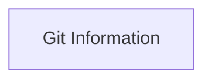

<!-- Generated by docs.api.reference; do not edit. -->
# Git Information

[API index](../README.md) | [Definition schema](../schema.md)

| Field | Value |
| --- | --- |
| ID | `cloud.mixin.git-info` |
| Source | `definitions/cloud.yaml` |
| Tags | mixin, git, deployment |

Adds the current short Git commit SHA to execution state.


## Relationships

| Relation | Definitions |
| --- | --- |
| Extends | - |
| Mixins | - |
| Children | - |
| Mixin consumers | [Cloud Deployer](definition-cloud.deployer.md) |
| Modules | - |




## Declared API

### Inputs

| Name | Type | Required | Default | Description |
| --- | --- | --- | --- | --- |
| - | - | - | - | No locally declared inputs. |


### Variables

| Name | YAML Type | Value / Template | Description |
| --- | --- | --- | --- |
| `git_short_sha` | `str` | `unknown` | Current abbreviated Git revision, or `unknown`. |


### Run Operations

#### Resolve Git revision

_No operation description provided._

```bash
sha=$(git -C "{{ env.cwd }}" rev-parse --short HEAD 2>/dev/null || echo "unknown")
printf '{"git_short_sha": "%s"}' "$sha" > "$STATE_FILE"

```

### Teardown Operations

_No locally declared teardown operations._

## Resolved API

### Effective Inputs

| Name | Type | Required | Default | Origin |
| --- | --- | --- | --- | --- |
| - | - | - | - | No effective inputs. |


### Effective Variables

| Name | Value / Template | Origin |
| --- | --- | --- |
| `git_short_sha` | `unknown` | [Git Information](definition-cloud.mixin.git-info.md) |


### Effective Lifecycle

| Phase | Operation | Origin |
| --- | --- | --- |
| Run | `bash` | [Git Information](definition-cloud.mixin.git-info.md) |
