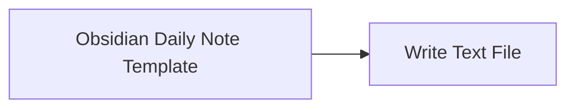

<!-- Generated by docs.api.reference; do not edit. -->
# Obsidian Daily Note Template

[API index](../README.md) | [Definition schema](../schema.md)

| Field | Value |
| --- | --- |
| ID | `obsidian.template` |
| Source | `definitions/obsidian.yaml` |
| Tags | example, obsidian, templates |

Creates a starter daily-note Markdown template beneath an Obsidian folder.

## Relationships

| Relation | Definitions |
| --- | --- |
| Extends | [Write Text File](definition-stdlib.files.write-text.md) |
| Mixins | - |
| Children | - |
| Mixin consumers | - |
| Modules | - |

## Declared API

### Inputs

| Name | Type | Required | Default | Description |
| --- | --- | --- | --- | --- |
| `obsidian_folder` | `string` | yes | `-` | Path to an Obsidian vault or notes folder. |
| `template_name` | `string` | no | `daily-note.md` | - |

### Variables

| Name | YAML Type | Value / Template | Description |
| --- | --- | --- | --- |
| `target_path` | `str` | `{{ obsidian_folder }}/Templates/{{ template_name }}` | - |
| `content` | `str` | `--- created: "[[OPEN_TEMPLATE]]date:YYYY-MM-DD[[CLOSE_TEMPLATE]]" tags:   - daily-note ---  # [[OPEN_TEMPLATE]]date:dddd, MMMM D, YYYY[[CLOSE_TEMPLATE]]  ## Focus  -  ## Notes  - ` | - |

### Run Operations

_No locally declared run operations._

### Teardown Operations

_No locally declared teardown operations._

## Resolved API

### Effective Inputs

| Name | Type | Required | Default | Origin |
| --- | --- | --- | --- | --- |
| `obsidian_folder` | `string` | yes | `-` | [Obsidian Daily Note Template](definition-obsidian.template.md) |
| `template_name` | `string` | no | `daily-note.md` | [Obsidian Daily Note Template](definition-obsidian.template.md) |

### Effective Variables

| Name | Value / Template | Origin |
| --- | --- | --- |
| `system_log_format` | `[{{ entity_id }} \| {{ runtime.version }}]` | [Abstract Base](definition-stdlib.base.md) |
| `target_path` | `{{ obsidian_folder }}/Templates/{{ template_name }}` | [Obsidian Daily Note Template](definition-obsidian.template.md) |
| `content` | `--- created: "[[OPEN_TEMPLATE]]date:YYYY-MM-DD[[CLOSE_TEMPLATE]]" tags:   - daily-note ---  # [[OPEN_TEMPLATE]]date:dddd, MMMM D, YYYY[[CLOSE_TEMPLATE]]  ## Focus  -  ## Notes  - ` | [Obsidian Daily Note Template](definition-obsidian.template.md) |

### Effective Lifecycle

| Phase | Operation | Origin |
| --- | --- | --- |
| Run | `artifact` | [Write Text File](definition-stdlib.files.write-text.md) |
