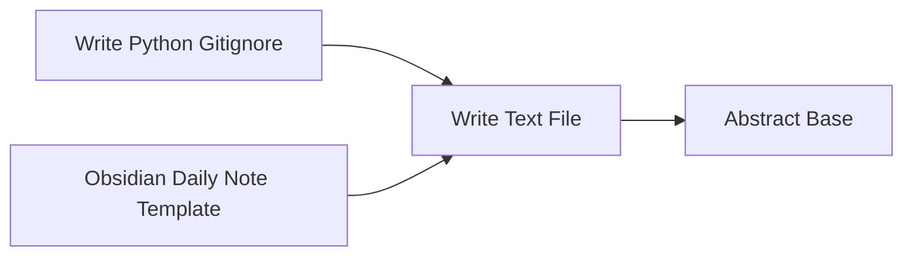

<!-- Generated by docs.api.reference; do not edit. -->
# Write Text File

[API index](../README.md) | [Definition schema](../schema.md)

| Field | Value |
| --- | --- |
| ID | `stdlib.files.write-text` |
| Source | `definitions/stdlib.files.yaml` |
| Tags | files, templates |

Writes rendered UTF-8 text and restores escaped template markers.


## Relationships

| Relation | Definitions |
| --- | --- |
| Extends | [Abstract Base](definition-stdlib.base.md) |
| Mixins | - |
| Children | [Write Python Gitignore](definition-stdlib.git.gitignore-python.md), [Obsidian Daily Note Template](definition-obsidian.template.md) |
| Mixin consumers | - |
| Modules | - |




## Declared API

### Inputs

| Name | Type | Required | Default | Description |
| --- | --- | --- | --- | --- |
| - | - | - | - | No locally declared inputs. |


### Variables

| Name | YAML Type | Value / Template | Description |
| --- | --- | --- | --- |
| `target_path` | `str` | `` | Output path for the generated text file. |
| `content` | `str` | `` | Text content to write. |


### Run Operations

#### Write text

Creates missing parent directories and writes UTF-8 content.


```artifact
artifact:
  action: write_text
  target_path: '{{ target_path }}'
  content: '{{ content }}'
  restore_template_markers: true
```

### Teardown Operations

_No locally declared teardown operations._

## Resolved API

### Effective Inputs

| Name | Type | Required | Default | Origin |
| --- | --- | --- | --- | --- |
| - | - | - | - | No effective inputs. |


### Effective Variables

| Name | Value / Template | Origin |
| --- | --- | --- |
| `system_log_format` | `[{{ entity_id }} \| {{ runtime.version }}]` | [Abstract Base](definition-stdlib.base.md) |
| `target_path` | `` | [Write Text File](definition-stdlib.files.write-text.md) |
| `content` | `` | [Write Text File](definition-stdlib.files.write-text.md) |


### Effective Lifecycle

| Phase | Operation | Origin |
| --- | --- | --- |
| Run | `artifact` | [Write Text File](definition-stdlib.files.write-text.md) |
