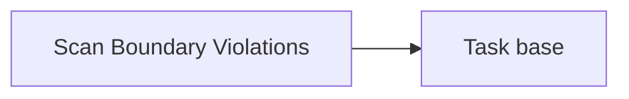

<!-- Generated by docs.api.reference; do not edit. -->
# Scan Boundary Violations
[API index](index.md) | [Definition schema](schema.md)
| Field | Value |
| --- | --- |
| ID | `audit.boundary-violations.scan.task` |
| Source | `05_tasks/audit.boundary-violations.scan.task.yaml` |
| Tags | task |
Run the responsibility-boundary audit over a workspace and write
findings.jsonl + summary.json. Wraps lib.audit.scan_boundary_violations.run_audit.


## Relationships
| Relation | Definitions |
| --- | --- |
| Extends | [Task base](task.base.definition.md) |
| Mixins | - |
| Children | - |
| Mixin consumers | - |
| Modules | - |



## Declared API

### Inputs
| Name | Type | Required | Default | Description |
| --- | --- | --- | --- | --- |
| `workspace` | `string` | no | `{{ env.cwd }}` | Root of the repository to audit. |
| `output_dir` | `string` | no | `14_data/runs/classification_audit` | Directory to write findings.jsonl and summary.json. |


### Variables
| Name | YAML Type | Value / Template | Description |
| --- | --- | --- | --- |
| - | - | - | No locally declared variables. |


### Run Operations
#### Python
_No operation description provided._
```python
import json, os
from pathlib import Path
from collections import Counter
from lib.audit.scan_boundary_violations import preserve_statuses, run_audit
workspace = Path("{{ workspace }}").resolve()
output_dir = Path("{{ output_dir }}")
output_dir.mkdir(parents=True, exist_ok=True)
findings, summary = run_audit(workspace, output_dir)
findings_path = output_dir / "findings.jsonl"
preserve_statuses(findings, findings_path)
summary["findings_by_status"] = dict(Counter(item["status"] for item in findings))
with findings_path.open("w", encoding="utf-8") as fh:
    for finding in findings:
        fh.write(json.dumps(finding, sort_keys=True) + "\n")
(output_dir / "summary.json").write_text(
    json.dumps(summary, indent=2) + "\n", encoding="utf-8"
)
with open(os.environ["STATE_FILE"], "w") as f:
    json.dump({"findings": len(findings), "summary": summary}, f)
```
### Teardown Operations
_No locally declared teardown operations._
## Resolved API

### Effective Inputs
| Name | Type | Required | Default | Origin |
| --- | --- | --- | --- | --- |
| `workspace` | `string` | no | `{{ env.cwd }}` | [Scan Boundary Violations](audit.boundary-violations.scan.task.definition.md) |
| `output_dir` | `string` | no | `14_data/runs/classification_audit` | [Scan Boundary Violations](audit.boundary-violations.scan.task.definition.md) |


### Effective Variables
| Name | Value / Template | Origin |
| --- | --- | --- |
| `system_log_format` | `[{{ entity_id }} \| {{ runtime.version }}]` | [Abstract Base](stdlib.base.definition.md) |


### Effective Lifecycle
| Phase | Operation | Origin |
| --- | --- | --- |
| Run | `python` | [Scan Boundary Violations](audit.boundary-violations.scan.task.definition.md) |
