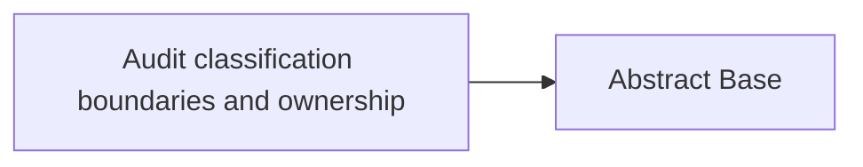

<!-- Generated by docs.api.reference; do not edit. -->
# Audit classification boundaries and ownership
[API index](index.md) | [Definition schema](schema.md)
| Field | Value |
| --- | --- |
| ID | `audit.classifications.scan.workflow` |
| Source | `06_workflows/audit.classifications.scan.workflow.yaml` |
| Tags | workflow |
Audit classification boundaries and ownership. This workflow analyzes files
in the repository to identify potential violations of responsibility boundaries.

## Relationships
| Relation | Definitions |
| --- | --- |
| Extends | [Abstract Base](stdlib.base.definition.md) |
| Mixins | - |
| Children | - |
| Mixin consumers | - |
| Modules | - |



## Declared API

### Inputs
| Name | Type | Required | Default | Description |
| --- | --- | --- | --- | --- |
| - | - | - | - | No locally declared inputs. |


### Variables
| Name | YAML Type | Value / Template | Description |
| --- | --- | --- | --- |
| - | - | - | No locally declared variables. |


### Run Operations
#### Python
_No operation description provided._
```python
import json
from collections import Counter
from pathlib import Path
from lib.audit.scan_boundary_violations import preserve_statuses, run_audit
workspace = Path(__file__).resolve().parents[1] if "__file__" in dir() else Path(".").resolve()
output_dir = workspace / "14_data" / "runs" / "classification_audit"
output_dir.mkdir(parents=True, exist_ok=True)
findings, summary = run_audit(workspace, output_dir)
findings_path = output_dir / "findings.jsonl"
preserve_statuses(findings, findings_path)
summary["findings_by_status"] = dict(Counter(item["status"] for item in findings))
with findings_path.open("w", encoding="utf-8") as handle:
    for finding in findings:
        handle.write(json.dumps(finding, sort_keys=True) + "\n")
(output_dir / "summary.json").write_text(json.dumps(summary, indent=2) + "\n", encoding="utf-8")
print(
    f"Scanned {summary['files_scanned']} files; wrote {summary['findings']} findings "
    f"to {summary['jsonl_file']}"
)
```
### Teardown Operations
_No locally declared teardown operations._
## Resolved API

### Effective Inputs
| Name | Type | Required | Default | Origin |
| --- | --- | --- | --- | --- |
| - | - | - | - | No effective inputs. |


### Effective Variables
| Name | Value / Template | Origin |
| --- | --- | --- |
| `system_log_format` | `[{{ entity_id }} \| {{ runtime.version }}]` | [Abstract Base](stdlib.base.definition.md) |


### Effective Lifecycle
| Phase | Operation | Origin |
| --- | --- | --- |
| Run | `python` | [Audit classification boundaries and ownership](audit.classifications.scan.workflow.definition.md) |
