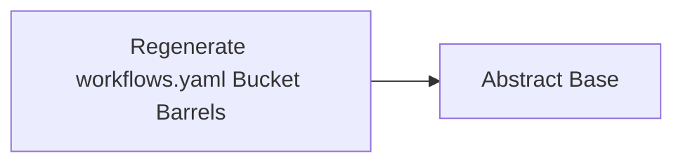

<!-- Generated by docs.api.reference; do not edit. -->
# Regenerate workflows.yaml Bucket Barrels

[API index](index.md) | [Definition schema](schema.md)

| Field | Value |
| --- | --- |
| ID | `barrels.regenerate.yaml-runtime` |
| Source | `06_workflows/barrels.regenerate.workflow.yaml` |
| Tags | python, generator, workflow |

Generates `__init__.py` files for the two Python packages in this bucket:
the runtime VM under `src/`, and the top-level `workflows.yaml` package
that re-exports it. Mirrors `docs.api.reference`: pass `--mode=write` to
regenerate, `--mode=check` to assert the committed files match.


## Relationships

| Relation | Definitions |
| --- | --- |
| Extends | [Abstract Base](stdlib.base.definition.md) |
| Mixins | - |
| Children | - |
| Mixin consumers | - |
| Modules | - |




## Declared API

### Inputs

| Name | Type | Required | Default | Description |
| --- | --- | --- | --- | --- |
| `mode` | `string` | no | `write` | Either `write` to regenerate barrels or `check` to verify them. |


### Variables

| Name | YAML Type | Value / Template | Description |
| --- | --- | --- | --- |
| - | - | - | No locally declared variables. |


### Run Operations

#### Regenerate src/ runtime barrel

_No operation description provided._

```invoke
invoke:
  definition: stdlib.python.barrel
  arguments:
    package_dir: '{{ runtime.workflow_dir }}/src'
    package_doc: YAML-driven polyglot abstract state machine runtime.
    mode: '{{ mode }}'
```

#### Regenerate top-level workflows.yaml barrel

_No operation description provided._

```invoke
invoke:
  definition: stdlib.python.barrel
  arguments:
    package_dir: '{{ runtime.workflow_dir }}'
    package_doc: "YAML polyglot runtime \u2014 public surface for `workflows.yaml`."
    mode: '{{ mode }}'
    exclude:
    - interpreter
```

### Teardown Operations

_No locally declared teardown operations._

## Resolved API

### Effective Inputs

| Name | Type | Required | Default | Origin |
| --- | --- | --- | --- | --- |
| `mode` | `string` | no | `write` | [Regenerate workflows.yaml Bucket Barrels](barrels.regenerate.yaml-runtime.definition.md) |


### Effective Variables

| Name | Value / Template | Origin |
| --- | --- | --- |
| `system_log_format` | `[{{ entity_id }} \| {{ runtime.version }}]` | [Abstract Base](stdlib.base.definition.md) |


### Effective Lifecycle

| Phase | Operation | Origin |
| --- | --- | --- |
| Run | `invoke` | [Regenerate workflows.yaml Bucket Barrels](barrels.regenerate.yaml-runtime.definition.md) |
| Run | `invoke` | [Regenerate workflows.yaml Bucket Barrels](barrels.regenerate.yaml-runtime.definition.md) |
