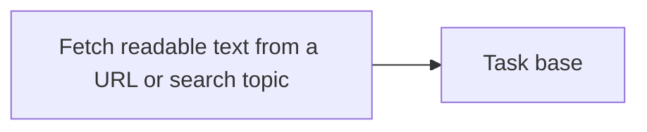

<!-- Generated by docs.api.reference; do not edit. -->
# Fetch readable text from a URL or search topic

[API index](index.md) | [Definition schema](schema.md)

| Field | Value |
| --- | --- |
| ID | `browser.fetch.text.task` |
| Source | `07_tasks/browser.fetch.text.task.yaml` |
| Tags | task |

Retrieve and clean readable text for a URL or DuckDuckGo search topic.
Wraps lib.browser.fetch_text.fetch_readable_text.


## Relationships

| Relation | Definitions |
| --- | --- |
| Extends | [Task base](task.base.definition.md) |
| Mixins | - |
| Children | - |
| Mixin consumers | - |
| Modules | - |




## Declared API

### Inputs

| Name | Type | Required | Default | Description |
| --- | --- | --- | --- | --- |
| `topic_or_url` | `string` | yes | `-` | A URL (starting with http) or a search topic string. |


### Variables

| Name | YAML Type | Value / Template | Description |
| --- | --- | --- | --- |
| - | - | - | No locally declared variables. |


### Run Operations

#### Python

_No operation description provided._

```python
import json, os
from lib.browser.fetch_text import fetch_readable_text

text, source_label, url = fetch_readable_text("{{ topic_or_url }}")
with open(os.environ["STATE_FILE"], "w") as f:
    json.dump({"text": text, "source_label": source_label, "url": url}, f)

```

### Teardown Operations

_No locally declared teardown operations._

## Resolved API

### Effective Inputs

| Name | Type | Required | Default | Origin |
| --- | --- | --- | --- | --- |
| `topic_or_url` | `string` | yes | `-` | [Fetch readable text from a URL or search topic](browser.fetch.text.task.definition.md) |


### Effective Variables

| Name | Value / Template | Origin |
| --- | --- | --- |
| `system_log_format` | `[{{ entity_id }} \| {{ runtime.version }}]` | [Abstract Base](stdlib.base.definition.md) |


### Effective Lifecycle

| Phase | Operation | Origin |
| --- | --- | --- |
| Run | `python` | [Fetch readable text from a URL or search topic](browser.fetch.text.task.definition.md) |
