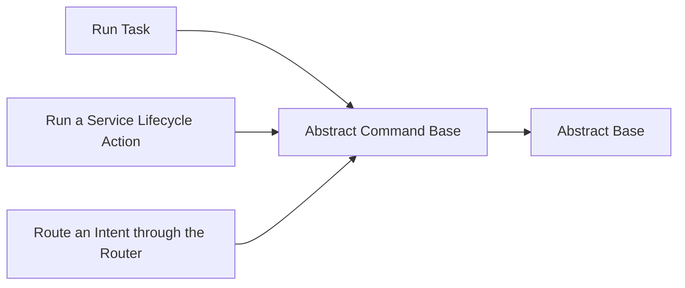

<!-- Generated by docs.api.reference; do not edit. -->
# Abstract Command Base
[API index](index.md) | [Definition schema](schema.md)
| Field | Value |
| --- | --- |
| ID | `command.base` |
| Source | `02_core/runtimes/yaml/definitions/command.yaml` |
| Tags | command, abstract |
Abstract base shared by all command definitions. Establishes the
three variable slots (argv_spec, http_spec, mcp_spec) that
interfaces/commands/binder.py reads to wire CLI / API / MCP handlers.
This definition is never executed directly; it is only an ancestor.

## Relationships
| Relation | Definitions |
| --- | --- |
| Extends | [Abstract Base](stdlib.base.definition.md) |
| Mixins | - |
| Children | [Run Task](command.task.run.command.definition.md), [Run a Service Lifecycle Action](command.service.action.command.definition.md), [Route an Intent through the Router](command.route.command.definition.md) |
| Mixin consumers | - |
| Modules | - |

## Declared API

### Inputs
| Name | Type | Required | Default | Description |
| --- | --- | --- | --- | --- |
| - | - | - | - | No locally declared inputs. |

### Variables
| Name | YAML Type | Value / Template | Description |
| --- | --- | --- | --- |
| `argv_spec` | `dict` | `{}` | CLI binding info consumed by binder.bind_typer(). Shape: {group, verb, positional: [], options: []}.
 |
| `http_spec` | `dict` | `{}` | FastAPI binding info consumed by binder.bind_fastapi() (Phase C3). Shape: {method, path}.
 |
| `mcp_spec` | `dict` | `{'expose': False}` | FastMCP exposure flag consumed by binder.bind_fastmcp() (Phase C4). Shape: {expose: bool}.
 |

### Run Operations
_No locally declared run operations._
### Teardown Operations
_No locally declared teardown operations._
## Resolved API

### Effective Inputs
| Name | Type | Required | Default | Origin |
| --- | --- | --- | --- | --- |
| - | - | - | - | No effective inputs. |

### Effective Variables
| Name | Value / Template | Origin |
| --- | --- | --- |
| `system_log_format` | `[{{ entity_id }} \| {{ runtime.version }}]` | [Abstract Base](stdlib.base.definition.md) |
| `argv_spec` | `{}` | [Abstract Command Base](command.base.definition.md) |
| `http_spec` | `{}` | [Abstract Command Base](command.base.definition.md) |
| `mcp_spec` | `{'expose': False}` | [Abstract Command Base](command.base.definition.md) |

### Effective Lifecycle
| Phase | Operation | Origin |
| --- | --- | --- |
| Run | `python` | [Abstract Base](stdlib.base.definition.md) |
