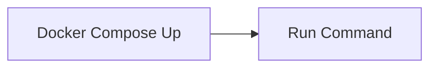

<!-- Generated by docs.api.reference; do not edit. -->
# Docker Compose Up
[API index](index.md) | [Definition schema](schema.md)
| Field | Value |
| --- | --- |
| ID | `compose.up.task` |
| Source | `02_core/runtimes/yaml/definitions/docker.yaml` |
| Tags | docker, compose, lifecycle |
Starts a scaffolded docker compose project in detached mode. The
`target_dir` input must point at a folder containing a generated
`docker-compose.yml`.

## Relationships
| Relation | Definitions |
| --- | --- |
| Extends | [Run Command](stdlib.run-command.task.definition.md) |
| Mixins | - |
| Children | - |
| Mixin consumers | - |
| Modules | - |

## Declared API

### Inputs
| Name | Type | Required | Default | Description |
| --- | --- | --- | --- | --- |
| `target_dir` | `string` | yes | `-` | Folder that contains the rendered docker-compose.yml. |

### Variables
| Name | YAML Type | Value / Template | Description |
| --- | --- | --- | --- |
| `command` | `str` | `docker compose -f {{ target_dir }}/docker-compose.yml up -d` | - |

### Run Operations
_No locally declared run operations._
### Teardown Operations
_No locally declared teardown operations._
## Resolved API

### Effective Inputs
| Name | Type | Required | Default | Origin |
| --- | --- | --- | --- | --- |
| `command` | `string` | no | `` | [Run Command](stdlib.run-command.task.definition.md) |
| `working_dir` | `string` | no | `{{ env.cwd }}` | [Run Command](stdlib.run-command.task.definition.md) |
| `target_dir` | `string` | yes | `-` | [Docker Compose Up](compose.up.task.definition.md) |

### Effective Variables
| Name | Value / Template | Origin |
| --- | --- | --- |
| `system_log_format` | `[{{ entity_id }} \| {{ runtime.version }}]` | [Abstract Base](stdlib.base.definition.md) |
| `command` | `docker compose -f {{ target_dir }}/docker-compose.yml up -d` | [Docker Compose Up](compose.up.task.definition.md) |

### Effective Lifecycle
| Phase | Operation | Origin |
| --- | --- | --- |
| Run | `bash` | [Run Command](stdlib.run-command.task.definition.md) |
