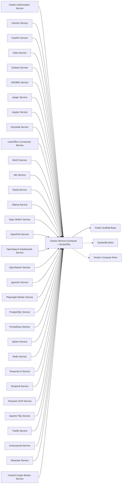

<!-- Generated by docs.api.reference; do not edit. -->
# Docker Service (Compose + Dockerfile)
[API index](index.md) | [Definition schema](schema.md)
| Field | Value |
| --- | --- |
| ID | `docker.base` |
| Source | `02_core/runtimes/yaml/definitions/docker.yaml` |
| Tags | docker, abstract |
Concrete base for a docker service definition. Combines the
`dockerfile.mixin` and `compose.mixin` variable surfaces with the
`folder.base` scaffolding loop, so children only declare the data
(services, dockerfile_body, extra_files) and the inherited run blocks
materialize the directory under `target_dir`.
The `files` list is built from a Dockerfile entry, a docker-compose.yml
entry, and any `extra_files` the child appends. Empty-content entries
(e.g. when `dockerfile_body` is unset) are rejected by the
`folder.base` scaffolding loop and are not written.

## Relationships
| Relation | Definitions |
| --- | --- |
| Extends | [Folder Scaffold Base](folder.base.definition.md) |
| Mixins | [Dockerfile Mixin](dockerfile.mixin.definition.md), [Docker Compose Mixin](compose.mixin.definition.md) |
| Children | [Casbin Authorization Service](docker.casbin.service.definition.md), [ClamAV Service](docker.clamav.service.definition.md), [FastAPI Service](docker.fastapi.service.definition.md), [Gitea Service](docker.gitea.service.definition.md), [Grafana Service](docker.grafana.service.definition.md), [GROBID Service](docker.grobid.service.definition.md), [Jaeger Service](docker.jaeger.service.definition.md), [Jupyter Service](docker.jupyter.service.definition.md), [Keycloak Service](docker.keycloak.service.definition.md), [LibreOffice Conversion Service](docker.libreoffice.service.definition.md), [MinIO Service](docker.minio.service.definition.md), [n8n Service](docker.n8n.service.definition.md), [Neo4j Service](docker.neo4j.service.definition.md), [Ollama Service](docker.ollama.service.definition.md), [Open WebUI Service](docker.open-webui.service.definition.md), [OpenFGA Service](docker.openfga.service.definition.md), [OpenSearch Dashboards Service](docker.opensearch-dashboards.service.definition.md), [OpenSearch Service](docker.opensearch.service.definition.md), [pgvector Service](docker.pgvector.service.definition.md), [Playwright Worker Service](docker.playwright-worker.service.definition.md), [PostgreSQL Service](docker.postgres.service.definition.md), [Prometheus Service](docker.prometheus.service.definition.md), [Qdrant Service](docker.qdrant.service.definition.md), [Redis Service](docker.redis.service.definition.md), [Temporal UI Service](docker.temporal-ui.service.definition.md), [Temporal Service](docker.temporal.service.definition.md), [Tesseract OCR Service](docker.tesseract-ocr.service.definition.md), [Apache Tika Service](docker.tika.service.definition.md), [Traefik Service](docker.traefik.service.definition.md), [Unstructured Service](docker.unstructured.service.definition.md), [Weaviate Service](docker.weaviate.service.definition.md), [Content-Graph Worker Service](docker.worker.service.definition.md) |
| Mixin consumers | - |
| Modules | - |

## Declared API

### Inputs
| Name | Type | Required | Default | Description |
| --- | --- | --- | --- | --- |
| - | - | - | - | No locally declared inputs. |

### Variables
| Name | YAML Type | Value / Template | Description |
| --- | --- | --- | --- |
| `extra_files` | `list` | `[]` | Additional files to scaffold beside Dockerfile and compose. |
| `files` | `list` | `[{'path': 'Dockerfile', 'content': '{{ dockerfile_body }}'}, {'path': 'docker-compose.yml', 'content': '{{ compose_yaml }}'}]` | Combined Dockerfile + compose entries (extra_files concat happens in the loop). |

### Run Operations
_No locally declared run operations._
### Teardown Operations
_No locally declared teardown operations._
## Resolved API

### Effective Inputs
| Name | Type | Required | Default | Origin |
| --- | --- | --- | --- | --- |
| `target_dir` | `string` | no | `14_data/{{ entity_id | replace('.', '_') }}` | [Folder Scaffold Base](folder.base.definition.md) |

### Effective Variables
| Name | Value / Template | Origin |
| --- | --- | --- |
| `system_log_format` | `[{{ entity_id }} \| {{ runtime.version }}]` | [Abstract Base](stdlib.base.definition.md) |
| `dockerfile_body` | `` | [Dockerfile Mixin](dockerfile.mixin.definition.md) |
| `image_tag` | `{{ entity_id \| replace('docker.', '') \| replace('.service', '') }}:local` | [Dockerfile Mixin](dockerfile.mixin.definition.md) |
| `build_context` | `{{ target_dir }}` | [Dockerfile Mixin](dockerfile.mixin.definition.md) |
| `services` | `{}` | [Docker Compose Mixin](compose.mixin.definition.md) |
| `networks` | `{}` | [Docker Compose Mixin](compose.mixin.definition.md) |
| `volumes` | `{}` | [Docker Compose Mixin](compose.mixin.definition.md) |
| `compose_yaml` | `{{ {'services': services, 'networks': networks, 'volumes': volumes} \| tojson(indent=2) }} ` | [Docker Compose Mixin](compose.mixin.definition.md) |
| `extra_files` | `[]` | [Docker Service (Compose + Dockerfile)](docker.base.definition.md) |
| `files` | `[{'path': 'Dockerfile', 'content': '{{ dockerfile_body }}'}, {'path': 'docker-compose.yml', 'content': '{{ compose_yaml }}'}]` | [Docker Service (Compose + Dockerfile)](docker.base.definition.md) |

### Effective Lifecycle
| Phase | Operation | Origin |
| --- | --- | --- |
| Run | `invoke` | [Folder Scaffold Base](folder.base.definition.md) |
| Run | `invoke` | [Folder Scaffold Base](folder.base.definition.md) |
| Run | `python` | [Abstract Base](stdlib.base.definition.md) |
| Run | `python` | [Abstract Base](stdlib.base.definition.md) |
