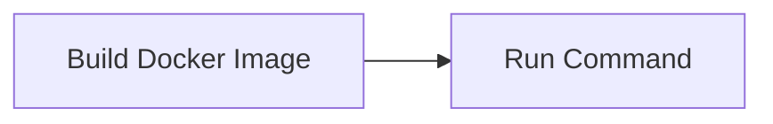

<!-- Generated by docs.api.reference; do not edit. -->
# Build Docker Image

[API index](index.md) | [Definition schema](schema.md)

| Field | Value |
| --- | --- |
| ID | `docker.build.task` |
| Source | `02_core/runtimes/yaml/definitions/docker.yaml` |
| Tags | docker, build |

Builds the docker image for a `docker.base` child. Reads `image_tag`
and `build_context` from the child's variables (or accepts overrides
via inputs). Wraps `stdlib.run-command.task`.

## Relationships

| Relation | Definitions |
| --- | --- |
| Extends | [Run Command](stdlib.run-command.task.definition.md) |
| Mixins | - |
| Children | - |
| Mixin consumers | - |
| Modules | - |

## Declared API

### Inputs

| Name | Type | Required | Default | Description |
| --- | --- | --- | --- | --- |
| `image_tag` | `string` | yes | `-` | Image tag to build (e.g. `worker:local`). |
| `build_context` | `string` | yes | `-` | Directory passed to `docker build` as the context. |

### Variables

| Name | YAML Type | Value / Template | Description |
| --- | --- | --- | --- |
| `command` | `str` | `docker build -t {{ image_tag }} {{ build_context }}` | - |

### Run Operations

_No locally declared run operations._

### Teardown Operations

_No locally declared teardown operations._

## Resolved API

### Effective Inputs

| Name | Type | Required | Default | Origin |
| --- | --- | --- | --- | --- |
| `command` | `string` | no | `` | [Run Command](stdlib.run-command.task.definition.md) |
| `working_dir` | `string` | no | `{{ env.cwd }}` | [Run Command](stdlib.run-command.task.definition.md) |
| `image_tag` | `string` | yes | `-` | [Build Docker Image](docker.build.task.definition.md) |
| `build_context` | `string` | yes | `-` | [Build Docker Image](docker.build.task.definition.md) |

### Effective Variables

| Name | Value / Template | Origin |
| --- | --- | --- |
| `system_log_format` | `[{{ entity_id }} \| {{ runtime.version }}]` | [Abstract Base](stdlib.base.definition.md) |
| `command` | `docker build -t {{ image_tag }} {{ build_context }}` | [Build Docker Image](docker.build.task.definition.md) |

### Effective Lifecycle

| Phase | Operation | Origin |
| --- | --- | --- |
| Run | `bash` | [Run Command](stdlib.run-command.task.definition.md) |
