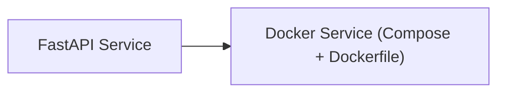

<!-- Generated by docs.api.reference; do not edit. -->
# FastAPI Service
[API index](index.md) | [Definition schema](schema.md)
| Field | Value |
| --- | --- |
| ID | `docker.fastapi.service` |
| Source | `09_docker/docker.fastapi.service.yaml` |
| Tags | docker, workers |
Content graph FastAPI service built locally. Provides the HTTP control plane and
integrates with Postgres, Neo4j, Redis, MinIO, and Tika via environment URLs.

## Relationships
| Relation | Definitions |
| --- | --- |
| Extends | [Docker Service (Compose + Dockerfile)](docker.base.definition.md) |
| Mixins | - |
| Children | - |
| Mixin consumers | - |
| Modules | - |

## Declared API

### Inputs
| Name | Type | Required | Default | Description |
| --- | --- | --- | --- | --- |
| `DATABASE_URL` | `string` | yes | `-` | PostgreSQL connection URL for the API |
| `NEO4J_PASSWORD` | `string` | yes | `-` | Password for the Neo4j user |
| `FASTAPI_PORT` | `string` | no | `8000` | Host port to expose the FastAPI service (default 8000) |
| `NEO4J_URI` | `string` | no | `bolt://neo4j:7687` | Bolt URI for the Neo4j server |
| `NEO4J_USER` | `string` | no | `neo4j` | Neo4j username |
| `REDIS_URL` | `string` | no | `redis://redis:6379/0` | Redis connection URL |
| `MINIO_ENDPOINT` | `string` | no | `minio:9000` | MinIO endpoint host:port |
| `TIKA_URL` | `string` | no | `http://tika:9998` | Apache Tika base URL |

### Variables
| Name | YAML Type | Value / Template | Description |
| --- | --- | --- | --- |
| `image_tag` | `str` | `contentgraph-api:local` | - |
| `dockerfile_body` | `str` | `FROM python:3.12-slim WORKDIR /app RUN pip install --no-cache-dir fastapi uvicorn[standard] psycopg[binary] redis neo4j boto3 httpx COPY app /app EXPOSE 8000 CMD ["uvicorn", "main:app", "--host", "0.0.0.0", "--port", "8000"] ` | - |
| `services` | `dict` | `{'contentgraph-api': {'build': '.', 'image': 'contentgraph-api:local', 'container_name': 'contentgraph-api', 'restart': 'unless-stopped', 'environment': {'DATABASE_URL': '{{ DATABASE_URL }}', 'NEO4J_URI': '{{ NEO4J_URI }}', 'NEO4J_USER': '{{ NEO4J_USER }}', 'NEO4J_PASSWORD': '{{ NEO4J_PASSWORD }}', 'REDIS_URL': '{{ REDIS_URL }}', 'MINIO_ENDPOINT': '{{ MINIO_ENDPOINT }}', 'TIKA_URL': '{{ TIKA_URL }}'}, 'ports': ['{{ FASTAPI_PORT }}:8000']}}` | - |
| `extra_files` | `list` | `[{'path': 'app/main.py', 'content': 'from fastapi import FastAPI\napp = FastAPI(title="Content Graph API")\n@app.get("/health")\ndef health() -> dict[str, str]:\n    return {"status": "ok"}'}]` | - |

### Run Operations
_No locally declared run operations._
### Teardown Operations
_No locally declared teardown operations._
## Resolved API

### Effective Inputs
| Name | Type | Required | Default | Origin |
| --- | --- | --- | --- | --- |
| `target_dir` | `string` | no | `14_data/{{ entity_id | replace('.', '_') }}` | [Folder Scaffold Base](folder.base.definition.md) |
| `DATABASE_URL` | `string` | yes | `-` | [FastAPI Service](docker.fastapi.service.definition.md) |
| `NEO4J_PASSWORD` | `string` | yes | `-` | [FastAPI Service](docker.fastapi.service.definition.md) |
| `FASTAPI_PORT` | `string` | no | `8000` | [FastAPI Service](docker.fastapi.service.definition.md) |
| `NEO4J_URI` | `string` | no | `bolt://neo4j:7687` | [FastAPI Service](docker.fastapi.service.definition.md) |
| `NEO4J_USER` | `string` | no | `neo4j` | [FastAPI Service](docker.fastapi.service.definition.md) |
| `REDIS_URL` | `string` | no | `redis://redis:6379/0` | [FastAPI Service](docker.fastapi.service.definition.md) |
| `MINIO_ENDPOINT` | `string` | no | `minio:9000` | [FastAPI Service](docker.fastapi.service.definition.md) |
| `TIKA_URL` | `string` | no | `http://tika:9998` | [FastAPI Service](docker.fastapi.service.definition.md) |

### Effective Variables
| Name | Value / Template | Origin |
| --- | --- | --- |
| `system_log_format` | `[{{ entity_id }} \| {{ runtime.version }}]` | [Abstract Base](stdlib.base.definition.md) |
| `dockerfile_body` | `FROM python:3.12-slim WORKDIR /app RUN pip install --no-cache-dir fastapi uvicorn[standard] psycopg[binary] redis neo4j boto3 httpx COPY app /app EXPOSE 8000 CMD ["uvicorn", "main:app", "--host", "0.0.0.0", "--port", "8000"] ` | [FastAPI Service](docker.fastapi.service.definition.md) |
| `image_tag` | `contentgraph-api:local` | [FastAPI Service](docker.fastapi.service.definition.md) |
| `build_context` | `{{ target_dir }}` | [Dockerfile Mixin](dockerfile.mixin.definition.md) |
| `services` | `{'contentgraph-api': {'build': '.', 'image': 'contentgraph-api:local', 'container_name': 'contentgraph-api', 'restart': 'unless-stopped', 'environment': {'DATABASE_URL': '{{ DATABASE_URL }}', 'NEO4J_URI': '{{ NEO4J_URI }}', 'NEO4J_USER': '{{ NEO4J_USER }}', 'NEO4J_PASSWORD': '{{ NEO4J_PASSWORD }}', 'REDIS_URL': '{{ REDIS_URL }}', 'MINIO_ENDPOINT': '{{ MINIO_ENDPOINT }}', 'TIKA_URL': '{{ TIKA_URL }}'}, 'ports': ['{{ FASTAPI_PORT }}:8000']}}` | [FastAPI Service](docker.fastapi.service.definition.md) |
| `networks` | `{}` | [Docker Compose Mixin](compose.mixin.definition.md) |
| `volumes` | `{}` | [Docker Compose Mixin](compose.mixin.definition.md) |
| `compose_yaml` | `{{ {'services': services, 'networks': networks, 'volumes': volumes} \| tojson(indent=2) }} ` | [Docker Compose Mixin](compose.mixin.definition.md) |
| `extra_files` | `[{'path': 'app/main.py', 'content': 'from fastapi import FastAPI\napp = FastAPI(title="Content Graph API")\n@app.get("/health")\ndef health() -> dict[str, str]:\n    return {"status": "ok"}'}]` | [FastAPI Service](docker.fastapi.service.definition.md) |
| `files` | `[{'path': 'Dockerfile', 'content': '{{ dockerfile_body }}'}, {'path': 'docker-compose.yml', 'content': '{{ compose_yaml }}'}]` | [Docker Service (Compose + Dockerfile)](docker.base.definition.md) |

### Effective Lifecycle
| Phase | Operation | Origin |
| --- | --- | --- |
| Run | `invoke` | [Folder Scaffold Base](folder.base.definition.md) |
| Run | `invoke` | [Folder Scaffold Base](folder.base.definition.md) |
| Run | `python` | [Abstract Base](stdlib.base.definition.md) |
| Run | `python` | [Abstract Base](stdlib.base.definition.md) |
