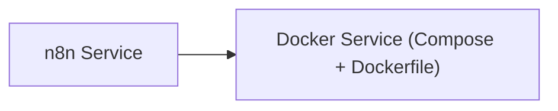

<!-- Generated by docs.api.reference; do not edit. -->
# n8n Service

[API index](index.md) | [Definition schema](schema.md)

| Field | Value |
| --- | --- |
| ID | `docker.n8n.service` |
| Source | `09_docker/docker.n8n.service.yaml` |
| Tags | docker, workers |

n8n workflow automation server used for low-code orchestration of local fabric
services. Bound data volume persists credentials, workflows, and execution history.

## Relationships

| Relation | Definitions |
| --- | --- |
| Extends | [Docker Service (Compose + Dockerfile)](docker.base.definition.md) |
| Mixins | - |
| Children | - |
| Mixin consumers | - |
| Modules | - |

## Declared API

### Inputs

| Name | Type | Required | Default | Description |
| --- | --- | --- | --- | --- |
| `DATA_PATH` | `string` | yes | `-` | Host folder for n8n state (binds to /home/node/.n8n in container) |
| `N8N_PORT` | `string` | no | `5678` | Host port to expose the n8n HTTP interface (default 5678) |
| `N8N_HOST` | `string` | no | `localhost` | Hostname n8n advertises in webhook URLs |
| `GENERIC_TIMEZONE` | `string` | no | `UTC` | Timezone for scheduled workflows |

### Variables

| Name | YAML Type | Value / Template | Description |
| --- | --- | --- | --- |
| `services` | `dict` | `{'n8n': {'image': 'n8nio/n8n:latest', 'container_name': 'localfabric-n8n', 'restart': 'unless-stopped', 'environment': {'N8N_HOST': '{{ N8N_HOST }}', 'N8N_PORT': '{{ N8N_PORT }}', 'N8N_PROTOCOL': 'http', 'WEBHOOK_URL': 'http://{{ N8N_HOST }}:{{ N8N_PORT }}/', 'GENERIC_TIMEZONE': '{{ GENERIC_TIMEZONE }}', 'N8N_DIAGNOSTICS_ENABLED': 'false', 'N8N_RUNNERS_ENABLED': 'true'}, 'ports': ['{{ N8N_PORT }}:5678'], 'volumes': ['{{ DATA_PATH }}:/home/node/.n8n']}}` | - |

### Run Operations

_No locally declared run operations._

### Teardown Operations

_No locally declared teardown operations._

## Resolved API

### Effective Inputs

| Name | Type | Required | Default | Origin |
| --- | --- | --- | --- | --- |
| `target_dir` | `string` | no | `14_data/{{ entity_id | replace('.', '_') }}` | [Folder Scaffold Base](folder.base.definition.md) |
| `DATA_PATH` | `string` | yes | `-` | [n8n Service](docker.n8n.service.definition.md) |
| `N8N_PORT` | `string` | no | `5678` | [n8n Service](docker.n8n.service.definition.md) |
| `N8N_HOST` | `string` | no | `localhost` | [n8n Service](docker.n8n.service.definition.md) |
| `GENERIC_TIMEZONE` | `string` | no | `UTC` | [n8n Service](docker.n8n.service.definition.md) |

### Effective Variables

| Name | Value / Template | Origin |
| --- | --- | --- |
| `system_log_format` | `[{{ entity_id }} \| {{ runtime.version }}]` | [Abstract Base](stdlib.base.definition.md) |
| `dockerfile_body` | `` | [Dockerfile Mixin](dockerfile.mixin.definition.md) |
| `image_tag` | `{{ entity_id \| replace('docker.', '') \| replace('.service', '') }}:local` | [Dockerfile Mixin](dockerfile.mixin.definition.md) |
| `build_context` | `{{ target_dir }}` | [Dockerfile Mixin](dockerfile.mixin.definition.md) |
| `services` | `{'n8n': {'image': 'n8nio/n8n:latest', 'container_name': 'localfabric-n8n', 'restart': 'unless-stopped', 'environment': {'N8N_HOST': '{{ N8N_HOST }}', 'N8N_PORT': '{{ N8N_PORT }}', 'N8N_PROTOCOL': 'http', 'WEBHOOK_URL': 'http://{{ N8N_HOST }}:{{ N8N_PORT }}/', 'GENERIC_TIMEZONE': '{{ GENERIC_TIMEZONE }}', 'N8N_DIAGNOSTICS_ENABLED': 'false', 'N8N_RUNNERS_ENABLED': 'true'}, 'ports': ['{{ N8N_PORT }}:5678'], 'volumes': ['{{ DATA_PATH }}:/home/node/.n8n']}}` | [n8n Service](docker.n8n.service.definition.md) |
| `networks` | `{}` | [Docker Compose Mixin](compose.mixin.definition.md) |
| `volumes` | `{}` | [Docker Compose Mixin](compose.mixin.definition.md) |
| `compose_yaml` | `{{ {'services': services, 'networks': networks, 'volumes': volumes} \| tojson(indent=2) }} ` | [Docker Compose Mixin](compose.mixin.definition.md) |
| `extra_files` | `[]` | [Docker Service (Compose + Dockerfile)](docker.base.definition.md) |
| `files` | `[{'path': 'Dockerfile', 'content': '{{ dockerfile_body }}'}, {'path': 'docker-compose.yml', 'content': '{{ compose_yaml }}'}]` | [Docker Service (Compose + Dockerfile)](docker.base.definition.md) |

### Effective Lifecycle

| Phase | Operation | Origin |
| --- | --- | --- |
| Run | `invoke` | [Folder Scaffold Base](folder.base.definition.md) |
| Run | `invoke` | [Folder Scaffold Base](folder.base.definition.md) |
| Run | `python` | [Abstract Base](stdlib.base.definition.md) |
| Run | `python` | [Abstract Base](stdlib.base.definition.md) |
