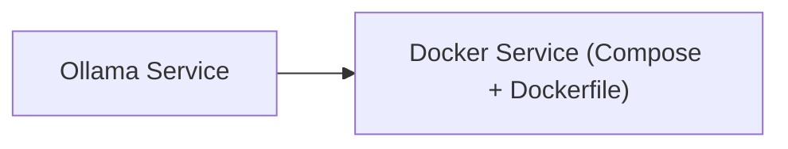

<!-- Generated by docs.api.reference; do not edit. -->
# Ollama Service
[API index](index.md) | [Definition schema](schema.md)
| Field | Value |
| --- | --- |
| ID | `docker.ollama.service` |
| Source | `09_docker/docker.ollama.service.yaml` |
| Tags | docker, ai |
Local LLM runtime serving the Ollama API. Hosts model weights on the
bound data volume and exposes the HTTP API for chat completions,
embeddings, and model management.

## Relationships
| Relation | Definitions |
| --- | --- |
| Extends | [Docker Service (Compose + Dockerfile)](docker.base.definition.md) |
| Mixins | - |
| Children | - |
| Mixin consumers | - |
| Modules | - |

## Declared API

### Inputs
| Name | Type | Required | Default | Description |
| --- | --- | --- | --- | --- |
| `DATA_PATH` | `string` | yes | `-` | Host path for Ollama model storage (binds to /root/.ollama in container). |
| `OLLAMA_PORT` | `string` | no | `11434` | Host port to bind the Ollama HTTP API. |

### Variables
| Name | YAML Type | Value / Template | Description |
| --- | --- | --- | --- |
| `services` | `dict` | `{'ollama': {'image': 'ollama/ollama', 'container_name': 'contentgraph-ollama', 'restart': 'unless-stopped', 'ports': ['{{ OLLAMA_PORT }}:11434'], 'volumes': ['{{ DATA_PATH }}:/root/.ollama']}}` | - |

### Run Operations
_No locally declared run operations._
### Teardown Operations
_No locally declared teardown operations._
## Resolved API

### Effective Inputs
| Name | Type | Required | Default | Origin |
| --- | --- | --- | --- | --- |
| `target_dir` | `string` | no | `14_data/{{ entity_id | replace('.', '_') }}` | [Folder Scaffold Base](folder.base.definition.md) |
| `DATA_PATH` | `string` | yes | `-` | [Ollama Service](docker.ollama.service.definition.md) |
| `OLLAMA_PORT` | `string` | no | `11434` | [Ollama Service](docker.ollama.service.definition.md) |

### Effective Variables
| Name | Value / Template | Origin |
| --- | --- | --- |
| `system_log_format` | `[{{ entity_id }} \| {{ runtime.version }}]` | [Abstract Base](stdlib.base.definition.md) |
| `dockerfile_body` | `` | [Dockerfile Mixin](dockerfile.mixin.definition.md) |
| `image_tag` | `{{ entity_id \| replace('docker.', '') \| replace('.service', '') }}:local` | [Dockerfile Mixin](dockerfile.mixin.definition.md) |
| `build_context` | `{{ target_dir }}` | [Dockerfile Mixin](dockerfile.mixin.definition.md) |
| `services` | `{'ollama': {'image': 'ollama/ollama', 'container_name': 'contentgraph-ollama', 'restart': 'unless-stopped', 'ports': ['{{ OLLAMA_PORT }}:11434'], 'volumes': ['{{ DATA_PATH }}:/root/.ollama']}}` | [Ollama Service](docker.ollama.service.definition.md) |
| `networks` | `{}` | [Docker Compose Mixin](compose.mixin.definition.md) |
| `volumes` | `{}` | [Docker Compose Mixin](compose.mixin.definition.md) |
| `compose_yaml` | `{{ {'services': services, 'networks': networks, 'volumes': volumes} \| tojson(indent=2) }} ` | [Docker Compose Mixin](compose.mixin.definition.md) |
| `extra_files` | `[]` | [Docker Service (Compose + Dockerfile)](docker.base.definition.md) |
| `files` | `[{'path': 'Dockerfile', 'content': '{{ dockerfile_body }}'}, {'path': 'docker-compose.yml', 'content': '{{ compose_yaml }}'}]` | [Docker Service (Compose + Dockerfile)](docker.base.definition.md) |

### Effective Lifecycle
| Phase | Operation | Origin |
| --- | --- | --- |
| Run | `invoke` | [Folder Scaffold Base](folder.base.definition.md) |
| Run | `invoke` | [Folder Scaffold Base](folder.base.definition.md) |
| Run | `python` | [Abstract Base](stdlib.base.definition.md) |
| Run | `python` | [Abstract Base](stdlib.base.definition.md) |
