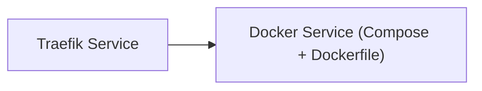

<!-- Generated by docs.api.reference; do not edit. -->
# Traefik Service
[API index](index.md) | [Definition schema](schema.md)
| Field | Value |
| --- | --- |
| ID | `docker.traefik.service` |
| Source | `09_docker/docker.traefik.service.yaml` |
| Tags | docker, proxy |
Traefik v3 reverse proxy with the Docker provider enabled. Routes HTTP/HTTPS to
labelled containers and exposes the insecure dashboard for local development.

## Relationships
| Relation | Definitions |
| --- | --- |
| Extends | [Docker Service (Compose + Dockerfile)](docker.base.definition.md) |
| Mixins | - |
| Children | - |
| Mixin consumers | - |
| Modules | - |

## Declared API

### Inputs
| Name | Type | Required | Default | Description |
| --- | --- | --- | --- | --- |
| `TRAEFIK_HTTP_PORT` | `string` | no | `80` | Host port for the HTTP entrypoint (default 80) |
| `TRAEFIK_HTTPS_PORT` | `string` | no | `443` | Host port for the HTTPS entrypoint (default 443) |
| `TRAEFIK_DASHBOARD_PORT` | `string` | no | `8080` | Host port for the Traefik dashboard (default 8080) |

### Variables
| Name | YAML Type | Value / Template | Description |
| --- | --- | --- | --- |
| `services` | `dict` | `{'traefik': {'image': 'traefik:v3', 'container_name': 'contentgraph-traefik', 'restart': 'unless-stopped', 'command': ['--api.dashboard=true', '--api.insecure=true', '--providers.docker=true', '--providers.docker.exposedbydefault=false', '--entrypoints.web.address=:80', '--entrypoints.websecure.address=:443'], 'ports': ['{{ TRAEFIK_HTTP_PORT }}:80', '{{ TRAEFIK_HTTPS_PORT }}:443', '{{ TRAEFIK_DASHBOARD_PORT }}:8080'], 'volumes': ['/var/run/docker.sock:/var/run/docker.sock:ro', './config:/etc/traefik:ro']}}` | - |
| `extra_files` | `list` | `[{'path': 'config/.gitkeep', 'content': ''}]` | - |

### Run Operations
_No locally declared run operations._
### Teardown Operations
_No locally declared teardown operations._
## Resolved API

### Effective Inputs
| Name | Type | Required | Default | Origin |
| --- | --- | --- | --- | --- |
| `target_dir` | `string` | no | `14_data/{{ entity_id | replace('.', '_') }}` | [Folder Scaffold Base](folder.base.definition.md) |
| `TRAEFIK_HTTP_PORT` | `string` | no | `80` | [Traefik Service](docker.traefik.service.definition.md) |
| `TRAEFIK_HTTPS_PORT` | `string` | no | `443` | [Traefik Service](docker.traefik.service.definition.md) |
| `TRAEFIK_DASHBOARD_PORT` | `string` | no | `8080` | [Traefik Service](docker.traefik.service.definition.md) |

### Effective Variables
| Name | Value / Template | Origin |
| --- | --- | --- |
| `system_log_format` | `[{{ entity_id }} \| {{ runtime.version }}]` | [Abstract Base](stdlib.base.definition.md) |
| `dockerfile_body` | `` | [Dockerfile Mixin](dockerfile.mixin.definition.md) |
| `image_tag` | `{{ entity_id \| replace('docker.', '') \| replace('.service', '') }}:local` | [Dockerfile Mixin](dockerfile.mixin.definition.md) |
| `build_context` | `{{ target_dir }}` | [Dockerfile Mixin](dockerfile.mixin.definition.md) |
| `services` | `{'traefik': {'image': 'traefik:v3', 'container_name': 'contentgraph-traefik', 'restart': 'unless-stopped', 'command': ['--api.dashboard=true', '--api.insecure=true', '--providers.docker=true', '--providers.docker.exposedbydefault=false', '--entrypoints.web.address=:80', '--entrypoints.websecure.address=:443'], 'ports': ['{{ TRAEFIK_HTTP_PORT }}:80', '{{ TRAEFIK_HTTPS_PORT }}:443', '{{ TRAEFIK_DASHBOARD_PORT }}:8080'], 'volumes': ['/var/run/docker.sock:/var/run/docker.sock:ro', './config:/etc/traefik:ro']}}` | [Traefik Service](docker.traefik.service.definition.md) |
| `networks` | `{}` | [Docker Compose Mixin](compose.mixin.definition.md) |
| `volumes` | `{}` | [Docker Compose Mixin](compose.mixin.definition.md) |
| `compose_yaml` | `{{ {'services': services, 'networks': networks, 'volumes': volumes} \| tojson(indent=2) }} ` | [Docker Compose Mixin](compose.mixin.definition.md) |
| `extra_files` | `[{'path': 'config/.gitkeep', 'content': ''}]` | [Traefik Service](docker.traefik.service.definition.md) |
| `files` | `[{'path': 'Dockerfile', 'content': '{{ dockerfile_body }}'}, {'path': 'docker-compose.yml', 'content': '{{ compose_yaml }}'}]` | [Docker Service (Compose + Dockerfile)](docker.base.definition.md) |

### Effective Lifecycle
| Phase | Operation | Origin |
| --- | --- | --- |
| Run | `invoke` | [Folder Scaffold Base](folder.base.definition.md) |
| Run | `invoke` | [Folder Scaffold Base](folder.base.definition.md) |
| Run | `python` | [Abstract Base](stdlib.base.definition.md) |
| Run | `python` | [Abstract Base](stdlib.base.definition.md) |
