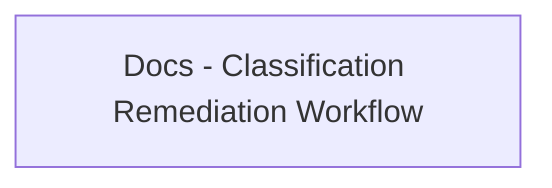

<!-- Generated by docs.api.reference; do not edit. -->
# Docs - Classification Remediation Workflow

[API index](index.md) | [Definition schema](schema.md)

| Field | Value |
| --- | --- |
| ID | `docs.classification.remediation-workflow.template` |
| Source | `14_templates/docs.classification.template.yaml` |
| Tags | documentation, template, classification |

Canonical body of `18_docs/classification_remediation_workflow.md`. Pure
static content owned by this YAML definition so the committed `.md` file
can be regenerated cleanly and drift is caught by `--mode=check`.

## Relationships

| Relation | Definitions |
| --- | --- |
| Extends | - |
| Mixins | - |
| Children | - |
| Mixin consumers | - |
| Modules | - |

## Declared API

### Inputs

| Name | Type | Required | Default | Description |
| --- | --- | --- | --- | --- |
| - | - | - | - | No locally declared inputs. |

### Variables

| Name | YAML Type | Value / Template | Description |
| --- | --- | --- | --- |
| - | - | - | No locally declared variables. |

### Run Operations

_No locally declared run operations._

### Teardown Operations

_No locally declared teardown operations._

## Resolved API

### Effective Inputs

| Name | Type | Required | Default | Origin |
| --- | --- | --- | --- | --- |
| - | - | - | - | No effective inputs. |

### Effective Variables

| Name | Value / Template | Origin |
| --- | --- | --- |
| - | - | No effective variables. |

### Effective Lifecycle

| Phase | Operation | Origin |
| --- | --- | --- |
| - | - | No effective lifecycle operations. |
