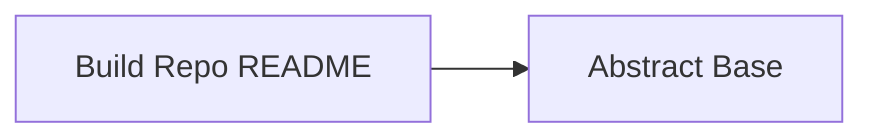

<!-- Generated by docs.api.reference; do not edit. -->
# Build Repo README

[API index](index.md) | [Definition schema](schema.md)

| Field | Value |
| --- | --- |
| ID | `docs.readme.generate.workflow` |
| Source | `06_workflows/docs.readme.generate.workflow.yaml` |
| Tags | documentation, workflow |

Reads `pyproject.toml`, prepares the tagline / bucket / CLI context, and
renders `docs.readme.template` to `README.md` at the repo root. The
bucket list is the union of `[tool.setuptools.package-dir]` (importable
buckets) and `[tool.localfabric.workspace_manifest].excluded_buckets`,
ordered alphabetically; descriptions come from
`[tool.localfabric.workspace_descriptions]`.

Honors `mode: check` so CI can detect drift — identical contract to
`docs.api.reference`.


## Relationships

| Relation | Definitions |
| --- | --- |
| Extends | [Abstract Base](stdlib.base.definition.md) |
| Mixins | - |
| Children | - |
| Mixin consumers | - |
| Modules | `../14_templates/docs.readme.template.yaml` |




## Declared API

### Inputs

| Name | Type | Required | Default | Description |
| --- | --- | --- | --- | --- |
| `repo_root` | `string` | no | `{{ env.cwd }}` | Absolute path to the repository root (cwd by default). |
| `mode` | `string` | no | `write` | Either `write` to regenerate README.md or `check` to verify. |


### Variables

| Name | YAML Type | Value / Template | Description |
| --- | --- | --- | --- |
| - | - | - | No locally declared variables. |


### Run Operations

#### Parse pyproject.toml and stash context

_No operation description provided._

```python
import json
import os
import sys
import tomllib
from pathlib import Path

repo_root = Path("{{ repo_root }}").resolve()
cfg = tomllib.loads((repo_root / "pyproject.toml").read_text(encoding="utf-8"))

project_tagline = f"**{cfg['project']['description']}**"

package_dir = cfg["tool"]["setuptools"]["package-dir"]
manifest = cfg["tool"]["localfabric"]["workspace_manifest"]
descriptions = cfg["tool"]["localfabric"]["workspace_descriptions"]
bucket_to_import = {path.split("/", 1)[0]: alias for alias, path in package_dir.items()}
all_buckets = sorted(set(bucket_to_import) | set(manifest["excluded_buckets"]))
missing = [b for b in all_buckets if b not in descriptions]
if missing:
    raise SystemExit(
        f"[tool.localfabric.workspace_descriptions] missing entries for: {missing}"
    )
buckets = [
    {
        "bucket": b,
        "description": descriptions[b],
        "import_name": bucket_to_import.get(b, ""),
    }
    for b in all_buckets
]

scripts = cfg.get("project", {}).get("scripts", {})
cli_commands = [
    {"name": name, "entry_point": scripts[name]} for name in sorted(scripts)
]

state_file = os.environ["STATE_FILE"]
with open(state_file, "w", encoding="utf-8") as fh:
    json.dump({
        "readme_tagline": project_tagline,
        "readme_buckets": buckets,
        "readme_cli_commands": cli_commands,
        "readme_target": str(repo_root / "README.md"),
    }, fh)

```

#### Render README.md

_No operation description provided._

```render
render:
  definition: docs.readme.template
  arguments:
    project_tagline: '{{ readme_tagline }}'
    buckets: '{{ readme_buckets }}'
    cli_commands: '{{ readme_cli_commands }}'
  target_path: '{{ readme_target }}'
  mode: '{{ mode }}'
```

### Teardown Operations

_No locally declared teardown operations._

## Resolved API

### Effective Inputs

| Name | Type | Required | Default | Origin |
| --- | --- | --- | --- | --- |
| `repo_root` | `string` | no | `{{ env.cwd }}` | [Build Repo README](docs.readme.generate.workflow.definition.md) |
| `mode` | `string` | no | `write` | [Build Repo README](docs.readme.generate.workflow.definition.md) |


### Effective Variables

| Name | Value / Template | Origin |
| --- | --- | --- |
| `system_log_format` | `[{{ entity_id }} \| {{ runtime.version }}]` | [Abstract Base](stdlib.base.definition.md) |


### Effective Lifecycle

| Phase | Operation | Origin |
| --- | --- | --- |
| Run | `python` | [Build Repo README](docs.readme.generate.workflow.definition.md) |
| Run | `render` | [Build Repo README](docs.readme.generate.workflow.definition.md) |
