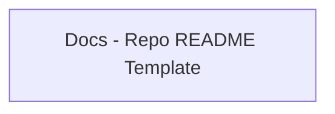

<!-- Generated by docs.api.reference; do not edit. -->
# Docs - Repo README Template
[API index](index.md) | [Definition schema](schema.md)
| Field | Value |
| --- | --- |
| ID | `docs.readme.template` |
| Source | `19_templates/docs.readme.template.yaml` |
| Tags | documentation, template |
Markdown template for the repo-root README.md. Static prose plus five
data-driven sections rendered from `pyproject.toml`: the project tagline,
the bucket table, the Python alias map (top-level packages and their
immediate subpackages), the console-script table, and the optional
dependency groups.
Marker pairs (`<!-- NAME_START -->` / `<!-- NAME_END -->`) wrap each
generated region so readers can locate the boundaries — the
regeneration source of truth is this YAML, not the markers.

## Relationships
| Relation | Definitions |
| --- | --- |
| Extends | - |
| Mixins | - |
| Children | - |
| Mixin consumers | - |
| Modules | - |

## Declared API

### Inputs
| Name | Type | Required | Default | Description |
| --- | --- | --- | --- | --- |
| `project_tagline` | `string` | yes | `-` | Bold one-line tagline (from `[project].description`). |
| `buckets` | `array` | yes | `-` | Ordered bucket descriptors. Each entry has `bucket` (the directory
name like `01_interfaces`), `description`, and `import_name` (the
clean Python alias, or `""` when the bucket isn't importable).
 |
| `python_aliases` | `array` | yes | `-` | Top-level Python aliases derived from `[tool.setuptools].packages`.
Each entry has `alias`, `bucket`, and `children` — where each
child has `name` (immediate subpackage) and `subitems` (its own
immediate subpackages).
 |
| `cli_commands` | `array` | yes | `-` | Console script entries. Each has `name` and `entry_point` mirroring
`[project.scripts]` in `pyproject.toml`.
 |
| `optional_groups` | `array` | yes | `-` | Extras from `[project.optional-dependencies]`. Each entry has
`name` and `packages` (list of requirement strings).
 |

### Variables
| Name | YAML Type | Value / Template | Description |
| --- | --- | --- | --- |
| - | - | - | No locally declared variables. |

### Run Operations
_No locally declared run operations._
### Teardown Operations
_No locally declared teardown operations._
## Resolved API

### Effective Inputs
| Name | Type | Required | Default | Origin |
| --- | --- | --- | --- | --- |
| `project_tagline` | `string` | yes | `-` | [Docs - Repo README Template](docs.readme.template.definition.md) |
| `buckets` | `array` | yes | `-` | [Docs - Repo README Template](docs.readme.template.definition.md) |
| `python_aliases` | `array` | yes | `-` | [Docs - Repo README Template](docs.readme.template.definition.md) |
| `cli_commands` | `array` | yes | `-` | [Docs - Repo README Template](docs.readme.template.definition.md) |
| `optional_groups` | `array` | yes | `-` | [Docs - Repo README Template](docs.readme.template.definition.md) |

### Effective Variables
| Name | Value / Template | Origin |
| --- | --- | --- |
| - | - | No effective variables. |

### Effective Lifecycle
| Phase | Operation | Origin |
| --- | --- | --- |
| - | - | No effective lifecycle operations. |
