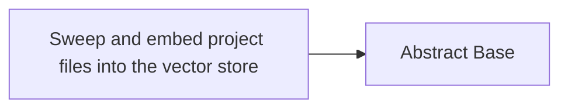

<!-- Generated by docs.api.reference; do not edit. -->
# Sweep and embed project files into the vector store
[API index](index.md) | [Definition schema](schema.md)
| Field | Value |
| --- | --- |
| ID | `embeddings.sweep.workflow` |
| Source | `06_workflows/embeddings.sweep.workflow.yaml` |
| Tags | workflow |
Walk *source_dir*, chunk every indexable file, generate embeddings via the
local Ollama harness, upsert changed chunks into LanceDB, and persist an
MD5 manifest so unchanged files are skipped on subsequent runs.
Equivalent to the old ``lib.embeddings.sweep.sweep()`` function, but
expressed as a YAML workflow so it can be scheduled, composed, and
dry-run through the standard YAML runtime.

## Relationships
| Relation | Definitions |
| --- | --- |
| Extends | [Abstract Base](stdlib.base.definition.md) |
| Mixins | - |
| Children | - |
| Mixin consumers | - |
| Modules | - |



## Declared API

### Inputs
| Name | Type | Required | Default | Description |
| --- | --- | --- | --- | --- |
| `source_dir` | `string` | no | `` | Root directory to sweep. Defaults to the repo root. |
| `manifest_path` | `string` | no | `` | Path to the JSON manifest file that tracks file hashes. Defaults to 14_data/cache/embeddings/sweep_manifest.json under the repo root. |
| `force` | `boolean` | no | `False` | Re-embed all files even if unchanged. |
| `clear` | `boolean` | no | `False` | Drop the entire vector store before sweeping. |
| `dry_run` | `boolean` | no | `False` | Print what would be processed without writing to the store. |
| `verbose` | `boolean` | no | `False` | Print per-chunk progress. |


### Variables
| Name | YAML Type | Value / Template | Description |
| --- | --- | --- | --- |
| - | - | - | No locally declared variables. |


### Run Operations
#### Python
_No operation description provided._
```python
import os
import time
from core.environment import REPO_ROOT as _REPO_ROOT
from drivers.vector.lancedb_driver import LanceStore
from lib.embeddings.chunker import chunk_file
from lib.embeddings.embedder import Embedder, EmbedderUnavailable
from lib.embeddings.sweep import (
    collect_files,
    file_hash,
    load_manifest,
    save_manifest,
)

# ------------------------------------------------------------------
# Resolve inputs
# ------------------------------------------------------------------
_target_dir = source_dir if source_dir else str(_REPO_ROOT)
_manifest_path = manifest_path if manifest_path else os.path.join(
    str(_REPO_ROOT), "14_data", "cache", "embeddings", "sweep_manifest.json"
)
print(f"[Sweep] Target: {_target_dir}")
print(
    f"[Sweep] Mode: {'dry-run' if dry_run else 'live'}"
    + (" | force-reindex" if force else "")
    + (" | clear-store" if clear else "")
)

# ------------------------------------------------------------------
# Initialise
# ------------------------------------------------------------------
t0 = time.time()
store = LanceStore()
embedder = Embedder()
manifest = load_manifest(_manifest_path)
if clear and not dry_run:
    store.clear()
    manifest = {}
    print("[Sweep] Store cleared.")
files = collect_files(_target_dir)
print(f"[Sweep] Found {len(files)} indexable files.")
stats = {
    "files_scanned": len(files),
    "files_changed": 0,
    "chunks_added": 0,
    "skipped": 0,
    "errors": 0,
    "elapsed_sec": 0.0,
}

# ------------------------------------------------------------------
# Main loop: hash → skip-if-unchanged → chunk → embed → upsert
# ------------------------------------------------------------------
for path in files:
    try:
        fhash = file_hash(path)
    except OSError as exc:
        print(f"[Sweep] ERROR reading {path}: {exc}")
        stats["errors"] += 1
        continue
    rel = os.path.relpath(path, _target_dir)
    if not force and manifest.get(path) == fhash:
        stats["skipped"] += 1
        if verbose:
            print(f"[Sweep] SKIP (unchanged): {rel}")
        continue
    stats["files_changed"] += 1
    print(f"[Sweep] Processing: {rel}")
    if dry_run:
        chunks = chunk_file(path)
        print(f"  → would embed {len(chunks)} chunks")
        continue
    chunks = chunk_file(path)
    if not chunks:
        manifest[path] = fhash
        continue
    if manifest.get(path):
        store.delete_source(os.path.abspath(path))
    try:
        chunks = embedder.embed_chunks(chunks, verbose=verbose)
    except EmbedderUnavailable as exc:
        print(f"[Sweep] ABORT — Embedder unavailable: {exc}")
        print("[Sweep] Make sure Ollama is running: ollama serve")
        stats["elapsed_sec"] = time.time() - t0
        break
    added = store.add(chunks)
    stats["chunks_added"] += added
    manifest[path] = fhash
    if verbose:
        print(f"  → added {added} chunks")

# ------------------------------------------------------------------
# Finalise
# ------------------------------------------------------------------
if not dry_run:
    save_manifest(_manifest_path, manifest)
    embedder.flush_cache()
stats["elapsed_sec"] = round(time.time() - t0, 2)
print("\n" + "=" * 50)
print("[Sweep] Summary")
print(f"  Files scanned : {stats['files_scanned']}")
print(f"  Files changed : {stats['files_changed']}")
print(f"  Chunks added  : {stats['chunks_added']}")
print(f"  Skipped       : {stats['skipped']}")
print(f"  Errors        : {stats['errors']}")
print(f"  Elapsed       : {stats['elapsed_sec']}s")
print("=" * 50)
```
### Teardown Operations
_No locally declared teardown operations._
## Resolved API

### Effective Inputs
| Name | Type | Required | Default | Origin |
| --- | --- | --- | --- | --- |
| `source_dir` | `string` | no | `` | [Sweep and embed project files into the vector store](embeddings.sweep.workflow.definition.md) |
| `manifest_path` | `string` | no | `` | [Sweep and embed project files into the vector store](embeddings.sweep.workflow.definition.md) |
| `force` | `boolean` | no | `False` | [Sweep and embed project files into the vector store](embeddings.sweep.workflow.definition.md) |
| `clear` | `boolean` | no | `False` | [Sweep and embed project files into the vector store](embeddings.sweep.workflow.definition.md) |
| `dry_run` | `boolean` | no | `False` | [Sweep and embed project files into the vector store](embeddings.sweep.workflow.definition.md) |
| `verbose` | `boolean` | no | `False` | [Sweep and embed project files into the vector store](embeddings.sweep.workflow.definition.md) |


### Effective Variables
| Name | Value / Template | Origin |
| --- | --- | --- |
| `system_log_format` | `[{{ entity_id }} \| {{ runtime.version }}]` | [Abstract Base](stdlib.base.definition.md) |


### Effective Lifecycle
| Phase | Operation | Origin |
| --- | --- | --- |
| Run | `python` | [Sweep and embed project files into the vector store](embeddings.sweep.workflow.definition.md) |
