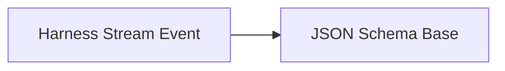

<!-- Generated by docs.api.reference; do not edit. -->
# Harness Stream Event

[API index](index.md) | [Definition schema](schema.md)

| Field | Value |
| --- | --- |
| ID | `harness.stream_event.schema` |
| Source | `01_schemas/harness.stream_event.schema.yaml` |
| Tags | schema, harness |

Single event emitted by a harness's stream() method. Modeled loosely on the
OpenAI/Anthropic streaming shape so adapters can normalize.

## Relationships

| Relation | Definitions |
| --- | --- |
| Extends | [JSON Schema Base](schemas.base.definition.md) |
| Mixins | - |
| Children | - |
| Mixin consumers | - |
| Modules | - |

## Declared API

### Inputs

| Name | Type | Required | Default | Description |
| --- | --- | --- | --- | --- |
| - | - | - | - | No locally declared inputs. |

### Variables

| Name | YAML Type | Value / Template | Description |
| --- | --- | --- | --- |
| - | - | - | No locally declared variables. |

### Run Operations

_No locally declared run operations._

### Teardown Operations

_No locally declared teardown operations._

## Resolved API

### Effective Inputs

| Name | Type | Required | Default | Origin |
| --- | --- | --- | --- | --- |
| - | - | - | - | No effective inputs. |

### Effective Variables

| Name | Value / Template | Origin |
| --- | --- | --- |
| - | - | No effective variables. |

### Effective Lifecycle

| Phase | Operation | Origin |
| --- | --- | --- |
| - | - | No effective lifecycle operations. |
