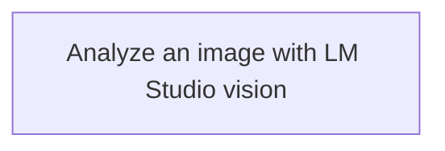

<!-- Generated by docs.api.reference; do not edit. -->
# Analyze an image with LM Studio vision
[API index](index.md) | [Definition schema](schema.md)
| Field | Value |
| --- | --- |
| ID | `image.analyze.example` |
| Source | `<raw>` |
| Tags | example, vision |
Boots LM Studio (`lms server start` when needed, via the harness) and
runs the four `image.vision.*.lmstudio-gemma4.task.md` prompts against
the supplied image. Vision inference is delegated to
`google/gemma-4-e4b` served by LM Studio. The four reports are
concatenated into a single Markdown report written to
`data/outputs/images/<image-stem>.md` and the path is published to the
workflow scope as `report_path`.

Prereqs: `uv sync --extra llm` (for the openai SDK the LM Studio harness
uses), the `lms` CLI on PATH, and `google/gemma-4-e4b` loaded in LM
Studio. Run with `uv run localfabric-md 15_examples/image.analyze.example.md --image_path=<path>`.


## Relationships
| Relation | Definitions |
| --- | --- |
| Extends | - |
| Mixins | - |
| Children | - |
| Mixin consumers | - |
| Modules | - |



## Declared API

### Inputs
| Name | Type | Required | Default | Description |
| --- | --- | --- | --- | --- |
| `image_path` | `string` | yes | `-` | - |


### Variables
| Name | YAML Type | Value / Template | Description |
| --- | --- | --- | --- |
| `body` | `str` | ` # Analyze Image  ```python {id: start-lmstudio} import sys  from harnesses.lmstudio import LMStudioHarness  harness = LMStudioHarness({"manage_server": True}) status = harness.start() sys.stderr.write(f"[lmstudio] {status.state}: {status.detail}\n") ```  ```python {id: run-vision-prompts} import json import os import sys import time from pathlib import Path  from core.environment import REPO_ROOT, data from core.runtimes.markdown import MarkdownHarness  prompts_dir = REPO_ROOT / "12_prompts" tasks = ["overview", "layout", "style", "visible-text"]  image_path = Path("{{ image_path }}") output_dir = data("outputs") / "images" output_dir.mkdir(parents=True, exist_ok=True) report_path = output_dir / f"{image_path.stem}.md"  harness = MarkdownHarness() sections: list[str] = [f"# Image report — `{image_path.name}`", ""] for task in tasks:     prompt = prompts_dir / f"image.vision.{task}.lmstudio-gemma4.task.md"     sys.stderr.write(f"[vision] {task}…")     sys.stderr.flush()     t0 = time.monotonic()     result = harness.execute(prompt, {"image_path": str(image_path)})     sys.stderr.write(f" {time.monotonic() - t0:.1f}s\n")     sections.append(result.text.strip())     sections.append("")  report_path.write_text("\n".join(sections), encoding="utf-8") sys.stderr.write(f"[report] wrote {report_path}\n")  with open(os.environ["STATE_FILE"], "w", encoding="utf-8") as handle:     json.dump({"report_path": str(report_path)}, handle) ``` ` | - |


### Run Operations
#### Python
_No operation description provided._
```python
import sys

from harnesses.lmstudio import LMStudioHarness

harness = LMStudioHarness({"manage_server": True})
status = harness.start()
sys.stderr.write(f"[lmstudio] {status.state}: {status.detail}\n")

```
#### Python
_No operation description provided._
```python
import json
import os
import sys
import time
from pathlib import Path

from core.environment import REPO_ROOT, data
from core.runtimes.markdown import MarkdownHarness

prompts_dir = REPO_ROOT / "12_prompts"
tasks = ["overview", "layout", "style", "visible-text"]

image_path = Path("{{ image_path }}")
output_dir = data("outputs") / "images"
output_dir.mkdir(parents=True, exist_ok=True)
report_path = output_dir / f"{image_path.stem}.md"

harness = MarkdownHarness()
sections: list[str] = [f"# Image report — `{image_path.name}`", ""]
for task in tasks:
    prompt = prompts_dir / f"image.vision.{task}.lmstudio-gemma4.task.md"
    sys.stderr.write(f"[vision] {task}…")
    sys.stderr.flush()
    t0 = time.monotonic()
    result = harness.execute(prompt, {"image_path": str(image_path)})
    sys.stderr.write(f" {time.monotonic() - t0:.1f}s\n")
    sections.append(result.text.strip())
    sections.append("")

report_path.write_text("\n".join(sections), encoding="utf-8")
sys.stderr.write(f"[report] wrote {report_path}\n")

with open(os.environ["STATE_FILE"], "w", encoding="utf-8") as handle:
    json.dump({"report_path": str(report_path)}, handle)

```
### Teardown Operations
_No locally declared teardown operations._
## Resolved API

### Effective Inputs
| Name | Type | Required | Default | Origin |
| --- | --- | --- | --- | --- |
| `image_path` | `string` | yes | `-` | [Analyze an image with LM Studio vision](image.analyze.example.definition.md) |


### Effective Variables
| Name | Value / Template | Origin |
| --- | --- | --- |
| `body` | ` # Analyze Image  ```python {id: start-lmstudio} import sys  from harnesses.lmstudio import LMStudioHarness  harness = LMStudioHarness({"manage_server": True}) status = harness.start() sys.stderr.write(f"[lmstudio] {status.state}: {status.detail}\n") ```  ```python {id: run-vision-prompts} import json import os import sys import time from pathlib import Path  from core.environment import REPO_ROOT, data from core.runtimes.markdown import MarkdownHarness  prompts_dir = REPO_ROOT / "12_prompts" tasks = ["overview", "layout", "style", "visible-text"]  image_path = Path("{{ image_path }}") output_dir = data("outputs") / "images" output_dir.mkdir(parents=True, exist_ok=True) report_path = output_dir / f"{image_path.stem}.md"  harness = MarkdownHarness() sections: list[str] = [f"# Image report — `{image_path.name}`", ""] for task in tasks:     prompt = prompts_dir / f"image.vision.{task}.lmstudio-gemma4.task.md"     sys.stderr.write(f"[vision] {task}…")     sys.stderr.flush()     t0 = time.monotonic()     result = harness.execute(prompt, {"image_path": str(image_path)})     sys.stderr.write(f" {time.monotonic() - t0:.1f}s\n")     sections.append(result.text.strip())     sections.append("")  report_path.write_text("\n".join(sections), encoding="utf-8") sys.stderr.write(f"[report] wrote {report_path}\n")  with open(os.environ["STATE_FILE"], "w", encoding="utf-8") as handle:     json.dump({"report_path": str(report_path)}, handle) ``` ` | [Analyze an image with LM Studio vision](image.analyze.example.definition.md) |


### Effective Lifecycle
| Phase | Operation | Origin |
| --- | --- | --- |
| Run | `python` | [Analyze an image with LM Studio vision](image.analyze.example.definition.md) |
| Run | `python` | [Analyze an image with LM Studio vision](image.analyze.example.definition.md) |
