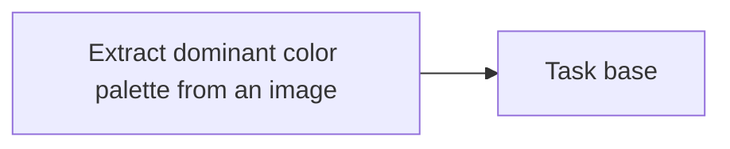

<!-- Generated by docs.api.reference; do not edit. -->
# Extract dominant color palette from an image
[API index](index.md) | [Definition schema](schema.md)
| Field | Value |
| --- | --- |
| ID | `image.color.dominant.task` |
| Source | `07_tasks/image.color.dominant.task.yaml` |
| Tags | task |
Return color analysis for an image: dominant palette, brightness,
contrast, saturation, and dominant hex color.
Wraps lib.image.color.extract_color.


## Relationships
| Relation | Definitions |
| --- | --- |
| Extends | [Task base](task.base.definition.md) |
| Mixins | - |
| Children | - |
| Mixin consumers | - |
| Modules | - |



## Declared API

### Inputs
| Name | Type | Required | Default | Description |
| --- | --- | --- | --- | --- |
| `path` | `string` | yes | `-` | Path to the image file. |
| `n_colors` | `number` | no | `6` | Number of palette colors to extract. |


### Variables
| Name | YAML Type | Value / Template | Description |
| --- | --- | --- | --- |
| - | - | - | No locally declared variables. |


### Run Operations
#### Python
_No operation description provided._
```python
import json, os
from pathlib import Path
from lib.image.color import extract_color
result = extract_color(Path("{{ path }}"), n_colors={{ n_colors }})
with open(os.environ["STATE_FILE"], "w") as f:
    json.dump(result, f)
```
### Teardown Operations
_No locally declared teardown operations._
## Resolved API

### Effective Inputs
| Name | Type | Required | Default | Origin |
| --- | --- | --- | --- | --- |
| `path` | `string` | yes | `-` | [Extract dominant color palette from an image](image.color.dominant.task.definition.md) |
| `n_colors` | `number` | no | `6` | [Extract dominant color palette from an image](image.color.dominant.task.definition.md) |


### Effective Variables
| Name | Value / Template | Origin |
| --- | --- | --- |
| `system_log_format` | `[{{ entity_id }} \| {{ runtime.version }}]` | [Abstract Base](stdlib.base.definition.md) |


### Effective Lifecycle
| Phase | Operation | Origin |
| --- | --- | --- |
| Run | `python` | [Extract dominant color palette from an image](image.color.dominant.task.definition.md) |
