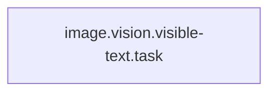

<!-- Generated by docs.api.reference; do not edit. -->
# image.vision.visible-text.task
[API index](index.md) | [Definition schema](schema.md)
| Field | Value |
| --- | --- |
| ID | `image.vision.visible-text.task` |
| Source | `<raw>` |
| Tags | - |
_No description provided._

## Relationships
| Relation | Definitions |
| --- | --- |
| Extends | - |
| Mixins | - |
| Children | - |
| Mixin consumers | - |
| Modules | - |

## Declared API

### Inputs
| Name | Type | Required | Default | Description |
| --- | --- | --- | --- | --- |
| - | - | - | - | No locally declared inputs. |

### Variables
| Name | YAML Type | Value / Template | Description |
| --- | --- | --- | --- |
| `body` | `str` | ` Extract only the exact visible text from the image. Return exactly this markdown shape:  ## Text  - \<exact visible text line 1> - \<exact visible text line 2> - \<exact visible text line 3>   Rules: - Maximum 8 bullets. - Preserve exact wording and line breaks as much as possible. - Do not summarize. - Do not explain the text. - Do not repeat any extracted line. - If nothing is readable, return one bullet: "No readable text." - No placeholders except the angle-bracket examples in this template. - End with <END>. ` | - |

### Run Operations
_No locally declared run operations._
### Teardown Operations
_No locally declared teardown operations._
## Resolved API

### Effective Inputs
| Name | Type | Required | Default | Origin |
| --- | --- | --- | --- | --- |
| - | - | - | - | No effective inputs. |

### Effective Variables
| Name | Value / Template | Origin |
| --- | --- | --- |
| `body` | ` Extract only the exact visible text from the image. Return exactly this markdown shape:  ## Text  - \<exact visible text line 1> - \<exact visible text line 2> - \<exact visible text line 3>   Rules: - Maximum 8 bullets. - Preserve exact wording and line breaks as much as possible. - Do not summarize. - Do not explain the text. - Do not repeat any extracted line. - If nothing is readable, return one bullet: "No readable text." - No placeholders except the angle-bracket examples in this template. - End with <END>. ` | [image.vision.visible-text.task](image.vision.visible-text.task.definition.md) |

### Effective Lifecycle
| Phase | Operation | Origin |
| --- | --- | --- |
| - | - | No effective lifecycle operations. |
