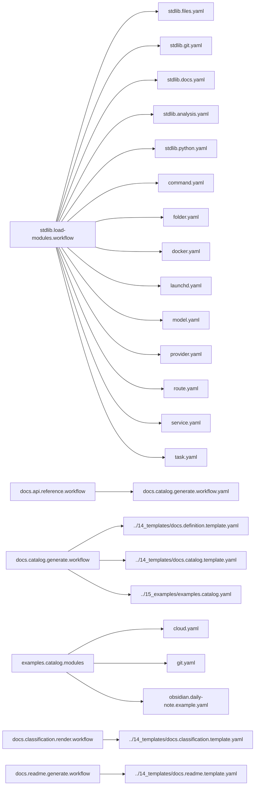

<!-- Generated by docs.api.reference; do not edit. -->
# YAML API Reference

This reference is generated by the `docs.api.reference.workflow` YAML workflow. It describes the
standard library, runnable examples, and the documentation workflow itself.

Regenerate or verify committed output from `06_workflows/yaml/`:

```bash
python interpreter.py 06_workflows/docs.api.reference.workflow.yaml docs.api.reference.workflow --output_dir=docs --mode=write
python interpreter.py 06_workflows/docs.api.reference.workflow.yaml docs.api.reference.workflow --output_dir=docs --mode=check
```

See the [definition authoring schema](schema.md) for metadata and composition fields.

## Definitions

| Definition | ID | Source | Tags |
| --- | --- | --- | --- |
| [Abstract Base](stdlib.base.definition.md) | `stdlib.base` | `02_core/runtimes/yaml/definitions/stdlib.yaml` | core, abstract |
| [Load Standard Library Modules](stdlib.load-modules.workflow.definition.md) | `stdlib.load-modules.workflow` | `02_core/runtimes/yaml/definitions/stdlib.yaml` | core, modules |
| [Run Command](stdlib.run-command.task.definition.md) | `stdlib.run-command.task` | `02_core/runtimes/yaml/definitions/stdlib.yaml` | shell |
| [Clean Workspace](stdlib.clean-workspace.task.definition.md) | `stdlib.clean-workspace.task` | `02_core/runtimes/yaml/definitions/stdlib.yaml` | files, destructive |
| [Logger](stdlib.logger.task.definition.md) | `stdlib.logger.task` | `02_core/runtimes/yaml/definitions/stdlib.yaml` | logging |
| [Write Text File](stdlib.files.write-text.task.definition.md) | `stdlib.files.write-text.task` | `02_core/runtimes/yaml/definitions/stdlib.files.yaml` | files, templates |
| [Create Directory](stdlib.files.create-directory.task.definition.md) | `stdlib.files.create-directory.task` | `02_core/runtimes/yaml/definitions/stdlib.files.yaml` | files |
| [Write Text File (input form)](stdlib.files.write.task.definition.md) | `stdlib.files.write.task` | `02_core/runtimes/yaml/definitions/stdlib.files.yaml` | files, templates |
| [Initialize Current Git Workspace](stdlib.git.init-current-workspace.task.definition.md) | `stdlib.git.init-current-workspace.task` | `02_core/runtimes/yaml/definitions/stdlib.git.yaml` | git |
| [Write Python Gitignore](stdlib.git.gitignore-python.task.definition.md) | `stdlib.git.gitignore-python.task` | `02_core/runtimes/yaml/definitions/stdlib.git.yaml` | git, files, templates |
| [Create GitHub Repository](stdlib.git.create-github-repository.task.definition.md) | `stdlib.git.create-github-repository.task` | `02_core/runtimes/yaml/definitions/stdlib.git.yaml` | git, github |
| [Prune Generated Definition Pages](stdlib.docs.prune-definition-pages.task.definition.md) | `stdlib.docs.prune-definition-pages.task` | `02_core/runtimes/yaml/definitions/stdlib.docs.yaml` | documentation, files |
| [Analysis Base](stdlib.analysis.base.definition.md) | `stdlib.analysis.base` | `02_core/runtimes/yaml/definitions/stdlib.analysis.yaml` | analysis, abstract |
| [Write Analysis Snapshot](stdlib.analysis.snapshot.task.definition.md) | `stdlib.analysis.snapshot.task` | `02_core/runtimes/yaml/definitions/stdlib.analysis.yaml` | analysis, intelligence |
| [Verify Definition References](stdlib.analysis.verify-references.task.definition.md) | `stdlib.analysis.verify-references.task` | `02_core/runtimes/yaml/definitions/stdlib.analysis.yaml` | analysis, validation |
| [Python Barrel - __init__.py Template](stdlib.python.barrel.template.definition.md) | `stdlib.python.barrel.template` | `02_core/runtimes/yaml/definitions/stdlib.python.yaml` | python, template |
| [Generate Python Barrel](stdlib.python.barrel.task.definition.md) | `stdlib.python.barrel.task` | `02_core/runtimes/yaml/definitions/stdlib.python.yaml` | python, generator |
| [Abstract Command Base](command.base.definition.md) | `command.base` | `02_core/runtimes/yaml/definitions/command.yaml` | command, abstract |
| [Run Task](command.task.run.command.definition.md) | `command.task.run.command` | `02_core/runtimes/yaml/definitions/command.yaml` | command |
| [Run a Service Lifecycle Action](command.service.action.command.definition.md) | `command.service.action.command` | `02_core/runtimes/yaml/definitions/command.yaml` | command |
| [Route an Intent through the Router](command.route.command.definition.md) | `command.route.command` | `02_core/runtimes/yaml/definitions/command.yaml` | command |
| [Folder Scaffold Base](folder.base.definition.md) | `folder.base` | `02_core/runtimes/yaml/definitions/folder.yaml` | folder, abstract |
| [Dockerfile Mixin](dockerfile.mixin.definition.md) | `dockerfile.mixin` | `02_core/runtimes/yaml/definitions/docker.yaml` | docker, dockerfile, abstract |
| [Docker Compose Mixin](compose.mixin.definition.md) | `compose.mixin` | `02_core/runtimes/yaml/definitions/docker.yaml` | docker, compose, abstract |
| [Docker Service (Compose + Dockerfile)](docker.base.definition.md) | `docker.base` | `02_core/runtimes/yaml/definitions/docker.yaml` | docker, abstract |
| [Build Docker Image](docker.build.task.definition.md) | `docker.build.task` | `02_core/runtimes/yaml/definitions/docker.yaml` | docker, build |
| [Docker Compose Up](compose.up.task.definition.md) | `compose.up.task` | `02_core/runtimes/yaml/definitions/docker.yaml` | docker, compose, lifecycle |
| [Docker Compose Down](compose.down.task.definition.md) | `compose.down.task` | `02_core/runtimes/yaml/definitions/docker.yaml` | docker, compose, lifecycle |
| [Docker Compose Status](compose.status.task.definition.md) | `compose.status.task` | `02_core/runtimes/yaml/definitions/docker.yaml` | docker, compose, lifecycle |
| [Docker Compose Logs](compose.logs.task.definition.md) | `compose.logs.task` | `02_core/runtimes/yaml/definitions/docker.yaml` | docker, compose, lifecycle |
| [Scaffold All Docker Services](docker.generate-all.workflow.definition.md) | `docker.generate-all.workflow` | `02_core/runtimes/yaml/definitions/docker.yaml` | docker, workflow |
| [launchd Job Base](launchd.base.definition.md) | `launchd.base` | `02_core/runtimes/yaml/definitions/launchd.yaml` | launchd, abstract |
| [Generate launchd Plists](launchd.generate-plist.workflow.definition.md) | `launchd.generate-plist.workflow` | `02_core/runtimes/yaml/definitions/launchd.yaml` | launchd, workflow |
| [launchd Lifecycle Base](launchd.lifecycle.base.definition.md) | `launchd.lifecycle.base` | `02_core/runtimes/yaml/definitions/launchd.yaml` | launchd, lifecycle, abstract |
| [Install LaunchAgent](launchd.install.task.definition.md) | `launchd.install.task` | `02_core/runtimes/yaml/definitions/launchd.yaml` | launchd, lifecycle |
| [Uninstall LaunchAgent](launchd.uninstall.task.definition.md) | `launchd.uninstall.task` | `02_core/runtimes/yaml/definitions/launchd.yaml` | launchd, lifecycle |
| [Enable LaunchAgent](launchd.enable.task.definition.md) | `launchd.enable.task` | `02_core/runtimes/yaml/definitions/launchd.yaml` | launchd, lifecycle |
| [Disable LaunchAgent](launchd.disable.task.definition.md) | `launchd.disable.task` | `02_core/runtimes/yaml/definitions/launchd.yaml` | launchd, lifecycle |
| [Start LaunchAgent](launchd.start.task.definition.md) | `launchd.start.task` | `02_core/runtimes/yaml/definitions/launchd.yaml` | launchd, lifecycle |
| [Stop LaunchAgent](launchd.stop.task.definition.md) | `launchd.stop.task` | `02_core/runtimes/yaml/definitions/launchd.yaml` | launchd, lifecycle |
| [Print LaunchAgent Status](launchd.status.task.definition.md) | `launchd.status.task` | `02_core/runtimes/yaml/definitions/launchd.yaml` | launchd, lifecycle |
| [LLM Model Record](model.base.definition.md) | `model.base` | `02_core/runtimes/yaml/definitions/model.yaml` | model, abstract |
| [LLM Provider Record](provider.base.definition.md) | `provider.base` | `02_core/runtimes/yaml/definitions/provider.yaml` | provider, abstract |
| [Routable Definition Base](route.base.definition.md) | `route.base` | `02_core/runtimes/yaml/definitions/route.yaml` | route, abstract |
| [Echo Route (smoke test)](route.echo.route.definition.md) | `route.echo.route` | `02_core/runtimes/yaml/definitions/route.yaml` | route |
| [Service Abstraction Base](service.base.definition.md) | `service.base` | `02_core/runtimes/yaml/definitions/service.yaml` | service, abstract |
| [Docker Backend Action Map](service.docker.mixin.definition.md) | `service.docker.mixin` | `02_core/runtimes/yaml/definitions/service.yaml` | service, docker, abstract |
| [Launchd Backend Action Map](service.launchd.mixin.definition.md) | `service.launchd.mixin` | `02_core/runtimes/yaml/definitions/service.yaml` | service, launchd, abstract |
| [Ollama Service (launchd backend)](service.ollama.service.definition.md) | `service.ollama.service` | `02_core/runtimes/yaml/definitions/service.yaml` | service, launchd |
| [Caffeinate Service (launchd backend)](service.caffeinate.service.definition.md) | `service.caffeinate.service` | `02_core/runtimes/yaml/definitions/service.yaml` | service, launchd |
| [LM Studio Service (launchd backend)](service.lm-studio.service.definition.md) | `service.lm-studio.service` | `02_core/runtimes/yaml/definitions/service.yaml` | service, launchd |
| [Postgres Service (docker backend)](service.postgres.service.definition.md) | `service.postgres.service` | `02_core/runtimes/yaml/definitions/service.yaml` | service, docker |
| [Redis Service (docker backend)](service.redis.service.definition.md) | `service.redis.service` | `02_core/runtimes/yaml/definitions/service.yaml` | service, docker |
| [Neo4j Service (docker backend)](service.neo4j.service.definition.md) | `service.neo4j.service` | `02_core/runtimes/yaml/definitions/service.yaml` | service, docker |
| [Task base](task.base.definition.md) | `task.base` | `02_core/runtimes/yaml/definitions/task.yaml` | task, abstract |
| [JSON Schema Base](schemas.base.definition.md) | `schemas.base` | `02_core/runtimes/yaml/definitions/schemas.yaml` | schema, abstract |
| [Generate Schema JSON](schemas.generate-json.workflow.definition.md) | `schemas.generate-json.workflow` | `02_core/runtimes/yaml/definitions/schemas.yaml` | schema, workflow |
| [Classification Audit Finding](audit.classification-finding.schema.definition.md) | `audit.classification-finding.schema` | `01_schemas/audit.classification-finding.schema.yaml` | schema, audit |
| [Dispatch Request Envelope](dispatch.request.schema.definition.md) | `dispatch.request.schema` | `01_schemas/dispatch.request.schema.yaml` | schema, dispatch |
| [Dispatch Response Envelope](dispatch.response.schema.definition.md) | `dispatch.response.schema` | `01_schemas/dispatch.response.schema.yaml` | schema, dispatch |
| [Harness Stream Event](harness.stream-event.schema.definition.md) | `harness.stream-event.schema` | `01_schemas/harness.stream-event.schema.yaml` | schema, harness |
| [Tool Invocation](tool.invocation.schema.definition.md) | `tool.invocation.schema` | `01_schemas/tool.invocation.schema.yaml` | schema, tool |
| [Audit classification boundaries and ownership](audit.classifications.scan.workflow.definition.md) | `audit.classifications.scan.workflow` | `06_workflows/audit.classifications.scan.workflow.yaml` | workflow |
| [Regenerate All Workflows Barrels](barrels.regenerate.workflow.definition.md) | `barrels.regenerate.workflow` | `06_workflows/barrels.regenerate.workflow.yaml` | python, generator, workflow |
| [Regenerate workflows.yaml Bucket Barrels](barrels.regenerate.yaml-runtime.workflow.definition.md) | `barrels.regenerate.yaml-runtime.workflow` | `06_workflows/barrels.regenerate.workflow.yaml` | python, generator, workflow |
| [YAML API Reference Build](docs.api.reference.workflow.definition.md) | `docs.api.reference.workflow` | `06_workflows/docs.api.reference.workflow.yaml` | documentation, workflow |
| [API Documentation Catalog Sources](docs.catalog.generate.workflow.definition.md) | `docs.catalog.generate.workflow` | `06_workflows/docs.catalog.generate.workflow.yaml` | documentation, modules |
| [Docs - Relationship Graph Component](docs.definition.template.component-relationship-graph.definition.md) | `docs.definition.template.component-relationship-graph` | `14_templates/docs.definition.template.yaml` | documentation, template, component |
| [Docs - Definition Page Template](docs.definition.template.definition.definition.md) | `docs.definition.template.definition` | `14_templates/docs.definition.template.yaml` | documentation, template |
| [Docs - Index Page Template](docs.catalog.template.index.definition.md) | `docs.catalog.template.index` | `14_templates/docs.catalog.template.yaml` | documentation, template |
| [Docs - Authoring Schema Page Template](docs.catalog.template.schema.definition.md) | `docs.catalog.template.schema` | `14_templates/docs.catalog.template.yaml` | documentation, template |
| [Example Catalog Modules](examples.catalog.modules.definition.md) | `examples.catalog.modules` | `15_examples/examples.catalog.yaml` | example, modules |
| [Git Information](cloud.mixin.git-info.definition.md) | `cloud.mixin.git-info` | `15_examples/cloud.yaml` | mixin, git, deployment |
| [Timestamp](cloud.mixin.timestamp.definition.md) | `cloud.mixin.timestamp` | `15_examples/cloud.yaml` | mixin, deployment |
| [Cloud Deployer](cloud.deployer.example.definition.md) | `cloud.deployer.example` | `15_examples/cloud.yaml` | example, deployment, cloud |
| [Initialize Git Example](git.init.example.definition.md) | `git.init.example` | `15_examples/git.yaml` | example, git |
| [GitHub Repository Example](git.github.example.definition.md) | `git.github.example` | `15_examples/git.yaml` | example, git, github |
| [Gitignore Template Example](git.gitignore.example.definition.md) | `git.gitignore.example` | `15_examples/git.yaml` | example, git, templates |
| [Obsidian Daily Note Template](obsidian.daily-note.example.definition.md) | `obsidian.daily-note.example` | `15_examples/obsidian.daily-note.example.yaml` | example, obsidian, templates |
| [Render Classification Docs](docs.classification.render.workflow.definition.md) | `docs.classification.render.workflow` | `06_workflows/docs.classification.render.workflow.yaml` | documentation, workflow, classification |
| [Docs - Classification Audit](docs.classification.audit.template.definition.md) | `docs.classification.audit.template` | `14_templates/docs.classification.template.yaml` | documentation, template, classification |
| [Docs - Classification Remediation Workflow](docs.classification.remediation-workflow.template.definition.md) | `docs.classification.remediation-workflow.template` | `14_templates/docs.classification.template.yaml` | documentation, template, classification |
| [Generate Documentation](docs.generate.workflow.definition.md) | `docs.generate.workflow` | `06_workflows/docs.generate.workflow.yaml` | workflow |
| [Build Repo README](docs.readme.generate.workflow.definition.md) | `docs.readme.generate.workflow` | `06_workflows/docs.readme.generate.workflow.yaml` | documentation, workflow |
| [Docs - Repo README Template](docs.readme.template.definition.md) | `docs.readme.template` | `14_templates/docs.readme.template.yaml` | documentation, template |
| [Sweep and embed project files into the vector store](embeddings.sweep.workflow.definition.md) | `embeddings.sweep.workflow` | `06_workflows/embeddings.sweep.workflow.yaml` | workflow |
| [Classify files for audit and remediation](files.classify.workflow.definition.md) | `files.classify.workflow` | `06_workflows/files.classify.workflow.yaml` | workflow |
| [Scan Boundary Violations](audit.boundary-violations.scan.task.definition.md) | `audit.boundary-violations.scan.task` | `07_tasks/audit.boundary-violations.scan.task.yaml` | task |
| [Fetch readable text from a URL or search topic](browser.fetch.text.task.definition.md) | `browser.fetch.text.task` | `07_tasks/browser.fetch.text.task.yaml` | task |
| [Build file classification manifest](classify.manifest.build.task.definition.md) | `classify.manifest.build.task` | `07_tasks/classify.manifest.build.task.yaml` | task |
| [Return broad media class for a path](classify.media.class-for-path.task.definition.md) | `classify.media.class-for-path.task` | `07_tasks/classify.media.class-for-path.task.yaml` | task |
| [Classify a file by media type and destination](classify.media.file.task.definition.md) | `classify.media.file.task` | `07_tasks/classify.media.file.task.yaml` | task |
| [Chunk a file into embeddable text segments](embeddings.chunker.chunk-file.task.definition.md) | `embeddings.chunker.chunk-file.task` | `07_tasks/embeddings.chunker.chunk-file.task.yaml` | task |
| [Generate an embedding vector for text](embeddings.embed.text.task.definition.md) | `embeddings.embed.text.task` | `07_tasks/embeddings.embed.text.task.yaml` | task |
| [Query the local knowledge base](embeddings.query.search.task.definition.md) | `embeddings.query.search.task` | `07_tasks/embeddings.query.search.task.yaml` | task |
| [Collect indexable files for embedding sweep](embeddings.sweep.collect-files.task.definition.md) | `embeddings.sweep.collect-files.task` | `07_tasks/embeddings.sweep.collect-files.task.yaml` | task |
| [Compute MD5 hash of a file](embeddings.sweep.file-hash.task.definition.md) | `embeddings.sweep.file-hash.task` | `07_tasks/embeddings.sweep.file-hash.task.yaml` | task |
| [Load the embedding sweep manifest](embeddings.sweep.load-manifest.task.definition.md) | `embeddings.sweep.load-manifest.task` | `07_tasks/embeddings.sweep.load-manifest.task.yaml` | task |
| [Persist the embedding sweep manifest](embeddings.sweep.save-manifest.task.definition.md) | `embeddings.sweep.save-manifest.task` | `07_tasks/embeddings.sweep.save-manifest.task.yaml` | task |
| [Iterate files in a directory tree](files.iter.task.definition.md) | `files.iter.task` | `07_tasks/files.iter.task.yaml` | task |
| [Compute SHA-256 hash of a file](files.sha256.task.definition.md) | `files.sha256.task` | `07_tasks/files.sha256.task.yaml` | task |
| [Write data to a JSON file](files.write-json.task.definition.md) | `files.write-json.task` | `07_tasks/files.write-json.task.yaml` | task |
| [Classify an image by semantic type](image.classify.task.definition.md) | `image.classify.task` | `07_tasks/image.classify.task.yaml` | task |
| [Extract dominant color palette from an image](image.color.dominant.task.definition.md) | `image.color.dominant.task` | `07_tasks/image.color.dominant.task.yaml` | task |
| [Extract image file metadata](image.meta.extract.task.definition.md) | `image.meta.extract.task` | `07_tasks/image.meta.extract.task.yaml` | task |
| [Assess image quality](image.quality.extract.task.definition.md) | `image.quality.extract.task` | `07_tasks/image.quality.extract.task.yaml` | task |
| [Detect content regions in an image](image.regions.extract.task.definition.md) | `image.regions.extract.task` | `07_tasks/image.regions.extract.task.yaml` | task |
| [Extract OCR text from an image](image.text-ocr.extract.task.definition.md) | `image.text-ocr.extract.task` | `07_tasks/image.text-ocr.extract.task.yaml` | task |
| [Infer document type from filename](metadata.doc-type.task.definition.md) | `metadata.doc-type.task` | `07_tasks/metadata.doc-type.task.yaml` | task |
| [Infer source origin from file path](metadata.source-guess.task.definition.md) | `metadata.source-guess.task` | `07_tasks/metadata.source-guess.task.yaml` | task |
| [Get PDF page count](pdf.meta.page-count.task.definition.md) | `pdf.meta.page-count.task` | `07_tasks/pdf.meta.page-count.task.yaml` | task |
| [research.local.summarize.task](research.local.summarize.task.definition.md) | `research.local.summarize.task` | `<raw>` | - |
| [Run local test suite](shell.tests.run.task.definition.md) | `shell.tests.run.task` | `07_tasks/shell.tests.run.task.yaml` | task |
| [Format Markdown for Compliance](text.markdown.format.task.definition.md) | `text.markdown.format.task` | `<raw>` | - |
| [Casbin Authorization Service](docker.casbin.service.definition.md) | `docker.casbin.service` | `09_docker/docker.casbin.service.yaml` | docker, auth |
| [ClamAV Service](docker.clamav.service.definition.md) | `docker.clamav.service` | `09_docker/docker.clamav.service.yaml` | docker, document |
| [FastAPI Service](docker.fastapi.service.definition.md) | `docker.fastapi.service` | `09_docker/docker.fastapi.service.yaml` | docker, workers |
| [Gitea Service](docker.gitea.service.definition.md) | `docker.gitea.service` | `09_docker/docker.gitea.service.yaml` | docker, dev |
| [Grafana Service](docker.grafana.service.definition.md) | `docker.grafana.service` | `09_docker/docker.grafana.service.yaml` | docker, observability |
| [GROBID Service](docker.grobid.service.definition.md) | `docker.grobid.service` | `09_docker/docker.grobid.service.yaml` | docker, document |
| [Jaeger Service](docker.jaeger.service.definition.md) | `docker.jaeger.service` | `09_docker/docker.jaeger.service.yaml` | docker, observability |
| [Jupyter Service](docker.jupyter.service.definition.md) | `docker.jupyter.service` | `09_docker/docker.jupyter.service.yaml` | docker, dev |
| [Keycloak Service](docker.keycloak.service.definition.md) | `docker.keycloak.service` | `09_docker/docker.keycloak.service.yaml` | docker, auth |
| [LibreOffice Conversion Service](docker.libreoffice.service.definition.md) | `docker.libreoffice.service` | `09_docker/docker.libreoffice.service.yaml` | docker, document |
| [MinIO Service](docker.minio.service.definition.md) | `docker.minio.service` | `09_docker/docker.minio.service.yaml` | docker, storage |
| [n8n Service](docker.n8n.service.definition.md) | `docker.n8n.service` | `09_docker/docker.n8n.service.yaml` | docker, workers |
| [Neo4j Service](docker.neo4j.service.definition.md) | `docker.neo4j.service` | `09_docker/docker.neo4j.service.yaml` | docker, graph |
| [Ollama Service](docker.ollama.service.definition.md) | `docker.ollama.service` | `09_docker/docker.ollama.service.yaml` | docker, ai |
| [Open WebUI Service](docker.open-webui.service.definition.md) | `docker.open-webui.service` | `09_docker/docker.open-webui.service.yaml` | docker, ai |
| [OpenFGA Service](docker.openfga.service.definition.md) | `docker.openfga.service` | `09_docker/docker.openfga.service.yaml` | docker, auth |
| [OpenSearch Dashboards Service](docker.opensearch-dashboards.service.definition.md) | `docker.opensearch-dashboards.service` | `09_docker/docker.opensearch-dashboards.service.yaml` | docker, search |
| [OpenSearch Service](docker.opensearch.service.definition.md) | `docker.opensearch.service` | `09_docker/docker.opensearch.service.yaml` | docker, search |
| [pgvector Service](docker.pgvector.service.definition.md) | `docker.pgvector.service` | `09_docker/docker.pgvector.service.yaml` | docker, database |
| [Playwright Worker Service](docker.playwright-worker.service.definition.md) | `docker.playwright-worker.service` | `09_docker/docker.playwright-worker.service.yaml` | docker, document |
| [PostgreSQL Service](docker.postgres.service.definition.md) | `docker.postgres.service` | `09_docker/docker.postgres.service.yaml` | docker, database |
| [Prometheus Service](docker.prometheus.service.definition.md) | `docker.prometheus.service` | `09_docker/docker.prometheus.service.yaml` | docker, observability |
| [Qdrant Service](docker.qdrant.service.definition.md) | `docker.qdrant.service` | `09_docker/docker.qdrant.service.yaml` | docker, vector |
| [Redis Service](docker.redis.service.definition.md) | `docker.redis.service` | `09_docker/docker.redis.service.yaml` | docker, database |
| [Temporal UI Service](docker.temporal-ui.service.definition.md) | `docker.temporal-ui.service` | `09_docker/docker.temporal-ui.service.yaml` | docker, workers |
| [Temporal Service](docker.temporal.service.definition.md) | `docker.temporal.service` | `09_docker/docker.temporal.service.yaml` | docker, workers |
| [Tesseract OCR Service](docker.tesseract-ocr.service.definition.md) | `docker.tesseract-ocr.service` | `09_docker/docker.tesseract-ocr.service.yaml` | docker, document |
| [Apache Tika Service](docker.tika.service.definition.md) | `docker.tika.service` | `09_docker/docker.tika.service.yaml` | docker, document |
| [Traefik Service](docker.traefik.service.definition.md) | `docker.traefik.service` | `09_docker/docker.traefik.service.yaml` | docker, proxy |
| [Unstructured Service](docker.unstructured.service.definition.md) | `docker.unstructured.service` | `09_docker/docker.unstructured.service.yaml` | docker, document |
| [Weaviate Service](docker.weaviate.service.definition.md) | `docker.weaviate.service` | `09_docker/docker.weaviate.service.yaml` | docker, vector |
| [Content-Graph Worker Service](docker.worker.service.definition.md) | `docker.worker.service` | `09_docker/docker.worker.service.yaml` | docker, workers |
| [launchd - Caffeinate](launchd.caffeinate.service.definition.md) | `launchd.caffeinate.service` | `09_launchd/launchd.caffeinate.service.yaml` | launchd, system |
| [launchd - Docker](launchd.docker.service.definition.md) | `launchd.docker.service` | `09_launchd/launchd.docker.service.yaml` | launchd, runtime |
| [launchd - LM Studio](launchd.lm-studio.service.definition.md) | `launchd.lm-studio.service` | `09_launchd/launchd.lm-studio.service.yaml` | launchd, ai |
| [launchd - Ollama](launchd.ollama.service.definition.md) | `launchd.ollama.service` | `09_launchd/launchd.ollama.service.yaml` | launchd, ai |
| [claude-haiku-4-5](model.claude.claude-haiku-4-5.model.definition.md) | `model.claude.claude-haiku-4-5.model` | `13_models/model.claude.claude-haiku-4-5.model.yaml` | model |
| [claude-opus-4-7](model.claude.claude-opus-4-7.model.definition.md) | `model.claude.claude-opus-4-7.model` | `13_models/model.claude.claude-opus-4-7.model.yaml` | model |
| [claude-sonnet-4-6](model.claude.claude-sonnet-4-6.model.definition.md) | `model.claude.claude-sonnet-4-6.model` | `13_models/model.claude.claude-sonnet-4-6.model.yaml` | model |
| [deepseek-r1](model.ollama.deepseek-r1.model.definition.md) | `model.ollama.deepseek-r1.model` | `13_models/model.ollama.deepseek-r1.model.yaml` | model |
| [gemma2](model.ollama.gemma2.model.definition.md) | `model.ollama.gemma2.model` | `13_models/model.ollama.gemma2.model.yaml` | model |
| [gemma3](model.ollama.gemma3.model.definition.md) | `model.ollama.gemma3.model` | `13_models/model.ollama.gemma3.model.yaml` | model |
| [llama3.1](model.ollama.llama3-1.model.definition.md) | `model.ollama.llama3-1.model` | `13_models/model.ollama.llama3-1.model.yaml` | model |
| [llama3.2-vision](model.ollama.llama3-2-vision.model.definition.md) | `model.ollama.llama3-2-vision.model` | `13_models/model.ollama.llama3-2-vision.model.yaml` | model |
| [llama3.2](model.ollama.llama3-2.model.definition.md) | `model.ollama.llama3-2.model` | `13_models/model.ollama.llama3-2.model.yaml` | model |
| [llama3](model.ollama.llama3.model.definition.md) | `model.ollama.llama3.model` | `13_models/model.ollama.llama3.model.yaml` | model |
| [mistral](model.ollama.mistral.model.definition.md) | `model.ollama.mistral.model` | `13_models/model.ollama.mistral.model.yaml` | model |
| [nomic-embed-text](model.ollama.nomic-embed-text.model.definition.md) | `model.ollama.nomic-embed-text.model` | `13_models/model.ollama.nomic-embed-text.model.yaml` | model |
| [qwen2.5](model.ollama.qwen2-5.model.definition.md) | `model.ollama.qwen2-5.model` | `13_models/model.ollama.qwen2-5.model.yaml` | model |
| [qwen3](model.ollama.qwen3.model.definition.md) | `model.ollama.qwen3.model` | `13_models/model.ollama.qwen3.model.yaml` | model |
| [claude](provider.claude.provider.definition.md) | `provider.claude.provider` | `13_providers/provider.claude.provider.yaml` | provider |
| [gemini](provider.gemini.provider.definition.md) | `provider.gemini.provider` | `13_providers/provider.gemini.provider.yaml` | provider |
| [lmstudio](provider.lmstudio.provider.definition.md) | `provider.lmstudio.provider` | `13_providers/provider.lmstudio.provider.yaml` | provider |
| [ollama](provider.ollama.provider.definition.md) | `provider.ollama.provider` | `13_providers/provider.ollama.provider.yaml` | provider |
| [openai](provider.openai.provider.definition.md) | `provider.openai.provider` | `13_providers/provider.openai.provider.yaml` | provider |
| [image.vision.layout.task](image.vision.layout.task.definition.md) | `image.vision.layout.task` | `<raw>` | - |
| [image.vision.overview.task](image.vision.overview.task.definition.md) | `image.vision.overview.task` | `<raw>` | - |
| [image.vision.style.task](image.vision.style.task.definition.md) | `image.vision.style.task` | `<raw>` | - |
| [image.vision.visible-text.task](image.vision.visible-text.task.definition.md) | `image.vision.visible-text.task` | `<raw>` | - |
| [Spec promotion — Final stage](spec.promotion.final.task.definition.md) | `spec.promotion.final.task` | `<raw>` | - |
| [Spec promotion — Prompts stage](spec.promotion.prompts.task.definition.md) | `spec.promotion.prompts.task` | `<raw>` | - |
| [Spec promotion — Requirements stage](spec.promotion.requirements.task.definition.md) | `spec.promotion.requirements.task` | `<raw>` | - |
| [Spec promotion — Research stage](spec.promotion.research.task.definition.md) | `spec.promotion.research.task` | `<raw>` | - |
| [Spec promotion — Tasks stage](spec.promotion.tasks.task.definition.md) | `spec.promotion.tasks.task` | `<raw>` | - |
| [text.title.generate.task](text.title.generate.task.definition.md) | `text.title.generate.task` | `<raw>` | - |
| [Hello Polyglot](polyglot.hello.example.definition.md) | `polyglot.hello.example` | `<raw>` | - |
| [Hello Python](python.hello.example.definition.md) | `python.hello.example` | `<raw>` | - |
| [Hello Shell](shell.hello.example.definition.md) | `shell.hello.example` | `<raw>` | - |


## Tags

### abstract

- [Abstract Base](stdlib.base.definition.md) (`stdlib.base`)
- [Analysis Base](stdlib.analysis.base.definition.md) (`stdlib.analysis.base`)
- [Abstract Command Base](command.base.definition.md) (`command.base`)
- [Folder Scaffold Base](folder.base.definition.md) (`folder.base`)
- [Dockerfile Mixin](dockerfile.mixin.definition.md) (`dockerfile.mixin`)
- [Docker Compose Mixin](compose.mixin.definition.md) (`compose.mixin`)
- [Docker Service (Compose + Dockerfile)](docker.base.definition.md) (`docker.base`)
- [launchd Job Base](launchd.base.definition.md) (`launchd.base`)
- [launchd Lifecycle Base](launchd.lifecycle.base.definition.md) (`launchd.lifecycle.base`)
- [LLM Model Record](model.base.definition.md) (`model.base`)
- [LLM Provider Record](provider.base.definition.md) (`provider.base`)
- [Routable Definition Base](route.base.definition.md) (`route.base`)
- [Service Abstraction Base](service.base.definition.md) (`service.base`)
- [Docker Backend Action Map](service.docker.mixin.definition.md) (`service.docker.mixin`)
- [Launchd Backend Action Map](service.launchd.mixin.definition.md) (`service.launchd.mixin`)
- [Task base](task.base.definition.md) (`task.base`)
- [JSON Schema Base](schemas.base.definition.md) (`schemas.base`)


### ai

- [Ollama Service](docker.ollama.service.definition.md) (`docker.ollama.service`)
- [Open WebUI Service](docker.open-webui.service.definition.md) (`docker.open-webui.service`)
- [launchd - LM Studio](launchd.lm-studio.service.definition.md) (`launchd.lm-studio.service`)
- [launchd - Ollama](launchd.ollama.service.definition.md) (`launchd.ollama.service`)


### analysis

- [Analysis Base](stdlib.analysis.base.definition.md) (`stdlib.analysis.base`)
- [Write Analysis Snapshot](stdlib.analysis.snapshot.task.definition.md) (`stdlib.analysis.snapshot.task`)
- [Verify Definition References](stdlib.analysis.verify-references.task.definition.md) (`stdlib.analysis.verify-references.task`)


### audit

- [Classification Audit Finding](audit.classification-finding.schema.definition.md) (`audit.classification-finding.schema`)


### auth

- [Casbin Authorization Service](docker.casbin.service.definition.md) (`docker.casbin.service`)
- [Keycloak Service](docker.keycloak.service.definition.md) (`docker.keycloak.service`)
- [OpenFGA Service](docker.openfga.service.definition.md) (`docker.openfga.service`)


### build

- [Build Docker Image](docker.build.task.definition.md) (`docker.build.task`)


### classification

- [Render Classification Docs](docs.classification.render.workflow.definition.md) (`docs.classification.render.workflow`)
- [Docs - Classification Audit](docs.classification.audit.template.definition.md) (`docs.classification.audit.template`)
- [Docs - Classification Remediation Workflow](docs.classification.remediation-workflow.template.definition.md) (`docs.classification.remediation-workflow.template`)


### cloud

- [Cloud Deployer](cloud.deployer.example.definition.md) (`cloud.deployer.example`)


### command

- [Abstract Command Base](command.base.definition.md) (`command.base`)
- [Run Task](command.task.run.command.definition.md) (`command.task.run.command`)
- [Run a Service Lifecycle Action](command.service.action.command.definition.md) (`command.service.action.command`)
- [Route an Intent through the Router](command.route.command.definition.md) (`command.route.command`)


### component

- [Docs - Relationship Graph Component](docs.definition.template.component-relationship-graph.definition.md) (`docs.definition.template.component-relationship-graph`)


### compose

- [Docker Compose Mixin](compose.mixin.definition.md) (`compose.mixin`)
- [Docker Compose Up](compose.up.task.definition.md) (`compose.up.task`)
- [Docker Compose Down](compose.down.task.definition.md) (`compose.down.task`)
- [Docker Compose Status](compose.status.task.definition.md) (`compose.status.task`)
- [Docker Compose Logs](compose.logs.task.definition.md) (`compose.logs.task`)


### core

- [Abstract Base](stdlib.base.definition.md) (`stdlib.base`)
- [Load Standard Library Modules](stdlib.load-modules.workflow.definition.md) (`stdlib.load-modules.workflow`)


### database

- [pgvector Service](docker.pgvector.service.definition.md) (`docker.pgvector.service`)
- [PostgreSQL Service](docker.postgres.service.definition.md) (`docker.postgres.service`)
- [Redis Service](docker.redis.service.definition.md) (`docker.redis.service`)


### deployment

- [Git Information](cloud.mixin.git-info.definition.md) (`cloud.mixin.git-info`)
- [Timestamp](cloud.mixin.timestamp.definition.md) (`cloud.mixin.timestamp`)
- [Cloud Deployer](cloud.deployer.example.definition.md) (`cloud.deployer.example`)


### destructive

- [Clean Workspace](stdlib.clean-workspace.task.definition.md) (`stdlib.clean-workspace.task`)


### dev

- [Gitea Service](docker.gitea.service.definition.md) (`docker.gitea.service`)
- [Jupyter Service](docker.jupyter.service.definition.md) (`docker.jupyter.service`)


### dispatch

- [Dispatch Request Envelope](dispatch.request.schema.definition.md) (`dispatch.request.schema`)
- [Dispatch Response Envelope](dispatch.response.schema.definition.md) (`dispatch.response.schema`)


### docker

- [Dockerfile Mixin](dockerfile.mixin.definition.md) (`dockerfile.mixin`)
- [Docker Compose Mixin](compose.mixin.definition.md) (`compose.mixin`)
- [Docker Service (Compose + Dockerfile)](docker.base.definition.md) (`docker.base`)
- [Build Docker Image](docker.build.task.definition.md) (`docker.build.task`)
- [Docker Compose Up](compose.up.task.definition.md) (`compose.up.task`)
- [Docker Compose Down](compose.down.task.definition.md) (`compose.down.task`)
- [Docker Compose Status](compose.status.task.definition.md) (`compose.status.task`)
- [Docker Compose Logs](compose.logs.task.definition.md) (`compose.logs.task`)
- [Scaffold All Docker Services](docker.generate-all.workflow.definition.md) (`docker.generate-all.workflow`)
- [Docker Backend Action Map](service.docker.mixin.definition.md) (`service.docker.mixin`)
- [Postgres Service (docker backend)](service.postgres.service.definition.md) (`service.postgres.service`)
- [Redis Service (docker backend)](service.redis.service.definition.md) (`service.redis.service`)
- [Neo4j Service (docker backend)](service.neo4j.service.definition.md) (`service.neo4j.service`)
- [Casbin Authorization Service](docker.casbin.service.definition.md) (`docker.casbin.service`)
- [ClamAV Service](docker.clamav.service.definition.md) (`docker.clamav.service`)
- [FastAPI Service](docker.fastapi.service.definition.md) (`docker.fastapi.service`)
- [Gitea Service](docker.gitea.service.definition.md) (`docker.gitea.service`)
- [Grafana Service](docker.grafana.service.definition.md) (`docker.grafana.service`)
- [GROBID Service](docker.grobid.service.definition.md) (`docker.grobid.service`)
- [Jaeger Service](docker.jaeger.service.definition.md) (`docker.jaeger.service`)
- [Jupyter Service](docker.jupyter.service.definition.md) (`docker.jupyter.service`)
- [Keycloak Service](docker.keycloak.service.definition.md) (`docker.keycloak.service`)
- [LibreOffice Conversion Service](docker.libreoffice.service.definition.md) (`docker.libreoffice.service`)
- [MinIO Service](docker.minio.service.definition.md) (`docker.minio.service`)
- [n8n Service](docker.n8n.service.definition.md) (`docker.n8n.service`)
- [Neo4j Service](docker.neo4j.service.definition.md) (`docker.neo4j.service`)
- [Ollama Service](docker.ollama.service.definition.md) (`docker.ollama.service`)
- [Open WebUI Service](docker.open-webui.service.definition.md) (`docker.open-webui.service`)
- [OpenFGA Service](docker.openfga.service.definition.md) (`docker.openfga.service`)
- [OpenSearch Dashboards Service](docker.opensearch-dashboards.service.definition.md) (`docker.opensearch-dashboards.service`)
- [OpenSearch Service](docker.opensearch.service.definition.md) (`docker.opensearch.service`)
- [pgvector Service](docker.pgvector.service.definition.md) (`docker.pgvector.service`)
- [Playwright Worker Service](docker.playwright-worker.service.definition.md) (`docker.playwright-worker.service`)
- [PostgreSQL Service](docker.postgres.service.definition.md) (`docker.postgres.service`)
- [Prometheus Service](docker.prometheus.service.definition.md) (`docker.prometheus.service`)
- [Qdrant Service](docker.qdrant.service.definition.md) (`docker.qdrant.service`)
- [Redis Service](docker.redis.service.definition.md) (`docker.redis.service`)
- [Temporal UI Service](docker.temporal-ui.service.definition.md) (`docker.temporal-ui.service`)
- [Temporal Service](docker.temporal.service.definition.md) (`docker.temporal.service`)
- [Tesseract OCR Service](docker.tesseract-ocr.service.definition.md) (`docker.tesseract-ocr.service`)
- [Apache Tika Service](docker.tika.service.definition.md) (`docker.tika.service`)
- [Traefik Service](docker.traefik.service.definition.md) (`docker.traefik.service`)
- [Unstructured Service](docker.unstructured.service.definition.md) (`docker.unstructured.service`)
- [Weaviate Service](docker.weaviate.service.definition.md) (`docker.weaviate.service`)
- [Content-Graph Worker Service](docker.worker.service.definition.md) (`docker.worker.service`)


### dockerfile

- [Dockerfile Mixin](dockerfile.mixin.definition.md) (`dockerfile.mixin`)


### document

- [ClamAV Service](docker.clamav.service.definition.md) (`docker.clamav.service`)
- [GROBID Service](docker.grobid.service.definition.md) (`docker.grobid.service`)
- [LibreOffice Conversion Service](docker.libreoffice.service.definition.md) (`docker.libreoffice.service`)
- [Playwright Worker Service](docker.playwright-worker.service.definition.md) (`docker.playwright-worker.service`)
- [Tesseract OCR Service](docker.tesseract-ocr.service.definition.md) (`docker.tesseract-ocr.service`)
- [Apache Tika Service](docker.tika.service.definition.md) (`docker.tika.service`)
- [Unstructured Service](docker.unstructured.service.definition.md) (`docker.unstructured.service`)


### documentation

- [Prune Generated Definition Pages](stdlib.docs.prune-definition-pages.task.definition.md) (`stdlib.docs.prune-definition-pages.task`)
- [YAML API Reference Build](docs.api.reference.workflow.definition.md) (`docs.api.reference.workflow`)
- [API Documentation Catalog Sources](docs.catalog.generate.workflow.definition.md) (`docs.catalog.generate.workflow`)
- [Docs - Relationship Graph Component](docs.definition.template.component-relationship-graph.definition.md) (`docs.definition.template.component-relationship-graph`)
- [Docs - Definition Page Template](docs.definition.template.definition.definition.md) (`docs.definition.template.definition`)
- [Docs - Index Page Template](docs.catalog.template.index.definition.md) (`docs.catalog.template.index`)
- [Docs - Authoring Schema Page Template](docs.catalog.template.schema.definition.md) (`docs.catalog.template.schema`)
- [Render Classification Docs](docs.classification.render.workflow.definition.md) (`docs.classification.render.workflow`)
- [Docs - Classification Audit](docs.classification.audit.template.definition.md) (`docs.classification.audit.template`)
- [Docs - Classification Remediation Workflow](docs.classification.remediation-workflow.template.definition.md) (`docs.classification.remediation-workflow.template`)
- [Build Repo README](docs.readme.generate.workflow.definition.md) (`docs.readme.generate.workflow`)
- [Docs - Repo README Template](docs.readme.template.definition.md) (`docs.readme.template`)


### example

- [Example Catalog Modules](examples.catalog.modules.definition.md) (`examples.catalog.modules`)
- [Cloud Deployer](cloud.deployer.example.definition.md) (`cloud.deployer.example`)
- [Initialize Git Example](git.init.example.definition.md) (`git.init.example`)
- [GitHub Repository Example](git.github.example.definition.md) (`git.github.example`)
- [Gitignore Template Example](git.gitignore.example.definition.md) (`git.gitignore.example`)
- [Obsidian Daily Note Template](obsidian.daily-note.example.definition.md) (`obsidian.daily-note.example`)


### files

- [Clean Workspace](stdlib.clean-workspace.task.definition.md) (`stdlib.clean-workspace.task`)
- [Write Text File](stdlib.files.write-text.task.definition.md) (`stdlib.files.write-text.task`)
- [Create Directory](stdlib.files.create-directory.task.definition.md) (`stdlib.files.create-directory.task`)
- [Write Text File (input form)](stdlib.files.write.task.definition.md) (`stdlib.files.write.task`)
- [Write Python Gitignore](stdlib.git.gitignore-python.task.definition.md) (`stdlib.git.gitignore-python.task`)
- [Prune Generated Definition Pages](stdlib.docs.prune-definition-pages.task.definition.md) (`stdlib.docs.prune-definition-pages.task`)


### folder

- [Folder Scaffold Base](folder.base.definition.md) (`folder.base`)


### generator

- [Generate Python Barrel](stdlib.python.barrel.task.definition.md) (`stdlib.python.barrel.task`)
- [Regenerate All Workflows Barrels](barrels.regenerate.workflow.definition.md) (`barrels.regenerate.workflow`)
- [Regenerate workflows.yaml Bucket Barrels](barrels.regenerate.yaml-runtime.workflow.definition.md) (`barrels.regenerate.yaml-runtime.workflow`)


### git

- [Initialize Current Git Workspace](stdlib.git.init-current-workspace.task.definition.md) (`stdlib.git.init-current-workspace.task`)
- [Write Python Gitignore](stdlib.git.gitignore-python.task.definition.md) (`stdlib.git.gitignore-python.task`)
- [Create GitHub Repository](stdlib.git.create-github-repository.task.definition.md) (`stdlib.git.create-github-repository.task`)
- [Git Information](cloud.mixin.git-info.definition.md) (`cloud.mixin.git-info`)
- [Initialize Git Example](git.init.example.definition.md) (`git.init.example`)
- [GitHub Repository Example](git.github.example.definition.md) (`git.github.example`)
- [Gitignore Template Example](git.gitignore.example.definition.md) (`git.gitignore.example`)


### github

- [Create GitHub Repository](stdlib.git.create-github-repository.task.definition.md) (`stdlib.git.create-github-repository.task`)
- [GitHub Repository Example](git.github.example.definition.md) (`git.github.example`)


### graph

- [Neo4j Service](docker.neo4j.service.definition.md) (`docker.neo4j.service`)


### harness

- [Harness Stream Event](harness.stream-event.schema.definition.md) (`harness.stream-event.schema`)


### intelligence

- [Write Analysis Snapshot](stdlib.analysis.snapshot.task.definition.md) (`stdlib.analysis.snapshot.task`)


### launchd

- [launchd Job Base](launchd.base.definition.md) (`launchd.base`)
- [Generate launchd Plists](launchd.generate-plist.workflow.definition.md) (`launchd.generate-plist.workflow`)
- [launchd Lifecycle Base](launchd.lifecycle.base.definition.md) (`launchd.lifecycle.base`)
- [Install LaunchAgent](launchd.install.task.definition.md) (`launchd.install.task`)
- [Uninstall LaunchAgent](launchd.uninstall.task.definition.md) (`launchd.uninstall.task`)
- [Enable LaunchAgent](launchd.enable.task.definition.md) (`launchd.enable.task`)
- [Disable LaunchAgent](launchd.disable.task.definition.md) (`launchd.disable.task`)
- [Start LaunchAgent](launchd.start.task.definition.md) (`launchd.start.task`)
- [Stop LaunchAgent](launchd.stop.task.definition.md) (`launchd.stop.task`)
- [Print LaunchAgent Status](launchd.status.task.definition.md) (`launchd.status.task`)
- [Launchd Backend Action Map](service.launchd.mixin.definition.md) (`service.launchd.mixin`)
- [Ollama Service (launchd backend)](service.ollama.service.definition.md) (`service.ollama.service`)
- [Caffeinate Service (launchd backend)](service.caffeinate.service.definition.md) (`service.caffeinate.service`)
- [LM Studio Service (launchd backend)](service.lm-studio.service.definition.md) (`service.lm-studio.service`)
- [launchd - Caffeinate](launchd.caffeinate.service.definition.md) (`launchd.caffeinate.service`)
- [launchd - Docker](launchd.docker.service.definition.md) (`launchd.docker.service`)
- [launchd - LM Studio](launchd.lm-studio.service.definition.md) (`launchd.lm-studio.service`)
- [launchd - Ollama](launchd.ollama.service.definition.md) (`launchd.ollama.service`)


### lifecycle

- [Docker Compose Up](compose.up.task.definition.md) (`compose.up.task`)
- [Docker Compose Down](compose.down.task.definition.md) (`compose.down.task`)
- [Docker Compose Status](compose.status.task.definition.md) (`compose.status.task`)
- [Docker Compose Logs](compose.logs.task.definition.md) (`compose.logs.task`)
- [launchd Lifecycle Base](launchd.lifecycle.base.definition.md) (`launchd.lifecycle.base`)
- [Install LaunchAgent](launchd.install.task.definition.md) (`launchd.install.task`)
- [Uninstall LaunchAgent](launchd.uninstall.task.definition.md) (`launchd.uninstall.task`)
- [Enable LaunchAgent](launchd.enable.task.definition.md) (`launchd.enable.task`)
- [Disable LaunchAgent](launchd.disable.task.definition.md) (`launchd.disable.task`)
- [Start LaunchAgent](launchd.start.task.definition.md) (`launchd.start.task`)
- [Stop LaunchAgent](launchd.stop.task.definition.md) (`launchd.stop.task`)
- [Print LaunchAgent Status](launchd.status.task.definition.md) (`launchd.status.task`)


### logging

- [Logger](stdlib.logger.task.definition.md) (`stdlib.logger.task`)


### mixin

- [Git Information](cloud.mixin.git-info.definition.md) (`cloud.mixin.git-info`)
- [Timestamp](cloud.mixin.timestamp.definition.md) (`cloud.mixin.timestamp`)


### model

- [LLM Model Record](model.base.definition.md) (`model.base`)
- [claude-haiku-4-5](model.claude.claude-haiku-4-5.model.definition.md) (`model.claude.claude-haiku-4-5.model`)
- [claude-opus-4-7](model.claude.claude-opus-4-7.model.definition.md) (`model.claude.claude-opus-4-7.model`)
- [claude-sonnet-4-6](model.claude.claude-sonnet-4-6.model.definition.md) (`model.claude.claude-sonnet-4-6.model`)
- [deepseek-r1](model.ollama.deepseek-r1.model.definition.md) (`model.ollama.deepseek-r1.model`)
- [gemma2](model.ollama.gemma2.model.definition.md) (`model.ollama.gemma2.model`)
- [gemma3](model.ollama.gemma3.model.definition.md) (`model.ollama.gemma3.model`)
- [llama3.1](model.ollama.llama3-1.model.definition.md) (`model.ollama.llama3-1.model`)
- [llama3.2-vision](model.ollama.llama3-2-vision.model.definition.md) (`model.ollama.llama3-2-vision.model`)
- [llama3.2](model.ollama.llama3-2.model.definition.md) (`model.ollama.llama3-2.model`)
- [llama3](model.ollama.llama3.model.definition.md) (`model.ollama.llama3.model`)
- [mistral](model.ollama.mistral.model.definition.md) (`model.ollama.mistral.model`)
- [nomic-embed-text](model.ollama.nomic-embed-text.model.definition.md) (`model.ollama.nomic-embed-text.model`)
- [qwen2.5](model.ollama.qwen2-5.model.definition.md) (`model.ollama.qwen2-5.model`)
- [qwen3](model.ollama.qwen3.model.definition.md) (`model.ollama.qwen3.model`)


### modules

- [Load Standard Library Modules](stdlib.load-modules.workflow.definition.md) (`stdlib.load-modules.workflow`)
- [API Documentation Catalog Sources](docs.catalog.generate.workflow.definition.md) (`docs.catalog.generate.workflow`)
- [Example Catalog Modules](examples.catalog.modules.definition.md) (`examples.catalog.modules`)


### observability

- [Grafana Service](docker.grafana.service.definition.md) (`docker.grafana.service`)
- [Jaeger Service](docker.jaeger.service.definition.md) (`docker.jaeger.service`)
- [Prometheus Service](docker.prometheus.service.definition.md) (`docker.prometheus.service`)


### obsidian

- [Obsidian Daily Note Template](obsidian.daily-note.example.definition.md) (`obsidian.daily-note.example`)


### provider

- [LLM Provider Record](provider.base.definition.md) (`provider.base`)
- [claude](provider.claude.provider.definition.md) (`provider.claude.provider`)
- [gemini](provider.gemini.provider.definition.md) (`provider.gemini.provider`)
- [lmstudio](provider.lmstudio.provider.definition.md) (`provider.lmstudio.provider`)
- [ollama](provider.ollama.provider.definition.md) (`provider.ollama.provider`)
- [openai](provider.openai.provider.definition.md) (`provider.openai.provider`)


### proxy

- [Traefik Service](docker.traefik.service.definition.md) (`docker.traefik.service`)


### python

- [Python Barrel - __init__.py Template](stdlib.python.barrel.template.definition.md) (`stdlib.python.barrel.template`)
- [Generate Python Barrel](stdlib.python.barrel.task.definition.md) (`stdlib.python.barrel.task`)
- [Regenerate All Workflows Barrels](barrels.regenerate.workflow.definition.md) (`barrels.regenerate.workflow`)
- [Regenerate workflows.yaml Bucket Barrels](barrels.regenerate.yaml-runtime.workflow.definition.md) (`barrels.regenerate.yaml-runtime.workflow`)


### route

- [Routable Definition Base](route.base.definition.md) (`route.base`)
- [Echo Route (smoke test)](route.echo.route.definition.md) (`route.echo.route`)


### runtime

- [launchd - Docker](launchd.docker.service.definition.md) (`launchd.docker.service`)


### schema

- [JSON Schema Base](schemas.base.definition.md) (`schemas.base`)
- [Generate Schema JSON](schemas.generate-json.workflow.definition.md) (`schemas.generate-json.workflow`)
- [Classification Audit Finding](audit.classification-finding.schema.definition.md) (`audit.classification-finding.schema`)
- [Dispatch Request Envelope](dispatch.request.schema.definition.md) (`dispatch.request.schema`)
- [Dispatch Response Envelope](dispatch.response.schema.definition.md) (`dispatch.response.schema`)
- [Harness Stream Event](harness.stream-event.schema.definition.md) (`harness.stream-event.schema`)
- [Tool Invocation](tool.invocation.schema.definition.md) (`tool.invocation.schema`)


### search

- [OpenSearch Dashboards Service](docker.opensearch-dashboards.service.definition.md) (`docker.opensearch-dashboards.service`)
- [OpenSearch Service](docker.opensearch.service.definition.md) (`docker.opensearch.service`)


### service

- [Service Abstraction Base](service.base.definition.md) (`service.base`)
- [Docker Backend Action Map](service.docker.mixin.definition.md) (`service.docker.mixin`)
- [Launchd Backend Action Map](service.launchd.mixin.definition.md) (`service.launchd.mixin`)
- [Ollama Service (launchd backend)](service.ollama.service.definition.md) (`service.ollama.service`)
- [Caffeinate Service (launchd backend)](service.caffeinate.service.definition.md) (`service.caffeinate.service`)
- [LM Studio Service (launchd backend)](service.lm-studio.service.definition.md) (`service.lm-studio.service`)
- [Postgres Service (docker backend)](service.postgres.service.definition.md) (`service.postgres.service`)
- [Redis Service (docker backend)](service.redis.service.definition.md) (`service.redis.service`)
- [Neo4j Service (docker backend)](service.neo4j.service.definition.md) (`service.neo4j.service`)


### shell

- [Run Command](stdlib.run-command.task.definition.md) (`stdlib.run-command.task`)


### storage

- [MinIO Service](docker.minio.service.definition.md) (`docker.minio.service`)


### system

- [launchd - Caffeinate](launchd.caffeinate.service.definition.md) (`launchd.caffeinate.service`)


### task

- [Task base](task.base.definition.md) (`task.base`)
- [Scan Boundary Violations](audit.boundary-violations.scan.task.definition.md) (`audit.boundary-violations.scan.task`)
- [Fetch readable text from a URL or search topic](browser.fetch.text.task.definition.md) (`browser.fetch.text.task`)
- [Build file classification manifest](classify.manifest.build.task.definition.md) (`classify.manifest.build.task`)
- [Return broad media class for a path](classify.media.class-for-path.task.definition.md) (`classify.media.class-for-path.task`)
- [Classify a file by media type and destination](classify.media.file.task.definition.md) (`classify.media.file.task`)
- [Chunk a file into embeddable text segments](embeddings.chunker.chunk-file.task.definition.md) (`embeddings.chunker.chunk-file.task`)
- [Generate an embedding vector for text](embeddings.embed.text.task.definition.md) (`embeddings.embed.text.task`)
- [Query the local knowledge base](embeddings.query.search.task.definition.md) (`embeddings.query.search.task`)
- [Collect indexable files for embedding sweep](embeddings.sweep.collect-files.task.definition.md) (`embeddings.sweep.collect-files.task`)
- [Compute MD5 hash of a file](embeddings.sweep.file-hash.task.definition.md) (`embeddings.sweep.file-hash.task`)
- [Load the embedding sweep manifest](embeddings.sweep.load-manifest.task.definition.md) (`embeddings.sweep.load-manifest.task`)
- [Persist the embedding sweep manifest](embeddings.sweep.save-manifest.task.definition.md) (`embeddings.sweep.save-manifest.task`)
- [Iterate files in a directory tree](files.iter.task.definition.md) (`files.iter.task`)
- [Compute SHA-256 hash of a file](files.sha256.task.definition.md) (`files.sha256.task`)
- [Write data to a JSON file](files.write-json.task.definition.md) (`files.write-json.task`)
- [Classify an image by semantic type](image.classify.task.definition.md) (`image.classify.task`)
- [Extract dominant color palette from an image](image.color.dominant.task.definition.md) (`image.color.dominant.task`)
- [Extract image file metadata](image.meta.extract.task.definition.md) (`image.meta.extract.task`)
- [Assess image quality](image.quality.extract.task.definition.md) (`image.quality.extract.task`)
- [Detect content regions in an image](image.regions.extract.task.definition.md) (`image.regions.extract.task`)
- [Extract OCR text from an image](image.text-ocr.extract.task.definition.md) (`image.text-ocr.extract.task`)
- [Infer document type from filename](metadata.doc-type.task.definition.md) (`metadata.doc-type.task`)
- [Infer source origin from file path](metadata.source-guess.task.definition.md) (`metadata.source-guess.task`)
- [Get PDF page count](pdf.meta.page-count.task.definition.md) (`pdf.meta.page-count.task`)
- [Run local test suite](shell.tests.run.task.definition.md) (`shell.tests.run.task`)


### template

- [Python Barrel - __init__.py Template](stdlib.python.barrel.template.definition.md) (`stdlib.python.barrel.template`)
- [Docs - Relationship Graph Component](docs.definition.template.component-relationship-graph.definition.md) (`docs.definition.template.component-relationship-graph`)
- [Docs - Definition Page Template](docs.definition.template.definition.definition.md) (`docs.definition.template.definition`)
- [Docs - Index Page Template](docs.catalog.template.index.definition.md) (`docs.catalog.template.index`)
- [Docs - Authoring Schema Page Template](docs.catalog.template.schema.definition.md) (`docs.catalog.template.schema`)
- [Docs - Classification Audit](docs.classification.audit.template.definition.md) (`docs.classification.audit.template`)
- [Docs - Classification Remediation Workflow](docs.classification.remediation-workflow.template.definition.md) (`docs.classification.remediation-workflow.template`)
- [Docs - Repo README Template](docs.readme.template.definition.md) (`docs.readme.template`)


### templates

- [Write Text File](stdlib.files.write-text.task.definition.md) (`stdlib.files.write-text.task`)
- [Write Text File (input form)](stdlib.files.write.task.definition.md) (`stdlib.files.write.task`)
- [Write Python Gitignore](stdlib.git.gitignore-python.task.definition.md) (`stdlib.git.gitignore-python.task`)
- [Gitignore Template Example](git.gitignore.example.definition.md) (`git.gitignore.example`)
- [Obsidian Daily Note Template](obsidian.daily-note.example.definition.md) (`obsidian.daily-note.example`)


### tool

- [Tool Invocation](tool.invocation.schema.definition.md) (`tool.invocation.schema`)


### validation

- [Verify Definition References](stdlib.analysis.verify-references.task.definition.md) (`stdlib.analysis.verify-references.task`)


### vector

- [Qdrant Service](docker.qdrant.service.definition.md) (`docker.qdrant.service`)
- [Weaviate Service](docker.weaviate.service.definition.md) (`docker.weaviate.service`)


### workers

- [FastAPI Service](docker.fastapi.service.definition.md) (`docker.fastapi.service`)
- [n8n Service](docker.n8n.service.definition.md) (`docker.n8n.service`)
- [Temporal UI Service](docker.temporal-ui.service.definition.md) (`docker.temporal-ui.service`)
- [Temporal Service](docker.temporal.service.definition.md) (`docker.temporal.service`)
- [Content-Graph Worker Service](docker.worker.service.definition.md) (`docker.worker.service`)


### workflow

- [Scaffold All Docker Services](docker.generate-all.workflow.definition.md) (`docker.generate-all.workflow`)
- [Generate launchd Plists](launchd.generate-plist.workflow.definition.md) (`launchd.generate-plist.workflow`)
- [Generate Schema JSON](schemas.generate-json.workflow.definition.md) (`schemas.generate-json.workflow`)
- [Audit classification boundaries and ownership](audit.classifications.scan.workflow.definition.md) (`audit.classifications.scan.workflow`)
- [Regenerate All Workflows Barrels](barrels.regenerate.workflow.definition.md) (`barrels.regenerate.workflow`)
- [Regenerate workflows.yaml Bucket Barrels](barrels.regenerate.yaml-runtime.workflow.definition.md) (`barrels.regenerate.yaml-runtime.workflow`)
- [YAML API Reference Build](docs.api.reference.workflow.definition.md) (`docs.api.reference.workflow`)
- [Render Classification Docs](docs.classification.render.workflow.definition.md) (`docs.classification.render.workflow`)
- [Generate Documentation](docs.generate.workflow.definition.md) (`docs.generate.workflow`)
- [Build Repo README](docs.readme.generate.workflow.definition.md) (`docs.readme.generate.workflow`)
- [Sweep and embed project files into the vector store](embeddings.sweep.workflow.definition.md) (`embeddings.sweep.workflow`)
- [Classify files for audit and remediation](files.classify.workflow.definition.md) (`files.classify.workflow`)


## Relationship Graph

Solid arrows identify `extends`; dashed arrows identify mixin use.

```mermaid
flowchart TD
def_stdlib_base["Abstract Base"]
def_stdlib_load_modules_workflow["Load Standard Library Modules"]
def_stdlib_load_modules_workflow --> def_stdlib.base
def_stdlib_run_command_task["Run Command"]
def_stdlib_run_command_task --> def_stdlib.base
def_stdlib_clean_workspace_task["Clean Workspace"]
def_stdlib_clean_workspace_task --> def_stdlib.base
def_stdlib_logger_task["Logger"]
def_stdlib_logger_task --> def_stdlib.base
def_stdlib_files_write_text_task["Write Text File"]
def_stdlib_files_write_text_task --> def_stdlib.base
def_stdlib_files_create_directory_task["Create Directory"]
def_stdlib_files_create_directory_task --> def_stdlib.base
def_stdlib_files_write_task["Write Text File (input form)"]
def_stdlib_files_write_task --> def_stdlib.base
def_stdlib_git_init_current_workspace_task["Initialize Current Git Workspace"]
def_stdlib_git_init_current_workspace_task --> def_stdlib.base
def_stdlib_git_gitignore_python_task["Write Python Gitignore"]
def_stdlib_git_gitignore_python_task --> def_stdlib.files.write_text.task
def_stdlib_git_create_github_repository_task["Create GitHub Repository"]
def_stdlib_git_create_github_repository_task --> def_stdlib.base
def_stdlib_docs_prune_definition_pages_task["Prune Generated Definition Pages"]
def_stdlib_docs_prune_definition_pages_task --> def_stdlib.base
def_stdlib_analysis_base["Analysis Base"]
def_stdlib_analysis_base --> def_stdlib.base
def_stdlib_analysis_snapshot_task["Write Analysis Snapshot"]
def_stdlib_analysis_snapshot_task --> def_stdlib.analysis.base
def_stdlib_analysis_verify_references_task["Verify Definition References"]
def_stdlib_analysis_verify_references_task --> def_stdlib.analysis.base
def_stdlib_python_barrel_template["Python Barrel - __init__.py Template"]
def_stdlib_python_barrel_task["Generate Python Barrel"]
def_stdlib_python_barrel_task --> def_stdlib.base
def_command_base["Abstract Command Base"]
def_command_base --> def_stdlib.base
def_command_task_run_command["Run Task"]
def_command_task_run_command --> def_command.base
def_command_service_action_command["Run a Service Lifecycle Action"]
def_command_service_action_command --> def_command.base
def_command_route_command["Route an Intent through the Router"]
def_command_route_command --> def_command.base
def_folder_base["Folder Scaffold Base"]
def_folder_base --> def_stdlib.base
def_dockerfile_mixin["Dockerfile Mixin"]
def_dockerfile_mixin --> def_stdlib.base
def_compose_mixin["Docker Compose Mixin"]
def_compose_mixin --> def_stdlib.base
def_docker_base["Docker Service (Compose + Dockerfile)"]
def_docker_base --> def_folder.base
def_docker_base -.-> def_dockerfile.mixin
def_docker_base -.-> def_compose.mixin
def_docker_build_task["Build Docker Image"]
def_docker_build_task --> def_stdlib.run_command.task
def_compose_up_task["Docker Compose Up"]
def_compose_up_task --> def_stdlib.run_command.task
def_compose_down_task["Docker Compose Down"]
def_compose_down_task --> def_stdlib.run_command.task
def_compose_status_task["Docker Compose Status"]
def_compose_status_task --> def_stdlib.run_command.task
def_compose_logs_task["Docker Compose Logs"]
def_compose_logs_task --> def_stdlib.run_command.task
def_docker_generate_all_workflow["Scaffold All Docker Services"]
def_docker_generate_all_workflow --> def_stdlib.base
def_launchd_base["launchd Job Base"]
def_launchd_generate_plist_workflow["Generate launchd Plists"]
def_launchd_generate_plist_workflow --> def_stdlib.base
def_launchd_lifecycle_base["launchd Lifecycle Base"]
def_launchd_lifecycle_base --> def_stdlib.run_command.task
def_launchd_install_task["Install LaunchAgent"]
def_launchd_install_task --> def_launchd.lifecycle.base
def_launchd_uninstall_task["Uninstall LaunchAgent"]
def_launchd_uninstall_task --> def_launchd.lifecycle.base
def_launchd_enable_task["Enable LaunchAgent"]
def_launchd_enable_task --> def_launchd.lifecycle.base
def_launchd_disable_task["Disable LaunchAgent"]
def_launchd_disable_task --> def_launchd.lifecycle.base
def_launchd_start_task["Start LaunchAgent"]
def_launchd_start_task --> def_launchd.lifecycle.base
def_launchd_stop_task["Stop LaunchAgent"]
def_launchd_stop_task --> def_launchd.lifecycle.base
def_launchd_status_task["Print LaunchAgent Status"]
def_launchd_status_task --> def_launchd.lifecycle.base
def_model_base["LLM Model Record"]
def_model_base --> def_stdlib.base
def_provider_base["LLM Provider Record"]
def_provider_base --> def_stdlib.base
def_route_base["Routable Definition Base"]
def_route_base --> def_stdlib.base
def_route_echo_route["Echo Route (smoke test)"]
def_route_echo_route --> def_route.base
def_service_base["Service Abstraction Base"]
def_service_base --> def_stdlib.base
def_service_docker_mixin["Docker Backend Action Map"]
def_service_docker_mixin --> def_stdlib.base
def_service_launchd_mixin["Launchd Backend Action Map"]
def_service_launchd_mixin --> def_stdlib.base
def_service_ollama_service["Ollama Service (launchd backend)"]
def_service_ollama_service --> def_service.base
def_service_ollama_service -.-> def_service.launchd.mixin
def_service_caffeinate_service["Caffeinate Service (launchd backend)"]
def_service_caffeinate_service --> def_service.base
def_service_caffeinate_service -.-> def_service.launchd.mixin
def_service_lm_studio_service["LM Studio Service (launchd backend)"]
def_service_lm_studio_service --> def_service.base
def_service_lm_studio_service -.-> def_service.launchd.mixin
def_service_postgres_service["Postgres Service (docker backend)"]
def_service_postgres_service --> def_service.base
def_service_postgres_service -.-> def_service.docker.mixin
def_service_redis_service["Redis Service (docker backend)"]
def_service_redis_service --> def_service.base
def_service_redis_service -.-> def_service.docker.mixin
def_service_neo4j_service["Neo4j Service (docker backend)"]
def_service_neo4j_service --> def_service.base
def_service_neo4j_service -.-> def_service.docker.mixin
def_task_base["Task base"]
def_task_base --> def_stdlib.base
def_schemas_base["JSON Schema Base"]
def_schemas_generate_json_workflow["Generate Schema JSON"]
def_schemas_generate_json_workflow --> def_stdlib.base
def_audit_classification_finding_schema["Classification Audit Finding"]
def_audit_classification_finding_schema --> def_schemas.base
def_dispatch_request_schema["Dispatch Request Envelope"]
def_dispatch_request_schema --> def_schemas.base
def_dispatch_response_schema["Dispatch Response Envelope"]
def_dispatch_response_schema --> def_schemas.base
def_harness_stream_event_schema["Harness Stream Event"]
def_harness_stream_event_schema --> def_schemas.base
def_tool_invocation_schema["Tool Invocation"]
def_tool_invocation_schema --> def_schemas.base
def_audit_classifications_scan_workflow["Audit classification boundaries and ownership"]
def_audit_classifications_scan_workflow --> def_stdlib.base
def_barrels_regenerate_workflow["Regenerate All Workflows Barrels"]
def_barrels_regenerate_workflow --> def_stdlib.base
def_barrels_regenerate_yaml_runtime_workflow["Regenerate workflows.yaml Bucket Barrels"]
def_barrels_regenerate_yaml_runtime_workflow --> def_stdlib.base
def_docs_api_reference_workflow["YAML API Reference Build"]
def_docs_api_reference_workflow --> def_stdlib.base
def_docs_catalog_generate_workflow["API Documentation Catalog Sources"]
def_docs_definition_template_component_relationship_graph["Docs - Relationship Graph Component"]
def_docs_definition_template_definition["Docs - Definition Page Template"]
def_docs_catalog_template_index["Docs - Index Page Template"]
def_docs_catalog_template_schema["Docs - Authoring Schema Page Template"]
def_examples_catalog_modules["Example Catalog Modules"]
def_cloud_mixin_git_info["Git Information"]
def_cloud_mixin_timestamp["Timestamp"]
def_cloud_deployer_example["Cloud Deployer"]
def_cloud_deployer_example --> def_stdlib.base
def_cloud_deployer_example -.-> def_cloud.mixin.timestamp
def_cloud_deployer_example -.-> def_cloud.mixin.git_info
def_git_init_example["Initialize Git Example"]
def_git_init_example -.-> def_stdlib.git.init_current_workspace.task
def_git_init_example -.-> def_stdlib.git.gitignore_python.task
def_git_github_example["GitHub Repository Example"]
def_git_github_example -.-> def_stdlib.git.init_current_workspace.task
def_git_github_example -.-> def_stdlib.git.gitignore_python.task
def_git_github_example -.-> def_stdlib.git.create_github_repository.task
def_git_gitignore_example["Gitignore Template Example"]
def_git_gitignore_example --> def_stdlib.git.gitignore_python.task
def_obsidian_daily_note_example["Obsidian Daily Note Template"]
def_obsidian_daily_note_example --> def_stdlib.files.write_text.task
def_docs_classification_render_workflow["Render Classification Docs"]
def_docs_classification_render_workflow --> def_stdlib.base
def_docs_classification_audit_template["Docs - Classification Audit"]
def_docs_classification_remediation_workflow_template["Docs - Classification Remediation Workflow"]
def_docs_generate_workflow["Generate Documentation"]
def_docs_generate_workflow --> def_stdlib.base
def_docs_readme_generate_workflow["Build Repo README"]
def_docs_readme_generate_workflow --> def_stdlib.base
def_docs_readme_template["Docs - Repo README Template"]
def_embeddings_sweep_workflow["Sweep and embed project files into the vector store"]
def_embeddings_sweep_workflow --> def_stdlib.base
def_files_classify_workflow["Classify files for audit and remediation"]
def_files_classify_workflow --> def_stdlib.base
def_audit_boundary_violations_scan_task["Scan Boundary Violations"]
def_audit_boundary_violations_scan_task --> def_task.base
def_browser_fetch_text_task["Fetch readable text from a URL or search topic"]
def_browser_fetch_text_task --> def_task.base
def_classify_manifest_build_task["Build file classification manifest"]
def_classify_manifest_build_task --> def_task.base
def_classify_media_class_for_path_task["Return broad media class for a path"]
def_classify_media_class_for_path_task --> def_task.base
def_classify_media_file_task["Classify a file by media type and destination"]
def_classify_media_file_task --> def_task.base
def_embeddings_chunker_chunk_file_task["Chunk a file into embeddable text segments"]
def_embeddings_chunker_chunk_file_task --> def_task.base
def_embeddings_embed_text_task["Generate an embedding vector for text"]
def_embeddings_embed_text_task --> def_task.base
def_embeddings_query_search_task["Query the local knowledge base"]
def_embeddings_query_search_task --> def_task.base
def_embeddings_sweep_collect_files_task["Collect indexable files for embedding sweep"]
def_embeddings_sweep_collect_files_task --> def_task.base
def_embeddings_sweep_file_hash_task["Compute MD5 hash of a file"]
def_embeddings_sweep_file_hash_task --> def_task.base
def_embeddings_sweep_load_manifest_task["Load the embedding sweep manifest"]
def_embeddings_sweep_load_manifest_task --> def_task.base
def_embeddings_sweep_save_manifest_task["Persist the embedding sweep manifest"]
def_embeddings_sweep_save_manifest_task --> def_task.base
def_files_iter_task["Iterate files in a directory tree"]
def_files_iter_task --> def_task.base
def_files_sha256_task["Compute SHA-256 hash of a file"]
def_files_sha256_task --> def_task.base
def_files_write_json_task["Write data to a JSON file"]
def_files_write_json_task --> def_task.base
def_image_classify_task["Classify an image by semantic type"]
def_image_classify_task --> def_task.base
def_image_color_dominant_task["Extract dominant color palette from an image"]
def_image_color_dominant_task --> def_task.base
def_image_meta_extract_task["Extract image file metadata"]
def_image_meta_extract_task --> def_task.base
def_image_quality_extract_task["Assess image quality"]
def_image_quality_extract_task --> def_task.base
def_image_regions_extract_task["Detect content regions in an image"]
def_image_regions_extract_task --> def_task.base
def_image_text_ocr_extract_task["Extract OCR text from an image"]
def_image_text_ocr_extract_task --> def_task.base
def_metadata_doc_type_task["Infer document type from filename"]
def_metadata_doc_type_task --> def_task.base
def_metadata_source_guess_task["Infer source origin from file path"]
def_metadata_source_guess_task --> def_task.base
def_pdf_meta_page_count_task["Get PDF page count"]
def_pdf_meta_page_count_task --> def_task.base
def_research_local_summarize_task["research.local.summarize.task"]
def_shell_tests_run_task["Run local test suite"]
def_shell_tests_run_task --> def_task.base
def_text_markdown_format_task["Format Markdown for Compliance"]
def_docker_casbin_service["Casbin Authorization Service"]
def_docker_casbin_service --> def_docker.base
def_docker_clamav_service["ClamAV Service"]
def_docker_clamav_service --> def_docker.base
def_docker_fastapi_service["FastAPI Service"]
def_docker_fastapi_service --> def_docker.base
def_docker_gitea_service["Gitea Service"]
def_docker_gitea_service --> def_docker.base
def_docker_grafana_service["Grafana Service"]
def_docker_grafana_service --> def_docker.base
def_docker_grobid_service["GROBID Service"]
def_docker_grobid_service --> def_docker.base
def_docker_jaeger_service["Jaeger Service"]
def_docker_jaeger_service --> def_docker.base
def_docker_jupyter_service["Jupyter Service"]
def_docker_jupyter_service --> def_docker.base
def_docker_keycloak_service["Keycloak Service"]
def_docker_keycloak_service --> def_docker.base
def_docker_libreoffice_service["LibreOffice Conversion Service"]
def_docker_libreoffice_service --> def_docker.base
def_docker_minio_service["MinIO Service"]
def_docker_minio_service --> def_docker.base
def_docker_n8n_service["n8n Service"]
def_docker_n8n_service --> def_docker.base
def_docker_neo4j_service["Neo4j Service"]
def_docker_neo4j_service --> def_docker.base
def_docker_ollama_service["Ollama Service"]
def_docker_ollama_service --> def_docker.base
def_docker_open_webui_service["Open WebUI Service"]
def_docker_open_webui_service --> def_docker.base
def_docker_openfga_service["OpenFGA Service"]
def_docker_openfga_service --> def_docker.base
def_docker_opensearch_dashboards_service["OpenSearch Dashboards Service"]
def_docker_opensearch_dashboards_service --> def_docker.base
def_docker_opensearch_service["OpenSearch Service"]
def_docker_opensearch_service --> def_docker.base
def_docker_pgvector_service["pgvector Service"]
def_docker_pgvector_service --> def_docker.base
def_docker_playwright_worker_service["Playwright Worker Service"]
def_docker_playwright_worker_service --> def_docker.base
def_docker_postgres_service["PostgreSQL Service"]
def_docker_postgres_service --> def_docker.base
def_docker_prometheus_service["Prometheus Service"]
def_docker_prometheus_service --> def_docker.base
def_docker_qdrant_service["Qdrant Service"]
def_docker_qdrant_service --> def_docker.base
def_docker_redis_service["Redis Service"]
def_docker_redis_service --> def_docker.base
def_docker_temporal_ui_service["Temporal UI Service"]
def_docker_temporal_ui_service --> def_docker.base
def_docker_temporal_service["Temporal Service"]
def_docker_temporal_service --> def_docker.base
def_docker_tesseract_ocr_service["Tesseract OCR Service"]
def_docker_tesseract_ocr_service --> def_docker.base
def_docker_tika_service["Apache Tika Service"]
def_docker_tika_service --> def_docker.base
def_docker_traefik_service["Traefik Service"]
def_docker_traefik_service --> def_docker.base
def_docker_unstructured_service["Unstructured Service"]
def_docker_unstructured_service --> def_docker.base
def_docker_weaviate_service["Weaviate Service"]
def_docker_weaviate_service --> def_docker.base
def_docker_worker_service["Content-Graph Worker Service"]
def_docker_worker_service --> def_docker.base
def_launchd_caffeinate_service["launchd - Caffeinate"]
def_launchd_caffeinate_service --> def_launchd.base
def_launchd_docker_service["launchd - Docker"]
def_launchd_docker_service --> def_launchd.base
def_launchd_lm_studio_service["launchd - LM Studio"]
def_launchd_lm_studio_service --> def_launchd.base
def_launchd_ollama_service["launchd - Ollama"]
def_launchd_ollama_service --> def_launchd.base
def_model_claude_claude_haiku_4_5_model["claude-haiku-4-5"]
def_model_claude_claude_haiku_4_5_model --> def_model.base
def_model_claude_claude_opus_4_7_model["claude-opus-4-7"]
def_model_claude_claude_opus_4_7_model --> def_model.base
def_model_claude_claude_sonnet_4_6_model["claude-sonnet-4-6"]
def_model_claude_claude_sonnet_4_6_model --> def_model.base
def_model_ollama_deepseek_r1_model["deepseek-r1"]
def_model_ollama_deepseek_r1_model --> def_model.base
def_model_ollama_gemma2_model["gemma2"]
def_model_ollama_gemma2_model --> def_model.base
def_model_ollama_gemma3_model["gemma3"]
def_model_ollama_gemma3_model --> def_model.base
def_model_ollama_llama3_1_model["llama3.1"]
def_model_ollama_llama3_1_model --> def_model.base
def_model_ollama_llama3_2_vision_model["llama3.2-vision"]
def_model_ollama_llama3_2_vision_model --> def_model.base
def_model_ollama_llama3_2_model["llama3.2"]
def_model_ollama_llama3_2_model --> def_model.base
def_model_ollama_llama3_model["llama3"]
def_model_ollama_llama3_model --> def_model.base
def_model_ollama_mistral_model["mistral"]
def_model_ollama_mistral_model --> def_model.base
def_model_ollama_nomic_embed_text_model["nomic-embed-text"]
def_model_ollama_nomic_embed_text_model --> def_model.base
def_model_ollama_qwen2_5_model["qwen2.5"]
def_model_ollama_qwen2_5_model --> def_model.base
def_model_ollama_qwen3_model["qwen3"]
def_model_ollama_qwen3_model --> def_model.base
def_provider_claude_provider["claude"]
def_provider_claude_provider --> def_provider.base
def_provider_gemini_provider["gemini"]
def_provider_gemini_provider --> def_provider.base
def_provider_lmstudio_provider["lmstudio"]
def_provider_lmstudio_provider --> def_provider.base
def_provider_ollama_provider["ollama"]
def_provider_ollama_provider --> def_provider.base
def_provider_openai_provider["openai"]
def_provider_openai_provider --> def_provider.base
def_image_vision_layout_task["image.vision.layout.task"]
def_image_vision_overview_task["image.vision.overview.task"]
def_image_vision_style_task["image.vision.style.task"]
def_image_vision_visible_text_task["image.vision.visible-text.task"]
def_spec_promotion_final_task["Spec promotion — Final stage"]
def_spec_promotion_prompts_task["Spec promotion — Prompts stage"]
def_spec_promotion_requirements_task["Spec promotion — Requirements stage"]
def_spec_promotion_research_task["Spec promotion — Research stage"]
def_spec_promotion_tasks_task["Spec promotion — Tasks stage"]
def_text_title_generate_task["text.title.generate.task"]
def_polyglot_hello_example["Hello Polyglot"]
def_python_hello_example["Hello Python"]
def_shell_hello_example["Hello Shell"]
```

## Module Imports


