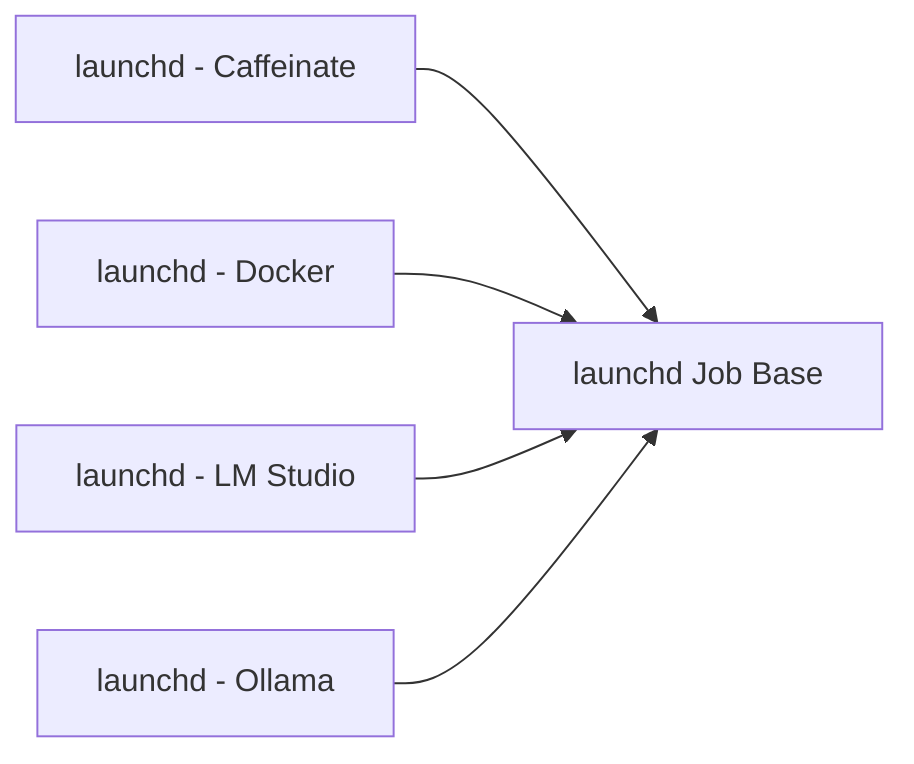

<!-- Generated by docs.api.reference; do not edit. -->
# launchd Job Base
[API index](index.md) | [Definition schema](schema.md)
| Field | Value |
| --- | --- |
| ID | `launchd.base` |
| Source | `02_core/runtimes/yaml/definitions/launchd.yaml` |
| Tags | launchd, abstract |
Abstract base for every macOS LaunchAgent authored in this repository.
Inheritors declare their own `label`, `program`, and `environment` while
picking up the common process posture and log layout from this definition.
Friendly snake_case keys map to plist PascalCase at render time (e.g.
`working_directory` → `WorkingDirectory`); see `_LAUNCHD_KEY_MAP` in the
runtime for the full table. Unknown keys are passed through unchanged.

## Relationships
| Relation | Definitions |
| --- | --- |
| Extends | - |
| Mixins | - |
| Children | [launchd - Caffeinate](launchd.caffeinate.service.definition.md), [launchd - Docker](launchd.docker.service.definition.md), [launchd - LM Studio](launchd.lm-studio.service.definition.md), [launchd - Ollama](launchd.ollama.service.definition.md) |
| Mixin consumers | - |
| Modules | - |

## Declared API

### Inputs
| Name | Type | Required | Default | Description |
| --- | --- | --- | --- | --- |
| - | - | - | - | No locally declared inputs. |

### Variables
| Name | YAML Type | Value / Template | Description |
| --- | --- | --- | --- |
| `user` | `str` | `{{ env.env.USER }}` | macOS user under whose LaunchAgents directory the job will install. |
| `log_dir` | `str` | `/Users/{{ user }}/Library/Logs/LocalFabric` | Default location for per-job stdout/stderr logs. |

### Run Operations
_No locally declared run operations._
### Teardown Operations
_No locally declared teardown operations._
## Resolved API

### Effective Inputs
| Name | Type | Required | Default | Origin |
| --- | --- | --- | --- | --- |
| - | - | - | - | No effective inputs. |

### Effective Variables
| Name | Value / Template | Origin |
| --- | --- | --- |
| `user` | `{{ env.env.USER }}` | [launchd Job Base](launchd.base.definition.md) |
| `log_dir` | `/Users/{{ user }}/Library/Logs/LocalFabric` | [launchd Job Base](launchd.base.definition.md) |

### Effective Lifecycle
| Phase | Operation | Origin |
| --- | --- | --- |
| - | - | No effective lifecycle operations. |
