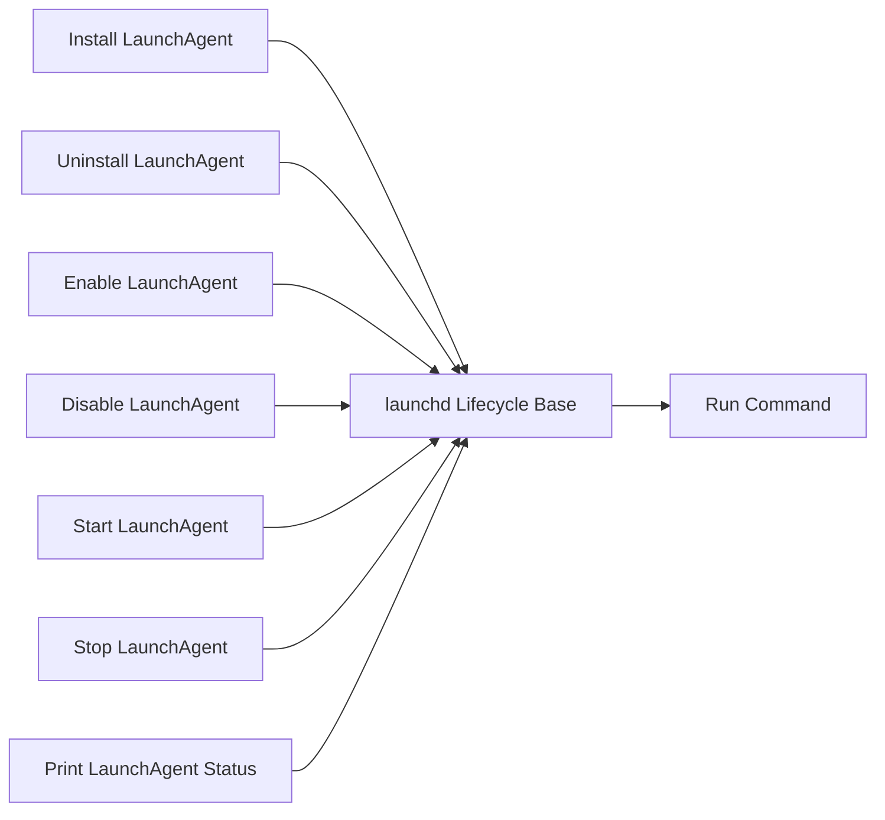

<!-- Generated by docs.api.reference; do not edit. -->
# launchd Lifecycle Base
[API index](index.md) | [Definition schema](schema.md)
| Field | Value |
| --- | --- |
| ID | `launchd.lifecycle.base` |
| Source | `02_core/runtimes/yaml/definitions/launchd.yaml` |
| Tags | launchd, lifecycle, abstract |
Internal abstract base shared by every launchd lifecycle wrapper. Hosts
the two-input contract (`definition` or `label`) and the
`resolved_label` variable so concrete lifecycle definitions only declare
their `command:` payload.

## Relationships
| Relation | Definitions |
| --- | --- |
| Extends | [Run Command](stdlib.run-command.task.definition.md) |
| Mixins | - |
| Children | [Install LaunchAgent](launchd.install.task.definition.md), [Uninstall LaunchAgent](launchd.uninstall.task.definition.md), [Enable LaunchAgent](launchd.enable.task.definition.md), [Disable LaunchAgent](launchd.disable.task.definition.md), [Start LaunchAgent](launchd.start.task.definition.md), [Stop LaunchAgent](launchd.stop.task.definition.md), [Print LaunchAgent Status](launchd.status.task.definition.md) |
| Mixin consumers | - |
| Modules | - |

## Declared API

### Inputs
| Name | Type | Required | Default | Description |
| --- | --- | --- | --- | --- |
| `definition` | `string` | no | `` | launchd definition id (e.g. `launchd.caffeinate`). Used to auto-resolve the job label from the catalog. |
| `label` | `string` | no | `` | Explicit launchd job label. Takes effect when `definition` is empty. |

### Variables
| Name | YAML Type | Value / Template | Description |
| --- | --- | --- | --- |
| `resolved_label` | `str` | `{{ ((runtime.catalog.definitions \| selectattr('id', 'equalto', definition) \| list \| first).launchd.label) if definition else label }}` | Effective launchctl label — either looked up from `definition` or copied from `label`. |

### Run Operations
_No locally declared run operations._
### Teardown Operations
_No locally declared teardown operations._
## Resolved API

### Effective Inputs
| Name | Type | Required | Default | Origin |
| --- | --- | --- | --- | --- |
| `command` | `string` | no | `` | [Run Command](stdlib.run-command.task.definition.md) |
| `working_dir` | `string` | no | `{{ env.cwd }}` | [Run Command](stdlib.run-command.task.definition.md) |
| `definition` | `string` | no | `` | [launchd Lifecycle Base](launchd.lifecycle.base.definition.md) |
| `label` | `string` | no | `` | [launchd Lifecycle Base](launchd.lifecycle.base.definition.md) |

### Effective Variables
| Name | Value / Template | Origin |
| --- | --- | --- |
| `system_log_format` | `[{{ entity_id }} \| {{ runtime.version }}]` | [Abstract Base](stdlib.base.definition.md) |
| `resolved_label` | `{{ ((runtime.catalog.definitions \| selectattr('id', 'equalto', definition) \| list \| first).launchd.label) if definition else label }}` | [launchd Lifecycle Base](launchd.lifecycle.base.definition.md) |

### Effective Lifecycle
| Phase | Operation | Origin |
| --- | --- | --- |
| Run | `bash` | [Run Command](stdlib.run-command.task.definition.md) |
