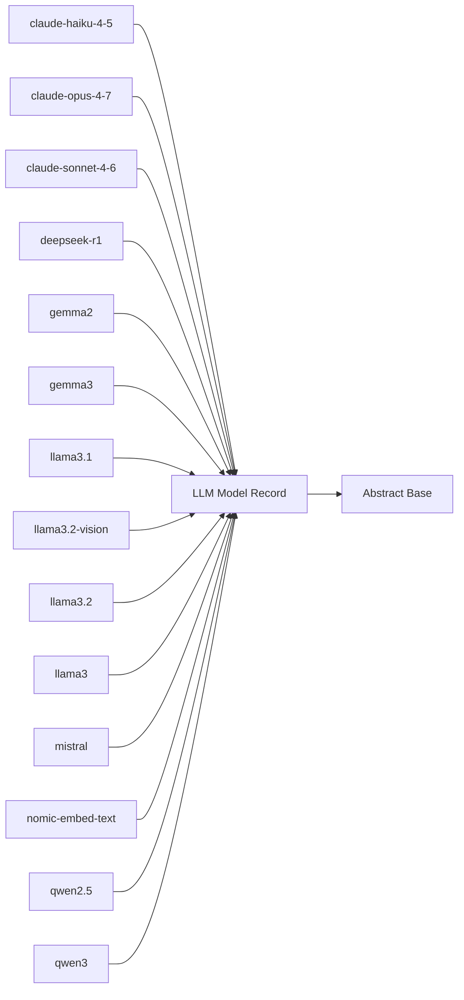

<!-- Generated by docs.api.reference; do not edit. -->
# LLM Model Record

[API index](index.md) | [Definition schema](schema.md)

| Field | Value |
| --- | --- |
| ID | `model.base` |
| Source | `02_core/runtimes/yaml/definitions/model.yaml` |
| Tags | model, abstract |

Pure-data base for the model records under `13_models/`. Establishes
the canonical fields every model declares (`name`, `documentation`,
`providers`, `features`) so the catalog can iterate them uniformly and
downstream tooling can rely on the shape. Carries no run blocks.

## Relationships

| Relation | Definitions |
| --- | --- |
| Extends | [Abstract Base](stdlib.base.definition.md) |
| Mixins | - |
| Children | [claude-haiku-4-5](model.claude-haiku-4-5.definition.md), [claude-opus-4-7](model.claude-opus-4-7.definition.md), [claude-sonnet-4-6](model.claude-sonnet-4-6.definition.md), [deepseek-r1](model.deepseek-r1.definition.md), [gemma2](model.gemma2.definition.md), [gemma3](model.gemma3.definition.md), [llama3.1](model.llama3.1.definition.md), [llama3.2-vision](model.llama3.2-vision.definition.md), [llama3.2](model.llama3.2.definition.md), [llama3](model.llama3.definition.md), [mistral](model.mistral.definition.md), [nomic-embed-text](model.nomic-embed-text.definition.md), [qwen2.5](model.qwen2.5.definition.md), [qwen3](model.qwen3.definition.md) |
| Mixin consumers | - |
| Modules | - |

## Declared API

### Inputs

| Name | Type | Required | Default | Description |
| --- | --- | --- | --- | --- |
| - | - | - | - | No locally declared inputs. |

### Variables

| Name | YAML Type | Value / Template | Description |
| --- | --- | --- | --- |
| `name` | `str` | `` | Canonical identifier of the model (e.g. `claude-opus-4-7`). |
| `documentation` | `dict` | `{}` | Free-form notes — typically `summary`, `vendor`, `homepage`. |
| `providers` | `list` | `[]` | List of provider IDs (from `13_providers/`) that serve this model. |
| `features` | `list` | `[]` | Capability tags (e.g. `text`, `tool_calling`, `vision`, `streaming`). |

### Run Operations

_No locally declared run operations._

### Teardown Operations

_No locally declared teardown operations._

## Resolved API

### Effective Inputs

| Name | Type | Required | Default | Origin |
| --- | --- | --- | --- | --- |
| - | - | - | - | No effective inputs. |

### Effective Variables

| Name | Value / Template | Origin |
| --- | --- | --- |
| `system_log_format` | `[{{ entity_id }} \| {{ runtime.version }}]` | [Abstract Base](stdlib.base.definition.md) |
| `name` | `` | [LLM Model Record](model.base.definition.md) |
| `documentation` | `{}` | [LLM Model Record](model.base.definition.md) |
| `providers` | `[]` | [LLM Model Record](model.base.definition.md) |
| `features` | `[]` | [LLM Model Record](model.base.definition.md) |

### Effective Lifecycle

| Phase | Operation | Origin |
| --- | --- | --- |
| Run | `python` | [Abstract Base](stdlib.base.definition.md) |
