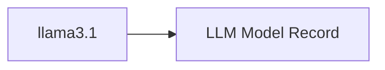

<!-- Generated by docs.api.reference; do not edit. -->
# llama3.1

[API index](index.md) | [Definition schema](schema.md)

| Field | Value |
| --- | --- |
| ID | `model.ollama.llama3-1.model` |
| Source | `13_models/model.ollama.llama3-1.model.yaml` |
| Tags | model |

General-purpose chat, instruction following, tool use, and long-context local assistant workflows.

## Relationships

| Relation | Definitions |
| --- | --- |
| Extends | [LLM Model Record](model.base.definition.md) |
| Mixins | - |
| Children | - |
| Mixin consumers | - |
| Modules | - |

## Declared API

### Inputs

| Name | Type | Required | Default | Description |
| --- | --- | --- | --- | --- |
| - | - | - | - | No locally declared inputs. |

### Variables

| Name | YAML Type | Value / Template | Description |
| --- | --- | --- | --- |
| `name` | `str` | `llama3.1` | - |
| `documentation` | `dict` | `{'summary': 'General-purpose chat, instruction following, tool use, and long-context\nlocal assistant workflows.\n', 'vendor': 'Meta'}` | - |
| `providers` | `list` | `['ollama']` | - |
| `features` | `list` | `['text', 'tool_calling', 'streaming']` | - |

### Run Operations

_No locally declared run operations._

### Teardown Operations

_No locally declared teardown operations._

## Resolved API

### Effective Inputs

| Name | Type | Required | Default | Origin |
| --- | --- | --- | --- | --- |
| - | - | - | - | No effective inputs. |

### Effective Variables

| Name | Value / Template | Origin |
| --- | --- | --- |
| `system_log_format` | `[{{ entity_id }} \| {{ runtime.version }}]` | [Abstract Base](stdlib.base.definition.md) |
| `name` | `llama3.1` | [llama3.1](model.ollama.llama3-1.model.definition.md) |
| `documentation` | `{'summary': 'General-purpose chat, instruction following, tool use, and long-context\nlocal assistant workflows.\n', 'vendor': 'Meta'}` | [llama3.1](model.ollama.llama3-1.model.definition.md) |
| `providers` | `['ollama']` | [llama3.1](model.ollama.llama3-1.model.definition.md) |
| `features` | `['text', 'tool_calling', 'streaming']` | [llama3.1](model.ollama.llama3-1.model.definition.md) |

### Effective Lifecycle

| Phase | Operation | Origin |
| --- | --- | --- |
| Run | `python` | [Abstract Base](stdlib.base.definition.md) |
