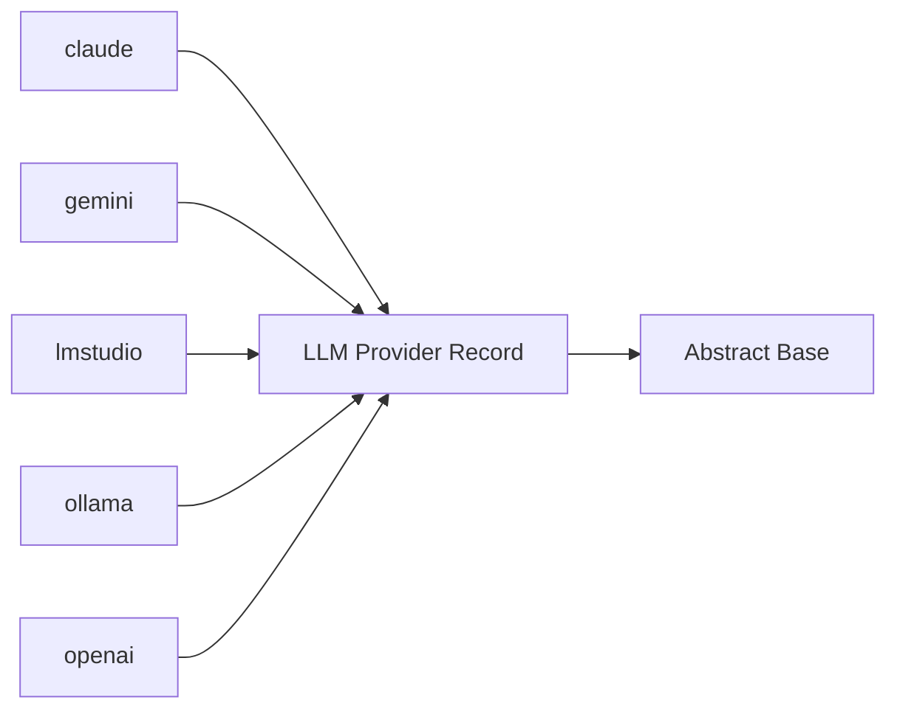

<!-- Generated by docs.api.reference; do not edit. -->
# LLM Provider Record
[API index](index.md) | [Definition schema](schema.md)
| Field | Value |
| --- | --- |
| ID | `provider.base` |
| Source | `02_core/runtimes/yaml/definitions/provider.yaml` |
| Tags | provider, abstract |
Pure-data base for the provider records under `13_providers/`.
Establishes the canonical fields every provider declares (`name`,
`location`, `endpoint`, `auth`, `env`, `protocols`, `documentation`).
Carries no run blocks.

## Relationships
| Relation | Definitions |
| --- | --- |
| Extends | [Abstract Base](stdlib.base.definition.md) |
| Mixins | - |
| Children | [claude](provider.claude.provider.definition.md), [gemini](provider.gemini.provider.definition.md), [lmstudio](provider.lmstudio.provider.definition.md), [ollama](provider.ollama.provider.definition.md), [openai](provider.openai.provider.definition.md) |
| Mixin consumers | - |
| Modules | - |

## Declared API

### Inputs
| Name | Type | Required | Default | Description |
| --- | --- | --- | --- | --- |
| - | - | - | - | No locally declared inputs. |

### Variables
| Name | YAML Type | Value / Template | Description |
| --- | --- | --- | --- |
| `name` | `str` | `` | Canonical identifier of the provider (e.g. `ollama`, `claude`). |
| `location` | `str` | `` | Either `cloud` or `local` — where the provider physically runs. |
| `documentation` | `dict` | `{}` | Free-form notes — typically `summary`, `homepage`, `install`. |
| `endpoint` | `str` | `` | Default endpoint URL clients connect to. |
| `auth` | `str` | `` | Auth mechanism (`api_key`, `none`, etc.). |
| `env` | `dict` | `{}` | Environment-variable mapping (logical name → env var). |
| `protocols` | `dict` | `{}` | Map of supported protocols (cli, sdk, openai-api, ...). |

### Run Operations
_No locally declared run operations._
### Teardown Operations
_No locally declared teardown operations._
## Resolved API

### Effective Inputs
| Name | Type | Required | Default | Origin |
| --- | --- | --- | --- | --- |
| - | - | - | - | No effective inputs. |

### Effective Variables
| Name | Value / Template | Origin |
| --- | --- | --- |
| `system_log_format` | `[{{ entity_id }} \| {{ runtime.version }}]` | [Abstract Base](stdlib.base.definition.md) |
| `name` | `` | [LLM Provider Record](provider.base.definition.md) |
| `location` | `` | [LLM Provider Record](provider.base.definition.md) |
| `documentation` | `{}` | [LLM Provider Record](provider.base.definition.md) |
| `endpoint` | `` | [LLM Provider Record](provider.base.definition.md) |
| `auth` | `` | [LLM Provider Record](provider.base.definition.md) |
| `env` | `{}` | [LLM Provider Record](provider.base.definition.md) |
| `protocols` | `{}` | [LLM Provider Record](provider.base.definition.md) |

### Effective Lifecycle
| Phase | Operation | Origin |
| --- | --- | --- |
| Run | `python` | [Abstract Base](stdlib.base.definition.md) |
