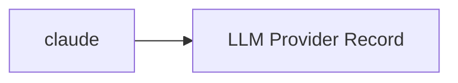

<!-- Generated by docs.api.reference; do not edit. -->
# claude

[API index](index.md) | [Definition schema](schema.md)

| Field | Value |
| --- | --- |
| ID | `provider.claude.provider` |
| Source | `13_providers/provider.claude.provider.yaml` |
| Tags | provider |

Anthropic's hosted Claude models. Accessed via the Anthropic Messages API (no OpenAI-compatible endpoint), the official Anthropic SDKs, or the Claude Code CLI.

## Relationships

| Relation | Definitions |
| --- | --- |
| Extends | [LLM Provider Record](provider.base.definition.md) |
| Mixins | - |
| Children | - |
| Mixin consumers | - |
| Modules | - |

## Declared API

### Inputs

| Name | Type | Required | Default | Description |
| --- | --- | --- | --- | --- |
| - | - | - | - | No locally declared inputs. |

### Variables

| Name | YAML Type | Value / Template | Description |
| --- | --- | --- | --- |
| `name` | `str` | `claude` | - |
| `location` | `str` | `cloud` | - |
| `documentation` | `dict` | `{'summary': "Anthropic's hosted Claude models. Accessed via the Anthropic Messages API\n(no OpenAI-compatible endpoint), the official Anthropic SDKs, or the Claude\nCode CLI.\n", 'homepage': 'https://www.anthropic.com', 'vendor': 'Anthropic'}` | - |
| `endpoint` | `str` | `https://api.anthropic.com` | - |
| `auth` | `str` | `api_key` | - |
| `env` | `dict` | `{'api_key': 'ANTHROPIC_API_KEY'}` | - |
| `protocols` | `dict` | `{'cli': {'binary': 'claude'}, 'sdk': {'package': 'anthropic', 'languages': ['python', 'typescript']}, 'anthropic-api': {'base_url': 'https://api.anthropic.com'}}` | - |

### Run Operations

_No locally declared run operations._

### Teardown Operations

_No locally declared teardown operations._

## Resolved API

### Effective Inputs

| Name | Type | Required | Default | Origin |
| --- | --- | --- | --- | --- |
| - | - | - | - | No effective inputs. |

### Effective Variables

| Name | Value / Template | Origin |
| --- | --- | --- |
| `system_log_format` | `[{{ entity_id }} \| {{ runtime.version }}]` | [Abstract Base](stdlib.base.definition.md) |
| `name` | `claude` | [claude](provider.claude.provider.definition.md) |
| `location` | `cloud` | [claude](provider.claude.provider.definition.md) |
| `documentation` | `{'summary': "Anthropic's hosted Claude models. Accessed via the Anthropic Messages API\n(no OpenAI-compatible endpoint), the official Anthropic SDKs, or the Claude\nCode CLI.\n", 'homepage': 'https://www.anthropic.com', 'vendor': 'Anthropic'}` | [claude](provider.claude.provider.definition.md) |
| `endpoint` | `https://api.anthropic.com` | [claude](provider.claude.provider.definition.md) |
| `auth` | `api_key` | [claude](provider.claude.provider.definition.md) |
| `env` | `{'api_key': 'ANTHROPIC_API_KEY'}` | [claude](provider.claude.provider.definition.md) |
| `protocols` | `{'cli': {'binary': 'claude'}, 'sdk': {'package': 'anthropic', 'languages': ['python', 'typescript']}, 'anthropic-api': {'base_url': 'https://api.anthropic.com'}}` | [claude](provider.claude.provider.definition.md) |

### Effective Lifecycle

| Phase | Operation | Origin |
| --- | --- | --- |
| Run | `python` | [Abstract Base](stdlib.base.definition.md) |
