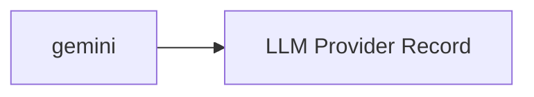

<!-- Generated by docs.api.reference; do not edit. -->
# gemini
[API index](index.md) | [Definition schema](schema.md)
| Field | Value |
| --- | --- |
| ID | `provider.gemini.provider` |
| Source | `13_providers/provider.gemini.provider.yaml` |
| Tags | provider |
Google's hosted Gemini models. Accessed via the Google GenAI API, the google-genai SDK, or the Gemini CLI.

## Relationships
| Relation | Definitions |
| --- | --- |
| Extends | [LLM Provider Record](provider.base.definition.md) |
| Mixins | - |
| Children | - |
| Mixin consumers | - |
| Modules | - |

## Declared API

### Inputs
| Name | Type | Required | Default | Description |
| --- | --- | --- | --- | --- |
| - | - | - | - | No locally declared inputs. |

### Variables
| Name | YAML Type | Value / Template | Description |
| --- | --- | --- | --- |
| `name` | `str` | `gemini` | - |
| `location` | `str` | `cloud` | - |
| `documentation` | `dict` | `{'summary': "Google's hosted Gemini models. Accessed via the Google GenAI API, the\ngoogle-genai SDK, or the Gemini CLI.\n", 'homepage': 'https://ai.google.dev', 'vendor': 'Google'}` | - |
| `endpoint` | `str` | `https://generativelanguage.googleapis.com` | - |
| `auth` | `str` | `api_key` | - |
| `env` | `dict` | `{'api_key': 'GEMINI_API_KEY'}` | - |
| `protocols` | `dict` | `{'cli': {'binary': 'gemini'}, 'sdk': {'package': 'google-genai', 'languages': ['python', 'typescript']}, 'google-api': {'base_url': 'https://generativelanguage.googleapis.com'}}` | - |

### Run Operations
_No locally declared run operations._
### Teardown Operations
_No locally declared teardown operations._
## Resolved API

### Effective Inputs
| Name | Type | Required | Default | Origin |
| --- | --- | --- | --- | --- |
| - | - | - | - | No effective inputs. |

### Effective Variables
| Name | Value / Template | Origin |
| --- | --- | --- |
| `system_log_format` | `[{{ entity_id }} \| {{ runtime.version }}]` | [Abstract Base](stdlib.base.definition.md) |
| `name` | `gemini` | [gemini](provider.gemini.provider.definition.md) |
| `location` | `cloud` | [gemini](provider.gemini.provider.definition.md) |
| `documentation` | `{'summary': "Google's hosted Gemini models. Accessed via the Google GenAI API, the\ngoogle-genai SDK, or the Gemini CLI.\n", 'homepage': 'https://ai.google.dev', 'vendor': 'Google'}` | [gemini](provider.gemini.provider.definition.md) |
| `endpoint` | `https://generativelanguage.googleapis.com` | [gemini](provider.gemini.provider.definition.md) |
| `auth` | `api_key` | [gemini](provider.gemini.provider.definition.md) |
| `env` | `{'api_key': 'GEMINI_API_KEY'}` | [gemini](provider.gemini.provider.definition.md) |
| `protocols` | `{'cli': {'binary': 'gemini'}, 'sdk': {'package': 'google-genai', 'languages': ['python', 'typescript']}, 'google-api': {'base_url': 'https://generativelanguage.googleapis.com'}}` | [gemini](provider.gemini.provider.definition.md) |

### Effective Lifecycle
| Phase | Operation | Origin |
| --- | --- | --- |
| Run | `python` | [Abstract Base](stdlib.base.definition.md) |
