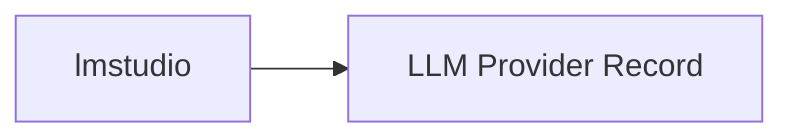

<!-- Generated by docs.api.reference; do not edit. -->
# lmstudio

[API index](index.md) | [Definition schema](schema.md)

| Field | Value |
| --- | --- |
| ID | `provider.lmstudio.provider` |
| Source | `13_providers/provider.lmstudio.provider.yaml` |
| Tags | provider |

Desktop LLM runtime. Loads quantized open-weight models locally and serves them through a native HTTP API plus an OpenAI-compatible surface.

## Relationships

| Relation | Definitions |
| --- | --- |
| Extends | [LLM Provider Record](provider.base.definition.md) |
| Mixins | - |
| Children | - |
| Mixin consumers | - |
| Modules | - |

## Declared API

### Inputs

| Name | Type | Required | Default | Description |
| --- | --- | --- | --- | --- |
| - | - | - | - | No locally declared inputs. |

### Variables

| Name | YAML Type | Value / Template | Description |
| --- | --- | --- | --- |
| `name` | `str` | `lmstudio` | - |
| `location` | `str` | `local` | - |
| `documentation` | `dict` | `{'summary': 'Desktop LLM runtime. Loads quantized open-weight models locally and serves\nthem through a native HTTP API plus an OpenAI-compatible surface.\n', 'homepage': 'https://lmstudio.ai'}` | - |
| `endpoint` | `str` | `http://localhost:1234` | - |
| `auth` | `str` | `none` | - |
| `env` | `dict` | `{'host': 'LMSTUDIO_HOST', 'api_key': 'LMSTUDIO_API_KEY'}` | - |
| `protocols` | `dict` | `{'cli': {'binary': 'lms'}, 'lmstudio-api': {'base_url': 'http://localhost:1234'}, 'openai-api': {'base_url': 'http://localhost:1234/v1'}}` | - |

### Run Operations

_No locally declared run operations._

### Teardown Operations

_No locally declared teardown operations._

## Resolved API

### Effective Inputs

| Name | Type | Required | Default | Origin |
| --- | --- | --- | --- | --- |
| - | - | - | - | No effective inputs. |

### Effective Variables

| Name | Value / Template | Origin |
| --- | --- | --- |
| `system_log_format` | `[{{ entity_id }} \| {{ runtime.version }}]` | [Abstract Base](stdlib.base.definition.md) |
| `name` | `lmstudio` | [lmstudio](provider.lmstudio.provider.definition.md) |
| `location` | `local` | [lmstudio](provider.lmstudio.provider.definition.md) |
| `documentation` | `{'summary': 'Desktop LLM runtime. Loads quantized open-weight models locally and serves\nthem through a native HTTP API plus an OpenAI-compatible surface.\n', 'homepage': 'https://lmstudio.ai'}` | [lmstudio](provider.lmstudio.provider.definition.md) |
| `endpoint` | `http://localhost:1234` | [lmstudio](provider.lmstudio.provider.definition.md) |
| `auth` | `none` | [lmstudio](provider.lmstudio.provider.definition.md) |
| `env` | `{'host': 'LMSTUDIO_HOST', 'api_key': 'LMSTUDIO_API_KEY'}` | [lmstudio](provider.lmstudio.provider.definition.md) |
| `protocols` | `{'cli': {'binary': 'lms'}, 'lmstudio-api': {'base_url': 'http://localhost:1234'}, 'openai-api': {'base_url': 'http://localhost:1234/v1'}}` | [lmstudio](provider.lmstudio.provider.definition.md) |

### Effective Lifecycle

| Phase | Operation | Origin |
| --- | --- | --- |
| Run | `python` | [Abstract Base](stdlib.base.definition.md) |
