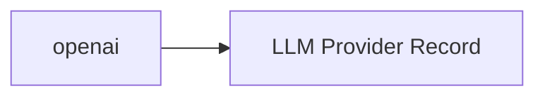

<!-- Generated by docs.api.reference; do not edit. -->
# openai

[API index](index.md) | [Definition schema](schema.md)

| Field | Value |
| --- | --- |
| ID | `provider.openai.provider` |
| Source | `13_providers/provider.openai.provider.yaml` |
| Tags | provider |

OpenAI's hosted model catalog (GPT-class chat, code, embedding, and vision). The canonical owner of the OpenAI Chat Completions wire format.

## Relationships

| Relation | Definitions |
| --- | --- |
| Extends | [LLM Provider Record](provider.base.definition.md) |
| Mixins | - |
| Children | - |
| Mixin consumers | - |
| Modules | - |

## Declared API

### Inputs

| Name | Type | Required | Default | Description |
| --- | --- | --- | --- | --- |
| - | - | - | - | No locally declared inputs. |

### Variables

| Name | YAML Type | Value / Template | Description |
| --- | --- | --- | --- |
| `name` | `str` | `openai` | - |
| `location` | `str` | `cloud` | - |
| `documentation` | `dict` | `{'summary': "OpenAI's hosted model catalog (GPT-class chat, code, embedding, and vision).\nThe canonical owner of the OpenAI Chat Completions wire format.\n", 'homepage': 'https://platform.openai.com', 'vendor': 'OpenAI'}` | - |
| `endpoint` | `str` | `https://api.openai.com` | - |
| `auth` | `str` | `api_key` | - |
| `env` | `dict` | `{'api_key': 'OPENAI_API_KEY'}` | - |
| `protocols` | `dict` | `{'cli': {'binary': 'codex'}, 'sdk': {'package': 'openai', 'languages': ['python', 'typescript']}, 'openai-api': {'base_url': 'https://api.openai.com/v1'}}` | - |

### Run Operations

_No locally declared run operations._

### Teardown Operations

_No locally declared teardown operations._

## Resolved API

### Effective Inputs

| Name | Type | Required | Default | Origin |
| --- | --- | --- | --- | --- |
| - | - | - | - | No effective inputs. |

### Effective Variables

| Name | Value / Template | Origin |
| --- | --- | --- |
| `system_log_format` | `[{{ entity_id }} \| {{ runtime.version }}]` | [Abstract Base](stdlib.base.definition.md) |
| `name` | `openai` | [openai](provider.openai.provider.definition.md) |
| `location` | `cloud` | [openai](provider.openai.provider.definition.md) |
| `documentation` | `{'summary': "OpenAI's hosted model catalog (GPT-class chat, code, embedding, and vision).\nThe canonical owner of the OpenAI Chat Completions wire format.\n", 'homepage': 'https://platform.openai.com', 'vendor': 'OpenAI'}` | [openai](provider.openai.provider.definition.md) |
| `endpoint` | `https://api.openai.com` | [openai](provider.openai.provider.definition.md) |
| `auth` | `api_key` | [openai](provider.openai.provider.definition.md) |
| `env` | `{'api_key': 'OPENAI_API_KEY'}` | [openai](provider.openai.provider.definition.md) |
| `protocols` | `{'cli': {'binary': 'codex'}, 'sdk': {'package': 'openai', 'languages': ['python', 'typescript']}, 'openai-api': {'base_url': 'https://api.openai.com/v1'}}` | [openai](provider.openai.provider.definition.md) |

### Effective Lifecycle

| Phase | Operation | Origin |
| --- | --- | --- |
| Run | `python` | [Abstract Base](stdlib.base.definition.md) |
