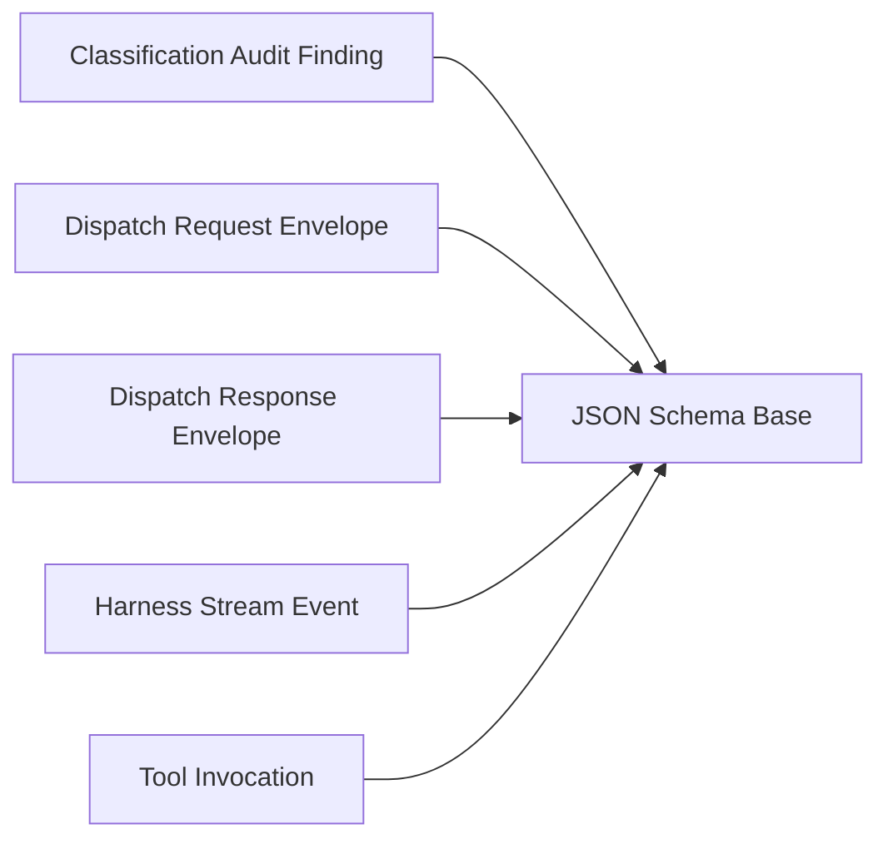

<!-- Generated by docs.api.reference; do not edit. -->
# JSON Schema Base
[API index](index.md) | [Definition schema](schema.md)
| Field | Value |
| --- | --- |
| ID | `schemas.base` |
| Source | `02_core/runtimes/yaml/definitions/schemas.yaml` |
| Tags | schema, abstract |
Abstract base for every JSON Schema document authored in this repository.
Inherits the dialect declaration (`$schema`) and the default closed-object
posture (`type: object`, `additionalProperties: false`) so concrete schemas
only declare what is specific to themselves.

## Relationships
| Relation | Definitions |
| --- | --- |
| Extends | - |
| Mixins | - |
| Children | [Classification Audit Finding](audit.classification-finding.schema.definition.md), [Dispatch Request Envelope](dispatch.request.schema.definition.md), [Dispatch Response Envelope](dispatch.response.schema.definition.md), [Harness Stream Event](harness.stream-event.schema.definition.md), [Tool Invocation](tool.invocation.schema.definition.md) |
| Mixin consumers | - |
| Modules | - |

## Declared API

### Inputs
| Name | Type | Required | Default | Description |
| --- | --- | --- | --- | --- |
| - | - | - | - | No locally declared inputs. |

### Variables
| Name | YAML Type | Value / Template | Description |
| --- | --- | --- | --- |
| - | - | - | No locally declared variables. |

### Run Operations
_No locally declared run operations._
### Teardown Operations
_No locally declared teardown operations._
## Resolved API

### Effective Inputs
| Name | Type | Required | Default | Origin |
| --- | --- | --- | --- | --- |
| - | - | - | - | No effective inputs. |

### Effective Variables
| Name | Value / Template | Origin |
| --- | --- | --- |
| - | - | No effective variables. |

### Effective Lifecycle
| Phase | Operation | Origin |
| --- | --- | --- |
| - | - | No effective lifecycle operations. |
