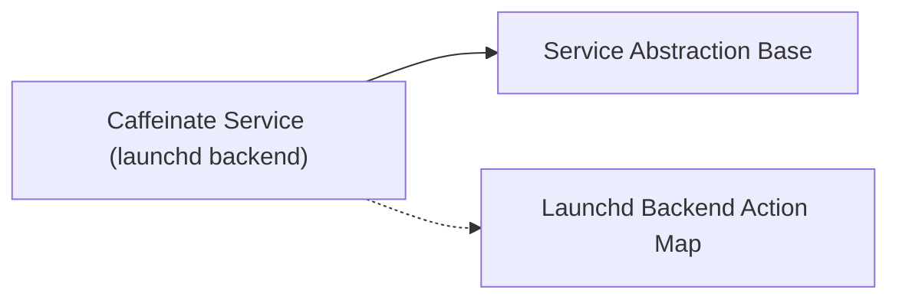

<!-- Generated by docs.api.reference; do not edit. -->
# Caffeinate Service (launchd backend)

[API index](index.md) | [Definition schema](schema.md)

| Field | Value |
| --- | --- |
| ID | `service.caffeinate.service` |
| Source | `02_core/runtimes/yaml/definitions/service.yaml` |
| Tags | service, launchd |

macOS Caffeinate keep-awake daemon managed via launchd.

## Relationships

| Relation | Definitions |
| --- | --- |
| Extends | [Service Abstraction Base](service.base.definition.md) |
| Mixins | [Launchd Backend Action Map](service.launchd.mixin.definition.md) |
| Children | - |
| Mixin consumers | - |
| Modules | - |

## Declared API

### Inputs

| Name | Type | Required | Default | Description |
| --- | --- | --- | --- | --- |
| - | - | - | - | No locally declared inputs. |

### Variables

| Name | YAML Type | Value / Template | Description |
| --- | --- | --- | --- |
| `backend` | `str` | `launchd` | - |
| `target` | `str` | `launchd.caffeinate.service` | - |

### Run Operations

_No locally declared run operations._

### Teardown Operations

_No locally declared teardown operations._

## Resolved API

### Effective Inputs

| Name | Type | Required | Default | Origin |
| --- | --- | --- | --- | --- |
| `action` | `string` | yes | `-` | [Service Abstraction Base](service.base.definition.md) |

### Effective Variables

| Name | Value / Template | Origin |
| --- | --- | --- |
| `system_log_format` | `[{{ entity_id }} \| {{ runtime.version }}]` | [Abstract Base](stdlib.base.definition.md) |
| `backend` | `launchd` | [Caffeinate Service (launchd backend)](service.caffeinate.service.definition.md) |
| `target` | `launchd.caffeinate.service` | [Caffeinate Service (launchd backend)](service.caffeinate.service.definition.md) |
| `action_to_def` | `{'start': 'launchd.start.task', 'stop': 'launchd.stop.task', 'enable': 'launchd.enable.task', 'disable': 'launchd.disable.task', 'install': 'launchd.install.task', 'uninstall': 'launchd.uninstall.task', 'status': 'launchd.status.task'}` | [Launchd Backend Action Map](service.launchd.mixin.definition.md) |
| `action_arguments` | `{'start': {'definition': '{{ target }}'}, 'stop': {'definition': '{{ target }}'}, 'enable': {'definition': '{{ target }}'}, 'disable': {'definition': '{{ target }}'}, 'install': {'definition': '{{ target }}'}, 'uninstall': {'definition': '{{ target }}'}, 'status': {'definition': '{{ target }}'}}` | [Launchd Backend Action Map](service.launchd.mixin.definition.md) |

### Effective Lifecycle

| Phase | Operation | Origin |
| --- | --- | --- |
| Run | `invoke` | [Service Abstraction Base](service.base.definition.md) |
| Run | `python` | [Abstract Base](stdlib.base.definition.md) |
