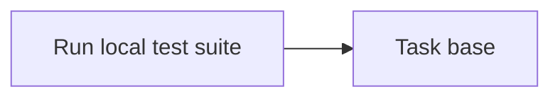

<!-- Generated by docs.api.reference; do not edit. -->
# Run local test suite
[API index](index.md) | [Definition schema](schema.md)
| Field | Value |
| --- | --- |
| ID | `shell.tests.run.task` |
| Source | `05_tasks/shell.tests.run.task.yaml` |
| Tags | task |
Execute a local test command and return a compact report string.
Trims output for downstream context-window efficiency.
Wraps lib.shell.run_tests.run_local_tests.


## Relationships
| Relation | Definitions |
| --- | --- |
| Extends | [Task base](task.base.definition.md) |
| Mixins | - |
| Children | - |
| Mixin consumers | - |
| Modules | - |



## Declared API

### Inputs
| Name | Type | Required | Default | Description |
| --- | --- | --- | --- | --- |
| `command` | `string` | no | `pytest` | Test command to execute (shell string). |


### Variables
| Name | YAML Type | Value / Template | Description |
| --- | --- | --- | --- |
| - | - | - | No locally declared variables. |


### Run Operations
#### Python
_No operation description provided._
```python
import json, os
from lib.shell.run_tests import run_local_tests
report = run_local_tests("{{ command }}")
with open(os.environ["STATE_FILE"], "w") as f:
    json.dump({"report": report}, f)
```
### Teardown Operations
_No locally declared teardown operations._
## Resolved API

### Effective Inputs
| Name | Type | Required | Default | Origin |
| --- | --- | --- | --- | --- |
| `command` | `string` | no | `pytest` | [Run local test suite](shell.tests.run.task.definition.md) |


### Effective Variables
| Name | Value / Template | Origin |
| --- | --- | --- |
| `system_log_format` | `[{{ entity_id }} \| {{ runtime.version }}]` | [Abstract Base](stdlib.base.definition.md) |


### Effective Lifecycle
| Phase | Operation | Origin |
| --- | --- | --- |
| Run | `python` | [Run local test suite](shell.tests.run.task.definition.md) |
