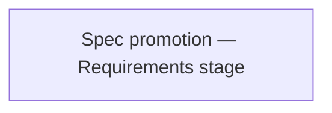

<!-- Generated by docs.api.reference; do not edit. -->
# Spec promotion — Requirements stage
[API index](index.md) | [Definition schema](schema.md)
| Field | Value |
| --- | --- |
| ID | `spec.promotion.requirements.task` |
| Source | `<raw>` |
| Tags | - |
_No description provided._

## Relationships
| Relation | Definitions |
| --- | --- |
| Extends | - |
| Mixins | - |
| Children | - |
| Mixin consumers | - |
| Modules | - |

## Declared API

### Inputs
| Name | Type | Required | Default | Description |
| --- | --- | --- | --- | --- |
| - | - | - | - | No locally declared inputs. |

### Variables
| Name | YAML Type | Value / Template | Description |
| --- | --- | --- | --- |
| `body` | `str` | ` # Spec promotion — Requirements stage  You are a spec promotion assistant. Given an idea and the research notes that survey existing assets, produce the requirements contract.  Resolve every open question raised in the research stage. Do not punt — if the answer is "later," say so explicitly and explain what would force the decision.  Produce a Markdown document with these sections, in order:  1. `# Requirements — <slug>` 1. `## Functional requirements` — IDs `F1`, `F2`, … each with a short title    line and 1–3 sentences of detail. Reference the research-stage question    each one resolves (e.g. "Resolves research Q1"). 1. `## Non-functional requirements` — IDs `N1`, `N2`, … covering    performance, security, observability, classification-audit compliance,    and path discipline as relevant. 1. `## Acceptance criteria` — IDs `A1`, `A2`, … each independently verifiable.    At least one criterion must reference    `python3 17_scripts/audit_classifications.py`. 1. `## Out of scope` — bulleted list of things deliberately deferred, with a    one-line reason each.  Return only the Markdown body. No code fences, no preamble.  ______________________________________________________________________  ## Idea  {{idea}}  ______________________________________________________________________  ## Research  {{research}} ` | - |

### Run Operations
_No locally declared run operations._
### Teardown Operations
_No locally declared teardown operations._
## Resolved API

### Effective Inputs
| Name | Type | Required | Default | Origin |
| --- | --- | --- | --- | --- |
| - | - | - | - | No effective inputs. |

### Effective Variables
| Name | Value / Template | Origin |
| --- | --- | --- |
| `body` | ` # Spec promotion — Requirements stage  You are a spec promotion assistant. Given an idea and the research notes that survey existing assets, produce the requirements contract.  Resolve every open question raised in the research stage. Do not punt — if the answer is "later," say so explicitly and explain what would force the decision.  Produce a Markdown document with these sections, in order:  1. `# Requirements — <slug>` 1. `## Functional requirements` — IDs `F1`, `F2`, … each with a short title    line and 1–3 sentences of detail. Reference the research-stage question    each one resolves (e.g. "Resolves research Q1"). 1. `## Non-functional requirements` — IDs `N1`, `N2`, … covering    performance, security, observability, classification-audit compliance,    and path discipline as relevant. 1. `## Acceptance criteria` — IDs `A1`, `A2`, … each independently verifiable.    At least one criterion must reference    `python3 17_scripts/audit_classifications.py`. 1. `## Out of scope` — bulleted list of things deliberately deferred, with a    one-line reason each.  Return only the Markdown body. No code fences, no preamble.  ______________________________________________________________________  ## Idea  {{idea}}  ______________________________________________________________________  ## Research  {{research}} ` | [Spec promotion — Requirements stage](spec.promotion.requirements.task.definition.md) |

### Effective Lifecycle
| Phase | Operation | Origin |
| --- | --- | --- |
| - | - | No effective lifecycle operations. |
