<!-- Generated by docs.api.reference; do not edit. -->
# Abstract Base

[API index](index.md) | [Definition schema](schema.md)

| Field | Value |
| --- | --- |
| ID | `stdlib.base` |
| Source | `02_core/runtimes/yaml/definitions/stdlib.yaml` |
| Tags | core, abstract |

Base execution frame shared by standard-library definitions.


## Relationships

| Relation | Definitions |
| --- | --- |
| Extends | - |
| Mixins | - |
| Children | [Load Standard Library Modules](stdlib.load-modules.definition.md), [Run Command](stdlib.run-command.definition.md), [Clean Workspace](stdlib.clean-workspace.definition.md), [Logger](stdlib.logger.definition.md), [Write Text File](stdlib.files.write-text.definition.md), [Create Directory](stdlib.files.create-directory.definition.md), [Write Text File (input form)](stdlib.files.write.definition.md), [Initialize Current Git Workspace](stdlib.git.init-current-workspace.definition.md), [Create GitHub Repository](stdlib.git.create-github-repository.definition.md), [Prune Generated Definition Pages](stdlib.docs.prune-definition-pages.definition.md), [Analysis Base](stdlib.analysis.base.definition.md), [Generate Python Barrel](stdlib.python.barrel.definition.md), [Abstract Command Base](command.base.definition.md), [Folder Scaffold Base](folder.base.definition.md), [Dockerfile Mixin](dockerfile.mixin.definition.md), [Docker Compose Mixin](compose.mixin.definition.md), [Scaffold All Docker Services](docker.generate-all.definition.md), [Generate launchd Plists](launchd.generate-plist.definition.md), [LLM Model Record](model.base.definition.md), [LLM Provider Record](provider.base.definition.md), [Routable Definition Base](route.base.definition.md), [Service Abstraction Base](service.base.definition.md), [Docker Backend Action Map](service.docker.mixin.definition.md), [Launchd Backend Action Map](service.launchd.mixin.definition.md), [Task base](task.base.definition.md), [Generate Schema JSON](schemas.generate-json.definition.md), [Audit classification boundaries and ownership](audit.classifications.scan.workflow.definition.md), [Regenerate All Workflows Barrels](barrels.regenerate.workflow.definition.md), [Regenerate workflows.yaml Bucket Barrels](barrels.regenerate.yaml-runtime.workflow.definition.md), [YAML API Reference Build](docs.api.reference.workflow.definition.md), [Cloud Deployer](cloud.deployer.definition.md), [Render Classification Docs](docs.classification.render.workflow.definition.md), [Generate Documentation](docs.generate.workflow.definition.md), [Build Repo README](docs.readme.generate.workflow.definition.md), [Sweep and embed project files into the vector store](embeddings.sweep.workflow.definition.md), [Classify files for audit and remediation](files.classify.workflow.definition.md) |
| Mixin consumers | - |
| Modules | - |

```mermaid
flowchart LR
  def_stdlib_base["Abstract Base"]
def_stdlib_load_modules["Load Standard Library Modules"] --> def_stdlib_base
def_stdlib_run_command["Run Command"] --> def_stdlib_base
def_stdlib_clean_workspace["Clean Workspace"] --> def_stdlib_base
def_stdlib_logger["Logger"] --> def_stdlib_base
def_stdlib_files_write_text["Write Text File"] --> def_stdlib_base
def_stdlib_files_create_directory["Create Directory"] --> def_stdlib_base
def_stdlib_files_write["Write Text File (input form)"] --> def_stdlib_base
def_stdlib_git_init_current_workspace["Initialize Current Git Workspace"] --> def_stdlib_base
def_stdlib_git_create_github_repository["Create GitHub Repository"] --> def_stdlib_base
def_stdlib_docs_prune_definition_pages["Prune Generated Definition Pages"] --> def_stdlib_base
def_stdlib_analysis_base["Analysis Base"] --> def_stdlib_base
def_stdlib_python_barrel["Generate Python Barrel"] --> def_stdlib_base
def_command_base["Abstract Command Base"] --> def_stdlib_base
def_folder_base["Folder Scaffold Base"] --> def_stdlib_base
def_dockerfile_mixin["Dockerfile Mixin"] --> def_stdlib_base
def_compose_mixin["Docker Compose Mixin"] --> def_stdlib_base
def_docker_generate_all["Scaffold All Docker Services"] --> def_stdlib_base
def_launchd_generate_plist["Generate launchd Plists"] --> def_stdlib_base
def_model_base["LLM Model Record"] --> def_stdlib_base
def_provider_base["LLM Provider Record"] --> def_stdlib_base
def_route_base["Routable Definition Base"] --> def_stdlib_base
def_service_base["Service Abstraction Base"] --> def_stdlib_base
def_service_docker_mixin["Docker Backend Action Map"] --> def_stdlib_base
def_service_launchd_mixin["Launchd Backend Action Map"] --> def_stdlib_base
def_task_base["Task base"] --> def_stdlib_base
def_schemas_generate_json["Generate Schema JSON"] --> def_stdlib_base
def_audit_classifications_scan_workflow["Audit classification boundaries and ownership"] --> def_stdlib_base
def_barrels_regenerate_workflow["Regenerate All Workflows Barrels"] --> def_stdlib_base
def_barrels_regenerate_yaml_runtime_workflow["Regenerate workflows.yaml Bucket Barrels"] --> def_stdlib_base
def_docs_api_reference_workflow["YAML API Reference Build"] --> def_stdlib_base
def_cloud_deployer["Cloud Deployer"] --> def_stdlib_base
def_docs_classification_render_workflow["Render Classification Docs"] --> def_stdlib_base
def_docs_generate_workflow["Generate Documentation"] --> def_stdlib_base
def_docs_readme_generate_workflow["Build Repo README"] --> def_stdlib_base
def_embeddings_sweep_workflow["Sweep and embed project files into the vector store"] --> def_stdlib_base
def_files_classify_workflow["Classify files for audit and remediation"] --> def_stdlib_base
```




## Declared API

### Inputs

| Name | Type | Required | Default | Description |
| --- | --- | --- | --- | --- |
| - | - | - | - | No locally declared inputs. |


### Variables

| Name | YAML Type | Value / Template | Description |
| --- | --- | --- | --- |
| `system_log_format` | `str` | `[{{ entity_id }} \| {{ runtime.version }}]` | Standard execution log prefix. |


### Run Operations

#### Announce frame startup

_No operation description provided._

```python
import sys
print(f"Booting execution frame cascade...")

```

### Teardown Operations

_No locally declared teardown operations._

## Resolved API

### Effective Inputs

| Name | Type | Required | Default | Origin |
| --- | --- | --- | --- | --- |
| - | - | - | - | No effective inputs. |


### Effective Variables

| Name | Value / Template | Origin |
| --- | --- | --- |
| `system_log_format` | `[{{ entity_id }} \| {{ runtime.version }}]` | [Abstract Base](stdlib.base.definition.md) |


### Effective Lifecycle

| Phase | Operation | Origin |
| --- | --- | --- |
| Run | `python` | [Abstract Base](stdlib.base.definition.md) |
