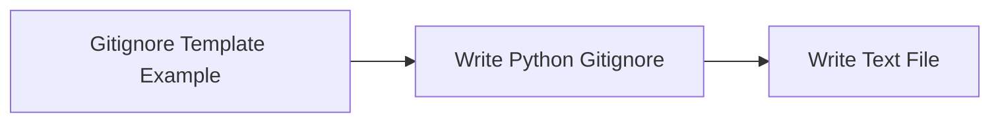

<!-- Generated by docs.api.reference; do not edit. -->
# Write Python Gitignore

[API index](index.md) | [Definition schema](schema.md)

| Field | Value |
| --- | --- |
| ID | `stdlib.git.gitignore-python.task` |
| Source | `02_core/runtimes/yaml/definitions/stdlib.git.yaml` |
| Tags | git, files, templates |

Writes a Python-oriented `.gitignore` into the current workspace.

## Relationships

| Relation | Definitions |
| --- | --- |
| Extends | [Write Text File](stdlib.files.write-text.task.definition.md) |
| Mixins | - |
| Children | [Gitignore Template Example](git.gitignore.definition.md) |
| Mixin consumers | [Initialize Git Example](git.init.definition.md), [GitHub Repository Example](git.github.definition.md) |
| Modules | - |

## Declared API

### Inputs

| Name | Type | Required | Default | Description |
| --- | --- | --- | --- | --- |
| - | - | - | - | No locally declared inputs. |

### Variables

| Name | YAML Type | Value / Template | Description |
| --- | --- | --- | --- |
| `target_path` | `str` | `{{ env.cwd }}/.gitignore` | Destination `.gitignore` path. |
| `content` | `str` | `# Python __pycache__/ *.py[cod] *.egg-info/ .pytest_cache/ .mypy_cache/ .ruff_cache/ .venv/ venv/  # Editors and operating system files .DS_Store .idea/ .vscode/  # Local secrets and output .env .env.* dist/ build/ ` | Standard Python ignore patterns. |

### Run Operations

_No locally declared run operations._

### Teardown Operations

_No locally declared teardown operations._

## Resolved API

### Effective Inputs

| Name | Type | Required | Default | Origin |
| --- | --- | --- | --- | --- |
| - | - | - | - | No effective inputs. |

### Effective Variables

| Name | Value / Template | Origin |
| --- | --- | --- |
| `system_log_format` | `[{{ entity_id }} \| {{ runtime.version }}]` | [Abstract Base](stdlib.base.definition.md) |
| `target_path` | `{{ env.cwd }}/.gitignore` | [Write Python Gitignore](stdlib.git.gitignore-python.task.definition.md) |
| `content` | `# Python __pycache__/ *.py[cod] *.egg-info/ .pytest_cache/ .mypy_cache/ .ruff_cache/ .venv/ venv/  # Editors and operating system files .DS_Store .idea/ .vscode/  # Local secrets and output .env .env.* dist/ build/ ` | [Write Python Gitignore](stdlib.git.gitignore-python.task.definition.md) |

### Effective Lifecycle

| Phase | Operation | Origin |
| --- | --- | --- |
| Run | `artifact` | [Write Text File](stdlib.files.write-text.task.definition.md) |
