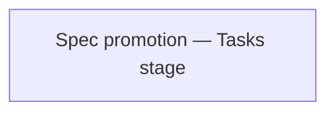

<!-- Generated by docs.api.reference; do not edit. -->
# Spec promotion — Tasks stage

[API index](index.md) | [Definition schema](schema.md)

| Field | Value |
| --- | --- |
| ID | `tasks.spec-promotion.tasks` |
| Source | `<raw>` |
| Tags | - |

_No description provided._

## Relationships

| Relation | Definitions |
| --- | --- |
| Extends | - |
| Mixins | - |
| Children | - |
| Mixin consumers | - |
| Modules | - |

## Declared API

### Inputs

| Name | Type | Required | Default | Description |
| --- | --- | --- | --- | --- |
| - | - | - | - | No locally declared inputs. |

### Variables

| Name | YAML Type | Value / Template | Description |
| --- | --- | --- | --- |
| `body` | `str` | ` # Spec promotion — Tasks stage  You are a spec promotion assistant. Given the idea, research, and requirements, decompose the work into independently shippable tasks.  Rules:  - Each task is scoped to a single numeric bucket (`12_prompts`,   `15_notebooks`, `06_workflows`, etc.) so it can be picked up as one branch   and one PR. If a piece of work crosses buckets, split it. - Each task names the bucket explicitly and states its acceptance criterion   by referencing a specific `Fn` / `An` from the requirements stage. - Order the tasks so dependencies flow strictly top-down. Note dependencies   in plain language ("depends on T1"). - Mark optional or deferred tasks clearly. Do not silently expand scope —   if it is deferred, it belongs in an `## Out of scope` block or a separate   follow-up task tagged "(follow-up)".  Produce a Markdown document with:  1. `# Tasks — <slug>` 2. One `## Tn — <title>` section per task, each containing **Bucket:**,    the task body, and **Acceptance:**. 3. A trailing `## Suggested branch sequence` section that names each branch    following the `<provider>_<type>_<slug>` convention from `CLAUDE.md` and    lists the dependencies in order.  Return only the Markdown body. No code fences.  ---  ## Idea  {{idea}}  ---  ## Research  {{research}}  ---  ## Requirements  {{requirements}} ` | - |

### Run Operations

_No locally declared run operations._

### Teardown Operations

_No locally declared teardown operations._

## Resolved API

### Effective Inputs

| Name | Type | Required | Default | Origin |
| --- | --- | --- | --- | --- |
| - | - | - | - | No effective inputs. |

### Effective Variables

| Name | Value / Template | Origin |
| --- | --- | --- |
| `body` | ` # Spec promotion — Tasks stage  You are a spec promotion assistant. Given the idea, research, and requirements, decompose the work into independently shippable tasks.  Rules:  - Each task is scoped to a single numeric bucket (`12_prompts`,   `15_notebooks`, `06_workflows`, etc.) so it can be picked up as one branch   and one PR. If a piece of work crosses buckets, split it. - Each task names the bucket explicitly and states its acceptance criterion   by referencing a specific `Fn` / `An` from the requirements stage. - Order the tasks so dependencies flow strictly top-down. Note dependencies   in plain language ("depends on T1"). - Mark optional or deferred tasks clearly. Do not silently expand scope —   if it is deferred, it belongs in an `## Out of scope` block or a separate   follow-up task tagged "(follow-up)".  Produce a Markdown document with:  1. `# Tasks — <slug>` 2. One `## Tn — <title>` section per task, each containing **Bucket:**,    the task body, and **Acceptance:**. 3. A trailing `## Suggested branch sequence` section that names each branch    following the `<provider>_<type>_<slug>` convention from `CLAUDE.md` and    lists the dependencies in order.  Return only the Markdown body. No code fences.  ---  ## Idea  {{idea}}  ---  ## Research  {{research}}  ---  ## Requirements  {{requirements}} ` | [Spec promotion — Tasks stage](tasks.spec-promotion.tasks.definition.md) |

### Effective Lifecycle

| Phase | Operation | Origin |
| --- | --- | --- |
| - | - | No effective lifecycle operations. |
