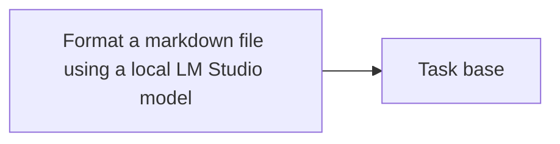

<!-- Generated by docs.api.reference; do not edit. -->
# Format a markdown file using a local LM Studio model

[API index](index.md) | [Definition schema](schema.md)

| Field | Value |
| --- | --- |
| ID | `text.markdown.format.task` |
| Source | `07_tasks/text.markdown.format.task.yaml` |
| Tags | task |

Read a markdown file, apply a formatting prompt through LM Studio,
and return the formatted content string.
Wraps lib.text.format_markdown.format_markdown_with_lmstudio.


## Relationships

| Relation | Definitions |
| --- | --- |
| Extends | [Task base](task.base.definition.md) |
| Mixins | - |
| Children | - |
| Mixin consumers | - |
| Modules | - |




## Declared API

### Inputs

| Name | Type | Required | Default | Description |
| --- | --- | --- | --- | --- |
| `file_path` | `string` | yes | `-` | Path to the markdown file to format. |
| `model` | `string` | no | `qwen/qwen3.6-27b` | LM Studio model identifier. |


### Variables

| Name | YAML Type | Value / Template | Description |
| --- | --- | --- | --- |
| - | - | - | No locally declared variables. |


### Run Operations

#### Python

_No operation description provided._

```python
import json, os
from lib.text.format_markdown import format_markdown_with_lmstudio

result = format_markdown_with_lmstudio("{{ file_path }}", model="{{ model }}")
with open(os.environ["STATE_FILE"], "w") as f:
    json.dump({"formatted": result}, f)

```

### Teardown Operations

_No locally declared teardown operations._

## Resolved API

### Effective Inputs

| Name | Type | Required | Default | Origin |
| --- | --- | --- | --- | --- |
| `file_path` | `string` | yes | `-` | [Format a markdown file using a local LM Studio model](text.markdown.format.task.definition.md) |
| `model` | `string` | no | `qwen/qwen3.6-27b` | [Format a markdown file using a local LM Studio model](text.markdown.format.task.definition.md) |


### Effective Variables

| Name | Value / Template | Origin |
| --- | --- | --- |
| `system_log_format` | `[{{ entity_id }} \| {{ runtime.version }}]` | [Abstract Base](stdlib.base.definition.md) |


### Effective Lifecycle

| Phase | Operation | Origin |
| --- | --- | --- |
| Run | `python` | [Format a markdown file using a local LM Studio model](text.markdown.format.task.definition.md) |
