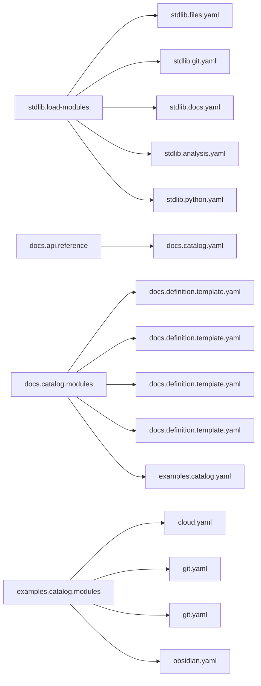

<!-- Generated by docs.api.reference; do not edit. -->
# YAML API Reference

This reference is generated by the `docs.api.reference` YAML workflow. It describes the
standard library, runnable examples, and the documentation workflow itself.

Regenerate or verify committed output from `06_workflows/yaml/`:

```bash
python interpreter.py definitions/docs.yaml docs.api.reference --output_dir=docs --mode=write
python interpreter.py definitions/docs.yaml docs.api.reference --output_dir=docs --mode=check
```

See the [definition authoring schema](schema.md) for metadata and composition fields.

## Definitions

| Definition | ID | Source | Tags |
| --- | --- | --- | --- |
| [Abstract Base](workflows.yaml.definition.stdlib.base.md) | `stdlib.base` | `06_workflows/yaml/definitions/stdlib.yaml` | core, abstract |
| [Load Standard Library Modules](workflows.yaml.definition.stdlib.load-modules.md) | `stdlib.load-modules` | `06_workflows/yaml/definitions/stdlib.yaml` | core, modules |
| [Run Command](workflows.yaml.definition.stdlib.run-command.md) | `stdlib.run-command` | `06_workflows/yaml/definitions/stdlib.yaml` | shell |
| [Clean Workspace](workflows.yaml.definition.stdlib.clean-workspace.md) | `stdlib.clean-workspace` | `06_workflows/yaml/definitions/stdlib.yaml` | files, destructive |
| [Logger](workflows.yaml.definition.stdlib.logger.md) | `stdlib.logger` | `06_workflows/yaml/definitions/stdlib.yaml` | logging |
| [Write Text File](workflows.yaml.definition.stdlib.files.write-text.md) | `stdlib.files.write-text` | `06_workflows/yaml/definitions/stdlib.files.yaml` | files, templates |
| [Create Directory](workflows.yaml.definition.stdlib.files.create-directory.md) | `stdlib.files.create-directory` | `06_workflows/yaml/definitions/stdlib.files.yaml` | files |
| [Initialize Current Git Workspace](workflows.yaml.definition.stdlib.git.init-current-workspace.md) | `stdlib.git.init-current-workspace` | `06_workflows/yaml/definitions/stdlib.git.yaml` | git |
| [Write Python Gitignore](workflows.yaml.definition.stdlib.git.gitignore-python.md) | `stdlib.git.gitignore-python` | `06_workflows/yaml/definitions/stdlib.git.yaml` | git, files, templates |
| [Create GitHub Repository](workflows.yaml.definition.stdlib.git.create-github-repository.md) | `stdlib.git.create-github-repository` | `06_workflows/yaml/definitions/stdlib.git.yaml` | git, github |
| [Prune Generated Definition Pages](workflows.yaml.definition.stdlib.docs.prune-definition-pages.md) | `stdlib.docs.prune-definition-pages` | `06_workflows/yaml/definitions/stdlib.docs.yaml` | documentation, files |
| [Analysis Base](workflows.yaml.definition.stdlib.analysis.base.md) | `stdlib.analysis.base` | `06_workflows/yaml/definitions/stdlib.analysis.yaml` | analysis, abstract |
| [Write Analysis Snapshot](workflows.yaml.definition.stdlib.analysis.snapshot.md) | `stdlib.analysis.snapshot` | `06_workflows/yaml/definitions/stdlib.analysis.yaml` | analysis, intelligence |
| [Verify Definition References](workflows.yaml.definition.stdlib.analysis.verify-references.md) | `stdlib.analysis.verify-references` | `06_workflows/yaml/definitions/stdlib.analysis.yaml` | analysis, validation |
| [Python Barrel - __init__.py Template](workflows.yaml.definition.stdlib.python.barrel.template.md) | `stdlib.python.barrel.template` | `06_workflows/yaml/definitions/stdlib.python.yaml` | python, template |
| [Generate Python Barrel](workflows.yaml.definition.stdlib.python.barrel.md) | `stdlib.python.barrel` | `06_workflows/yaml/definitions/stdlib.python.yaml` | python, generator |
| [YAML API Reference Build](workflows.yaml.definition.docs.api.reference.md) | `docs.api.reference` | `06_workflows/yaml/definitions/docs.yaml` | documentation, workflow |
| [API Documentation Catalog Sources](workflows.yaml.definition.docs.catalog.modules.md) | `docs.catalog.modules` | `06_workflows/yaml/definitions/docs.catalog.yaml` | documentation, modules |
| [Docs - Relationship Graph Component](workflows.yaml.definition.docs.definition.template.component-relationship-graph.md) | `docs.definition.template.component-relationship-graph` | `06_workflows/yaml/definitions/docs.definition.template.yaml` | documentation, template, component |
| [Docs - Index Page Template](workflows.yaml.definition.docs.definition.template.index.md) | `docs.definition.template.index` | `06_workflows/yaml/definitions/docs.definition.template.yaml` | documentation, template |
| [Docs - Authoring Schema Page Template](workflows.yaml.definition.docs.definition.template.schema.md) | `docs.definition.template.schema` | `06_workflows/yaml/definitions/docs.definition.template.yaml` | documentation, template |
| [Docs - Definition Page Template](workflows.yaml.definition.docs.definition.template.definition.md) | `docs.definition.template.definition` | `06_workflows/yaml/definitions/docs.definition.template.yaml` | documentation, template |
| [Example Catalog Modules](workflows.yaml.definition.examples.catalog.modules.md) | `examples.catalog.modules` | `06_workflows/yaml/definitions/examples.catalog.yaml` | examples, modules |
| [Git Information](workflows.yaml.definition.cloud.mixin.git-info.md) | `cloud.mixin.git-info` | `06_workflows/yaml/definitions/cloud.yaml` | mixin, git, deployment |
| [Timestamp](workflows.yaml.definition.cloud.mixin.timestamp.md) | `cloud.mixin.timestamp` | `06_workflows/yaml/definitions/cloud.yaml` | mixin, deployment |
| [Cloud Deployer](workflows.yaml.definition.cloud.deployer.md) | `cloud.deployer` | `06_workflows/yaml/definitions/cloud.yaml` | example, deployment, cloud |
| [Initialize Git Example](workflows.yaml.definition.git.init.md) | `git.init` | `06_workflows/yaml/definitions/git.yaml` | example, git |
| [GitHub Repository Example](workflows.yaml.definition.git.github.md) | `git.github` | `06_workflows/yaml/definitions/git.yaml` | example, git, github |
| [Gitignore Template Example](workflows.yaml.definition.git.gitignore.md) | `git.gitignore` | `06_workflows/yaml/definitions/git.yaml` | example, git, templates |
| [Obsidian Daily Note Template](workflows.yaml.definition.obsidian.template.md) | `obsidian.template` | `06_workflows/yaml/definitions/obsidian.yaml` | example, obsidian, templates |


## Tags

### abstract

- [Abstract Base](workflows.yaml.definition.stdlib.base.md) (`stdlib.base`)
- [Analysis Base](workflows.yaml.definition.stdlib.analysis.base.md) (`stdlib.analysis.base`)


### analysis

- [Analysis Base](workflows.yaml.definition.stdlib.analysis.base.md) (`stdlib.analysis.base`)
- [Write Analysis Snapshot](workflows.yaml.definition.stdlib.analysis.snapshot.md) (`stdlib.analysis.snapshot`)
- [Verify Definition References](workflows.yaml.definition.stdlib.analysis.verify-references.md) (`stdlib.analysis.verify-references`)


### cloud

- [Cloud Deployer](workflows.yaml.definition.cloud.deployer.md) (`cloud.deployer`)


### component

- [Docs - Relationship Graph Component](workflows.yaml.definition.docs.definition.template.component-relationship-graph.md) (`docs.definition.template.component-relationship-graph`)


### core

- [Abstract Base](workflows.yaml.definition.stdlib.base.md) (`stdlib.base`)
- [Load Standard Library Modules](workflows.yaml.definition.stdlib.load-modules.md) (`stdlib.load-modules`)


### deployment

- [Git Information](workflows.yaml.definition.cloud.mixin.git-info.md) (`cloud.mixin.git-info`)
- [Timestamp](workflows.yaml.definition.cloud.mixin.timestamp.md) (`cloud.mixin.timestamp`)
- [Cloud Deployer](workflows.yaml.definition.cloud.deployer.md) (`cloud.deployer`)


### destructive

- [Clean Workspace](workflows.yaml.definition.stdlib.clean-workspace.md) (`stdlib.clean-workspace`)


### documentation

- [Prune Generated Definition Pages](workflows.yaml.definition.stdlib.docs.prune-definition-pages.md) (`stdlib.docs.prune-definition-pages`)
- [YAML API Reference Build](workflows.yaml.definition.docs.api.reference.md) (`docs.api.reference`)
- [API Documentation Catalog Sources](workflows.yaml.definition.docs.catalog.modules.md) (`docs.catalog.modules`)
- [Docs - Relationship Graph Component](workflows.yaml.definition.docs.definition.template.component-relationship-graph.md) (`docs.definition.template.component-relationship-graph`)
- [Docs - Index Page Template](workflows.yaml.definition.docs.definition.template.index.md) (`docs.definition.template.index`)
- [Docs - Authoring Schema Page Template](workflows.yaml.definition.docs.definition.template.schema.md) (`docs.definition.template.schema`)
- [Docs - Definition Page Template](workflows.yaml.definition.docs.definition.template.definition.md) (`docs.definition.template.definition`)


### example

- [Cloud Deployer](workflows.yaml.definition.cloud.deployer.md) (`cloud.deployer`)
- [Initialize Git Example](workflows.yaml.definition.git.init.md) (`git.init`)
- [GitHub Repository Example](workflows.yaml.definition.git.github.md) (`git.github`)
- [Gitignore Template Example](workflows.yaml.definition.git.gitignore.md) (`git.gitignore`)
- [Obsidian Daily Note Template](workflows.yaml.definition.obsidian.template.md) (`obsidian.template`)


### examples

- [Example Catalog Modules](workflows.yaml.definition.examples.catalog.modules.md) (`examples.catalog.modules`)


### files

- [Clean Workspace](workflows.yaml.definition.stdlib.clean-workspace.md) (`stdlib.clean-workspace`)
- [Write Text File](workflows.yaml.definition.stdlib.files.write-text.md) (`stdlib.files.write-text`)
- [Create Directory](workflows.yaml.definition.stdlib.files.create-directory.md) (`stdlib.files.create-directory`)
- [Write Python Gitignore](workflows.yaml.definition.stdlib.git.gitignore-python.md) (`stdlib.git.gitignore-python`)
- [Prune Generated Definition Pages](workflows.yaml.definition.stdlib.docs.prune-definition-pages.md) (`stdlib.docs.prune-definition-pages`)


### generator

- [Generate Python Barrel](workflows.yaml.definition.stdlib.python.barrel.md) (`stdlib.python.barrel`)


### git

- [Initialize Current Git Workspace](workflows.yaml.definition.stdlib.git.init-current-workspace.md) (`stdlib.git.init-current-workspace`)
- [Write Python Gitignore](workflows.yaml.definition.stdlib.git.gitignore-python.md) (`stdlib.git.gitignore-python`)
- [Create GitHub Repository](workflows.yaml.definition.stdlib.git.create-github-repository.md) (`stdlib.git.create-github-repository`)
- [Git Information](workflows.yaml.definition.cloud.mixin.git-info.md) (`cloud.mixin.git-info`)
- [Initialize Git Example](workflows.yaml.definition.git.init.md) (`git.init`)
- [GitHub Repository Example](workflows.yaml.definition.git.github.md) (`git.github`)
- [Gitignore Template Example](workflows.yaml.definition.git.gitignore.md) (`git.gitignore`)


### github

- [Create GitHub Repository](workflows.yaml.definition.stdlib.git.create-github-repository.md) (`stdlib.git.create-github-repository`)
- [GitHub Repository Example](workflows.yaml.definition.git.github.md) (`git.github`)


### intelligence

- [Write Analysis Snapshot](workflows.yaml.definition.stdlib.analysis.snapshot.md) (`stdlib.analysis.snapshot`)


### logging

- [Logger](workflows.yaml.definition.stdlib.logger.md) (`stdlib.logger`)


### mixin

- [Git Information](workflows.yaml.definition.cloud.mixin.git-info.md) (`cloud.mixin.git-info`)
- [Timestamp](workflows.yaml.definition.cloud.mixin.timestamp.md) (`cloud.mixin.timestamp`)


### modules

- [Load Standard Library Modules](workflows.yaml.definition.stdlib.load-modules.md) (`stdlib.load-modules`)
- [API Documentation Catalog Sources](workflows.yaml.definition.docs.catalog.modules.md) (`docs.catalog.modules`)
- [Example Catalog Modules](workflows.yaml.definition.examples.catalog.modules.md) (`examples.catalog.modules`)


### obsidian

- [Obsidian Daily Note Template](workflows.yaml.definition.obsidian.template.md) (`obsidian.template`)


### python

- [Python Barrel - __init__.py Template](workflows.yaml.definition.stdlib.python.barrel.template.md) (`stdlib.python.barrel.template`)
- [Generate Python Barrel](workflows.yaml.definition.stdlib.python.barrel.md) (`stdlib.python.barrel`)


### shell

- [Run Command](workflows.yaml.definition.stdlib.run-command.md) (`stdlib.run-command`)


### template

- [Python Barrel - __init__.py Template](workflows.yaml.definition.stdlib.python.barrel.template.md) (`stdlib.python.barrel.template`)
- [Docs - Relationship Graph Component](workflows.yaml.definition.docs.definition.template.component-relationship-graph.md) (`docs.definition.template.component-relationship-graph`)
- [Docs - Index Page Template](workflows.yaml.definition.docs.definition.template.index.md) (`docs.definition.template.index`)
- [Docs - Authoring Schema Page Template](workflows.yaml.definition.docs.definition.template.schema.md) (`docs.definition.template.schema`)
- [Docs - Definition Page Template](workflows.yaml.definition.docs.definition.template.definition.md) (`docs.definition.template.definition`)


### templates

- [Write Text File](workflows.yaml.definition.stdlib.files.write-text.md) (`stdlib.files.write-text`)
- [Write Python Gitignore](workflows.yaml.definition.stdlib.git.gitignore-python.md) (`stdlib.git.gitignore-python`)
- [Gitignore Template Example](workflows.yaml.definition.git.gitignore.md) (`git.gitignore`)
- [Obsidian Daily Note Template](workflows.yaml.definition.obsidian.template.md) (`obsidian.template`)


### validation

- [Verify Definition References](workflows.yaml.definition.stdlib.analysis.verify-references.md) (`stdlib.analysis.verify-references`)


### workflow

- [YAML API Reference Build](workflows.yaml.definition.docs.api.reference.md) (`docs.api.reference`)


## Relationship Graph

Solid arrows identify `extends`; dashed arrows identify mixin use.


## Module Imports


