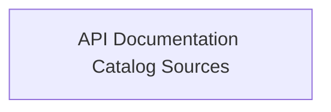

<!-- Generated by docs.api.reference; do not edit. -->
# API Documentation Catalog Sources

[API index](workflows.yaml.api.md) | [Definition schema](workflows.yaml.schema.md)

| Field | Value |
| --- | --- |
| ID | `docs.catalog.modules` |
| Source | `06_workflows/yaml/definitions/docs.catalog.yaml` |
| Tags | documentation, modules |

Imports template definitions used by the docs workflow and the runnable
example catalog into the generated YAML API reference.

## Relationships

| Relation | Definitions |
| --- | --- |
| Extends | - |
| Mixins | - |
| Children | - |
| Mixin consumers | - |
| Modules | `docs.definition.template.yaml`, `docs.definition.template.yaml`, `docs.definition.template.yaml`, `docs.definition.template.yaml`, `examples.catalog.yaml` |

## Declared API

### Inputs

| Name | Type | Required | Default | Description |
| --- | --- | --- | --- | --- |
| - | - | - | - | No locally declared inputs. |

### Variables

| Name | YAML Type | Value / Template | Description |
| --- | --- | --- | --- |
| - | - | - | No locally declared variables. |

### Run Operations

_No locally declared run operations._

### Teardown Operations

_No locally declared teardown operations._

## Resolved API

### Effective Inputs

| Name | Type | Required | Default | Origin |
| --- | --- | --- | --- | --- |
| - | - | - | - | No effective inputs. |

### Effective Variables

| Name | Value / Template | Origin |
| --- | --- | --- |
| - | - | No effective variables. |

### Effective Lifecycle

| Phase | Operation | Origin |
| --- | --- | --- |
| - | - | No effective lifecycle operations. |
