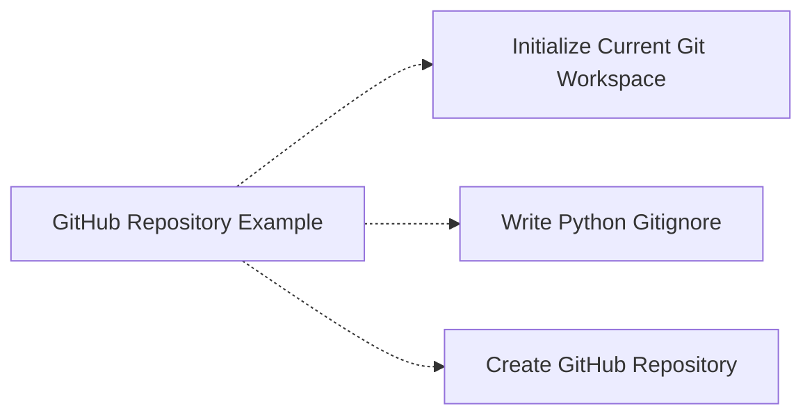

<!-- Generated by docs.api.reference; do not edit. -->
# GitHub Repository Example

[API index](workflows.yaml.api.md) | [Definition schema](workflows.yaml.schema.md)

| Field | Value |
| --- | --- |
| ID | `git.github` |
| Source | `06_workflows/yaml/definitions/git.yaml` |
| Tags | example, git, github |

Initializes local Git files and creates a matching remote GitHub repository.

## Relationships

| Relation | Definitions |
| --- | --- |
| Extends | - |
| Mixins | [Initialize Current Git Workspace](workflows.yaml.definition.stdlib.git.init-current-workspace.md), [Write Python Gitignore](workflows.yaml.definition.stdlib.git.gitignore-python.md), [Create GitHub Repository](workflows.yaml.definition.stdlib.git.create-github-repository.md) |
| Children | - |
| Mixin consumers | - |
| Modules | - |

## Declared API

### Inputs

| Name | Type | Required | Default | Description |
| --- | --- | --- | --- | --- |
| - | - | - | - | No locally declared inputs. |

### Variables

| Name | YAML Type | Value / Template | Description |
| --- | --- | --- | --- |
| - | - | - | No locally declared variables. |

### Run Operations

_No locally declared run operations._

### Teardown Operations

_No locally declared teardown operations._

## Resolved API

### Effective Inputs

| Name | Type | Required | Default | Origin |
| --- | --- | --- | --- | --- |
| `repository_name` | `string` | yes | `-` | [Create GitHub Repository](workflows.yaml.definition.stdlib.git.create-github-repository.md) |
| `visibility` | `string` | no | `private` | [Create GitHub Repository](workflows.yaml.definition.stdlib.git.create-github-repository.md) |
| `description` | `string` | no | `Created from a LocalFabric YAML example.` | [Create GitHub Repository](workflows.yaml.definition.stdlib.git.create-github-repository.md) |

### Effective Variables

| Name | Value / Template | Origin |
| --- | --- | --- |
| `system_log_format` | `[{{ entity_id }} \| {{ runtime.version }}]` | [Abstract Base](workflows.yaml.definition.stdlib.base.md) |
| `repository_path` | `{{ env.cwd }}` | [Create GitHub Repository](workflows.yaml.definition.stdlib.git.create-github-repository.md) |
| `initial_branch` | `main` | [Initialize Current Git Workspace](workflows.yaml.definition.stdlib.git.init-current-workspace.md) |
| `target_path` | `{{ env.cwd }}/.gitignore` | [Write Python Gitignore](workflows.yaml.definition.stdlib.git.gitignore-python.md) |
| `content` | `# Python __pycache__/ *.py[cod] *.egg-info/ .pytest_cache/ .mypy_cache/ .ruff_cache/ .venv/ venv/  # Editors and operating system files .DS_Store .idea/ .vscode/  # Local secrets and output .env .env.* dist/ build/ ` | [Write Python Gitignore](workflows.yaml.definition.stdlib.git.gitignore-python.md) |

### Effective Lifecycle

| Phase | Operation | Origin |
| --- | --- | --- |
| Run | `bash` | [Initialize Current Git Workspace](workflows.yaml.definition.stdlib.git.init-current-workspace.md) |
| Run | `artifact` | [Write Text File](workflows.yaml.definition.stdlib.files.write-text.md) |
| Run | `bash` | [Create GitHub Repository](workflows.yaml.definition.stdlib.git.create-github-repository.md) |
