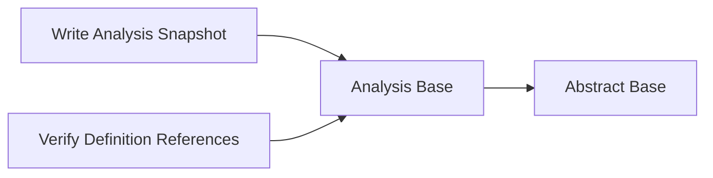

<!-- Generated by docs.api.reference; do not edit. -->
# Analysis Base

[API index](workflows.yaml.api.md) | [Definition schema](workflows.yaml.schema.md)

| Field | Value |
| --- | --- |
| ID | `stdlib.analysis.base` |
| Source | `06_workflows/yaml/definitions/stdlib.analysis.yaml` |
| Tags | analysis, abstract |

Shared scaffolding for analysis definitions. Pins the path to the
`yaml_analysis` Python module so subprocess `python:` blocks can import it.

## Relationships

| Relation | Definitions |
| --- | --- |
| Extends | [Abstract Base](workflows.yaml.definition.stdlib.base.md) |
| Mixins | - |
| Children | [Write Analysis Snapshot](workflows.yaml.definition.stdlib.analysis.snapshot.md), [Verify Definition References](workflows.yaml.definition.stdlib.analysis.verify-references.md) |
| Mixin consumers | - |
| Modules | - |

## Declared API

### Inputs

| Name | Type | Required | Default | Description |
| --- | --- | --- | --- | --- |
| - | - | - | - | No locally declared inputs. |

### Variables

| Name | YAML Type | Value / Template | Description |
| --- | --- | --- | --- |
| `yaml_analysis_src` | `str` | `{{ runtime.workflow_dir }}/src` | Absolute path to the directory containing `yaml_analysis.py`. Defaults
to the workflow's own `src/` (resolved via the runtime's
`workflow_dir` anchor, so it's independent of shell cwd).
 |

### Run Operations

_No locally declared run operations._

### Teardown Operations

_No locally declared teardown operations._

## Resolved API

### Effective Inputs

| Name | Type | Required | Default | Origin |
| --- | --- | --- | --- | --- |
| - | - | - | - | No effective inputs. |

### Effective Variables

| Name | Value / Template | Origin |
| --- | --- | --- |
| `system_log_format` | `[{{ entity_id }} \| {{ runtime.version }}]` | [Abstract Base](workflows.yaml.definition.stdlib.base.md) |
| `yaml_analysis_src` | `{{ runtime.workflow_dir }}/src` | [Analysis Base](workflows.yaml.definition.stdlib.analysis.base.md) |

### Effective Lifecycle

| Phase | Operation | Origin |
| --- | --- | --- |
| Run | `python` | [Abstract Base](workflows.yaml.definition.stdlib.base.md) |
