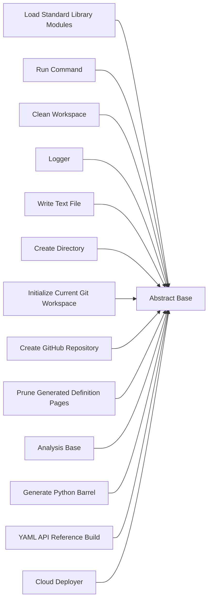

<!-- Generated by docs.api.reference; do not edit. -->
# Abstract Base

[API index](workflows.yaml.api.md) | [Definition schema](workflows.yaml.schema.md)

| Field | Value |
| --- | --- |
| ID | `stdlib.base` |
| Source | `06_workflows/yaml/definitions/stdlib.yaml` |
| Tags | core, abstract |

Base execution frame shared by standard-library definitions.


## Relationships

| Relation | Definitions |
| --- | --- |
| Extends | - |
| Mixins | - |
| Children | [Load Standard Library Modules](workflows.yaml.definition.stdlib.load-modules.md), [Run Command](workflows.yaml.definition.stdlib.run-command.md), [Clean Workspace](workflows.yaml.definition.stdlib.clean-workspace.md), [Logger](workflows.yaml.definition.stdlib.logger.md), [Write Text File](workflows.yaml.definition.stdlib.files.write-text.md), [Create Directory](workflows.yaml.definition.stdlib.files.create-directory.md), [Initialize Current Git Workspace](workflows.yaml.definition.stdlib.git.init-current-workspace.md), [Create GitHub Repository](workflows.yaml.definition.stdlib.git.create-github-repository.md), [Prune Generated Definition Pages](workflows.yaml.definition.stdlib.docs.prune-definition-pages.md), [Analysis Base](workflows.yaml.definition.stdlib.analysis.base.md), [Generate Python Barrel](workflows.yaml.definition.stdlib.python.barrel.md), [YAML API Reference Build](workflows.yaml.definition.docs.api.reference.md), [Cloud Deployer](workflows.yaml.definition.cloud.deployer.md) |
| Mixin consumers | - |
| Modules | - |




## Declared API

### Inputs

| Name | Type | Required | Default | Description |
| --- | --- | --- | --- | --- |
| - | - | - | - | No locally declared inputs. |


### Variables

| Name | YAML Type | Value / Template | Description |
| --- | --- | --- | --- |
| `system_log_format` | `str` | `[{{ entity_id }} \| {{ runtime.version }}]` | Standard execution log prefix. |


### Run Operations

#### Announce frame startup

_No operation description provided._

```python
import sys
print(f"Booting execution frame cascade...")

```

### Teardown Operations

_No locally declared teardown operations._

## Resolved API

### Effective Inputs

| Name | Type | Required | Default | Origin |
| --- | --- | --- | --- | --- |
| - | - | - | - | No effective inputs. |


### Effective Variables

| Name | Value / Template | Origin |
| --- | --- | --- |
| `system_log_format` | `[{{ entity_id }} \| {{ runtime.version }}]` | [Abstract Base](workflows.yaml.definition.stdlib.base.md) |


### Effective Lifecycle

| Phase | Operation | Origin |
| --- | --- | --- |
| Run | `python` | [Abstract Base](workflows.yaml.definition.stdlib.base.md) |
