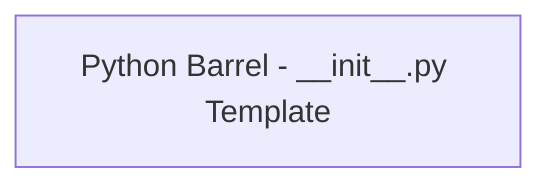

<!-- Generated by docs.api.reference; do not edit. -->
# Python Barrel - __init__.py Template

[API index](workflows.yaml.api.md) | [Definition schema](workflows.yaml.schema.md)

| Field | Value |
| --- | --- |
| ID | `stdlib.python.barrel.template` |
| Source | `06_workflows/yaml/definitions/stdlib.python.yaml` |
| Tags | python, template |

Renders a package's `__init__.py` from the module list produced by
`python_packages.scan_package`. One `from .X import (...)` block per
sibling module or subpackage, followed by an aggregate `__all__`.

Module sections appear in the order the scanner returns them
(alphabetical by name), and exports within a module preserve declaration
order so reviewers see the public surface as the author wrote it.

## Relationships

| Relation | Definitions |
| --- | --- |
| Extends | - |
| Mixins | - |
| Children | - |
| Mixin consumers | - |
| Modules | - |

## Declared API

### Inputs

| Name | Type | Required | Default | Description |
| --- | --- | --- | --- | --- |
| `package_name` | `string` | yes | `-` | Name of the package being generated, used in the docstring. |
| `package_doc` | `string` | no | `` | Optional one-line docstring summary placed at the top. |
| `modules` | `array` | yes | `-` | Output of `python_packages.scan_package`. Each entry is a dict with
`name`, `is_subpackage`, `docstring`, and `exports`.
 |
| `flatten` | `boolean` | no | `True` | When true (the default), re-exports every symbol from every scanned
module so callers can `from <pkg> import Name` directly — appropriate
when the children are implementation details. When false, exposes
each child as its own namespace via `from . import child` — the right
choice for a top-level package whose children are distinct domains
and whose symbols may collide.
 |

### Variables

| Name | YAML Type | Value / Template | Description |
| --- | --- | --- | --- |
| - | - | - | No locally declared variables. |

### Run Operations

_No locally declared run operations._

### Teardown Operations

_No locally declared teardown operations._

## Resolved API

### Effective Inputs

| Name | Type | Required | Default | Origin |
| --- | --- | --- | --- | --- |
| `package_name` | `string` | yes | `-` | [Python Barrel - __init__.py Template](workflows.yaml.definition.stdlib.python.barrel.template.md) |
| `package_doc` | `string` | no | `` | [Python Barrel - __init__.py Template](workflows.yaml.definition.stdlib.python.barrel.template.md) |
| `modules` | `array` | yes | `-` | [Python Barrel - __init__.py Template](workflows.yaml.definition.stdlib.python.barrel.template.md) |
| `flatten` | `boolean` | no | `True` | [Python Barrel - __init__.py Template](workflows.yaml.definition.stdlib.python.barrel.template.md) |

### Effective Variables

| Name | Value / Template | Origin |
| --- | --- | --- |
| - | - | No effective variables. |

### Effective Lifecycle

| Phase | Operation | Origin |
| --- | --- | --- |
| - | - | No effective lifecycle operations. |
