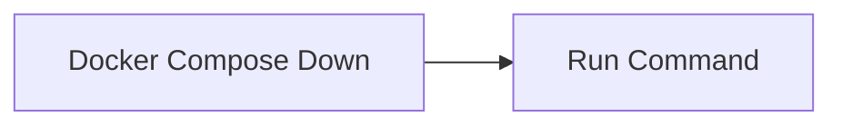

<!-- Generated by docs.api.reference; do not edit. -->
# Docker Compose Down

[API index](index.md) | [Definition schema](schema.md)

| Field | Value |
| --- | --- |
| ID | `compose.down` |
| Source | `02_core/runtimes/yaml/definitions/docker.yaml` |
| Tags | docker, compose, lifecycle |

Stops a scaffolded docker compose project and removes its containers
and default networks. Volumes are preserved.

## Relationships

| Relation | Definitions |
| --- | --- |
| Extends | [Run Command](stdlib.run-command.md) |
| Mixins | - |
| Children | - |
| Mixin consumers | - |
| Modules | - |

## Declared API

### Inputs

| Name | Type | Required | Default | Description |
| --- | --- | --- | --- | --- |
| `target_dir` | `string` | yes | `-` | Folder that contains the rendered docker-compose.yml. |

### Variables

| Name | YAML Type | Value / Template | Description |
| --- | --- | --- | --- |
| `command` | `str` | `docker compose -f {{ target_dir }}/docker-compose.yml down` | - |

### Run Operations

_No locally declared run operations._

### Teardown Operations

_No locally declared teardown operations._

## Resolved API

### Effective Inputs

| Name | Type | Required | Default | Origin |
| --- | --- | --- | --- | --- |
| `command` | `string` | no | `` | [Run Command](stdlib.run-command.md) |
| `working_dir` | `string` | no | `{{ env.cwd }}` | [Run Command](stdlib.run-command.md) |
| `target_dir` | `string` | yes | `-` | [Docker Compose Down](compose.down.md) |

### Effective Variables

| Name | Value / Template | Origin |
| --- | --- | --- |
| `system_log_format` | `[{{ entity_id }} \| {{ runtime.version }}]` | [Abstract Base](stdlib.base.md) |
| `command` | `docker compose -f {{ target_dir }}/docker-compose.yml down` | [Docker Compose Down](compose.down.md) |

### Effective Lifecycle

| Phase | Operation | Origin |
| --- | --- | --- |
| Run | `bash` | [Run Command](stdlib.run-command.md) |
