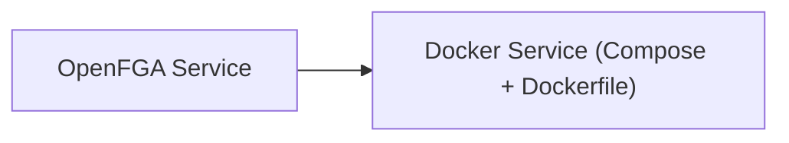

<!-- Generated by docs.api.reference; do not edit. -->
# OpenFGA Service

[API index](index.md) | [Definition schema](schema.md)

| Field | Value |
| --- | --- |
| ID | `docker.openfga` |
| Source | `09_docker/openfga.yaml` |
| Tags | docker, auth |

OpenFGA fine-grained authorization server running with in-memory storage and the
playground enabled. Used for relationship-based access checks in the content graph.

## Relationships

| Relation | Definitions |
| --- | --- |
| Extends | [Docker Service (Compose + Dockerfile)](docker.base.md) |
| Mixins | - |
| Children | - |
| Mixin consumers | - |
| Modules | - |

## Declared API

### Inputs

| Name | Type | Required | Default | Description |
| --- | --- | --- | --- | --- |
| `OPENFGA_HTTP_PORT` | `string` | no | `8083` | Host port to expose the OpenFGA HTTP API (default 8083) |
| `OPENFGA_GRPC_PORT` | `string` | no | `8081` | Host port to expose the OpenFGA gRPC API (default 8081) |
| `OPENFGA_PLAYGROUND_PORT` | `string` | no | `3003` | Host port to expose the OpenFGA Playground UI (default 3003) |

### Variables

| Name | YAML Type | Value / Template | Description |
| --- | --- | --- | --- |
| `services` | `dict` | `{'openfga': {'image': 'openfga/openfga', 'container_name': 'contentgraph-openfga', 'restart': 'unless-stopped', 'command': 'run --playground-enabled --datastore-engine memory', 'ports': ['{{ OPENFGA_HTTP_PORT }}:8080', '{{ OPENFGA_GRPC_PORT }}:8081', '{{ OPENFGA_PLAYGROUND_PORT }}:3000']}}` | - |

### Run Operations

_No locally declared run operations._

### Teardown Operations

_No locally declared teardown operations._

## Resolved API

### Effective Inputs

| Name | Type | Required | Default | Origin |
| --- | --- | --- | --- | --- |
| `target_dir` | `string` | no | `14_data/{{ entity_id | replace('.', '_') }}` | [Folder Scaffold Base](folder.base.md) |
| `OPENFGA_HTTP_PORT` | `string` | no | `8083` | [OpenFGA Service](docker.openfga.md) |
| `OPENFGA_GRPC_PORT` | `string` | no | `8081` | [OpenFGA Service](docker.openfga.md) |
| `OPENFGA_PLAYGROUND_PORT` | `string` | no | `3003` | [OpenFGA Service](docker.openfga.md) |

### Effective Variables

| Name | Value / Template | Origin |
| --- | --- | --- |
| `system_log_format` | `[{{ entity_id }} \| {{ runtime.version }}]` | [Abstract Base](stdlib.base.md) |
| `dockerfile_body` | `` | [Dockerfile Mixin](dockerfile.base.md) |
| `image_tag` | `{{ entity_id \| replace('docker.', '') }}:local` | [Dockerfile Mixin](dockerfile.base.md) |
| `build_context` | `{{ target_dir }}` | [Dockerfile Mixin](dockerfile.base.md) |
| `services` | `{'openfga': {'image': 'openfga/openfga', 'container_name': 'contentgraph-openfga', 'restart': 'unless-stopped', 'command': 'run --playground-enabled --datastore-engine memory', 'ports': ['{{ OPENFGA_HTTP_PORT }}:8080', '{{ OPENFGA_GRPC_PORT }}:8081', '{{ OPENFGA_PLAYGROUND_PORT }}:3000']}}` | [OpenFGA Service](docker.openfga.md) |
| `networks` | `{}` | [Docker Compose Mixin](compose.base.md) |
| `volumes` | `{}` | [Docker Compose Mixin](compose.base.md) |
| `compose_yaml` | `{{ {'services': services, 'networks': networks, 'volumes': volumes} \| tojson(indent=2) }} ` | [Docker Compose Mixin](compose.base.md) |
| `extra_files` | `[]` | [Docker Service (Compose + Dockerfile)](docker.base.md) |
| `files` | `[{'path': 'Dockerfile', 'content': '{{ dockerfile_body }}'}, {'path': 'docker-compose.yml', 'content': '{{ compose_yaml }}'}]` | [Docker Service (Compose + Dockerfile)](docker.base.md) |

### Effective Lifecycle

| Phase | Operation | Origin |
| --- | --- | --- |
| Run | `invoke` | [Folder Scaffold Base](folder.base.md) |
| Run | `invoke` | [Folder Scaffold Base](folder.base.md) |
| Run | `python` | [Abstract Base](stdlib.base.md) |
| Run | `python` | [Abstract Base](stdlib.base.md) |
