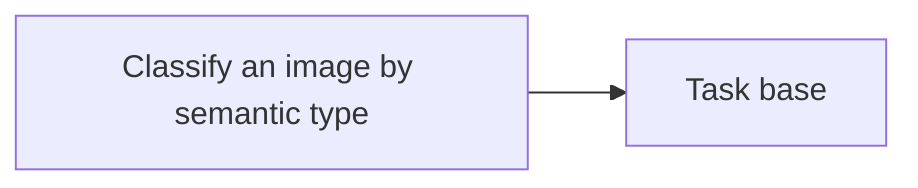

<!-- Generated by docs.api.reference; do not edit. -->
# Classify an image by semantic type

[API index](index.md) | [Definition schema](schema.md)

| Field | Value |
| --- | --- |
| ID | `image.classify.task` |
| Source | `07_tasks/image.classify.task.yaml` |
| Tags | task |

Classify an image into one of 10 semantic types (photograph, screenshot,
diagram, chart, infographic, illustration, document, blueprint, logo, other)
with a confidence score. Wraps lib.image.classify.classify_image.


## Relationships

| Relation | Definitions |
| --- | --- |
| Extends | [Task base](task.base.md) |
| Mixins | - |
| Children | - |
| Mixin consumers | - |
| Modules | - |




## Declared API

### Inputs

| Name | Type | Required | Default | Description |
| --- | --- | --- | --- | --- |
| `path` | `string` | yes | `-` | Path to the image file. |


### Variables

| Name | YAML Type | Value / Template | Description |
| --- | --- | --- | --- |
| - | - | - | No locally declared variables. |


### Run Operations

#### Python

_No operation description provided._

```python
import json, os
from pathlib import Path
from lib.image.classify import classify_image

result = classify_image(Path("{{ path }}"))
with open(os.environ["STATE_FILE"], "w") as f:
    json.dump(result, f)

```

### Teardown Operations

_No locally declared teardown operations._

## Resolved API

### Effective Inputs

| Name | Type | Required | Default | Origin |
| --- | --- | --- | --- | --- |
| `path` | `string` | yes | `-` | [Classify an image by semantic type](image.classify.task.md) |


### Effective Variables

| Name | Value / Template | Origin |
| --- | --- | --- |
| `system_log_format` | `[{{ entity_id }} \| {{ runtime.version }}]` | [Abstract Base](stdlib.base.md) |


### Effective Lifecycle

| Phase | Operation | Origin |
| --- | --- | --- |
| Run | `python` | [Classify an image by semantic type](image.classify.task.md) |
